# Figuras extraídas

**Fuente:** `/home/santi/Documentos/ilovepappers/pappers/libro.pdf`
**Total figuras:** 42

---

## FIG_001 · Picture · Página 1

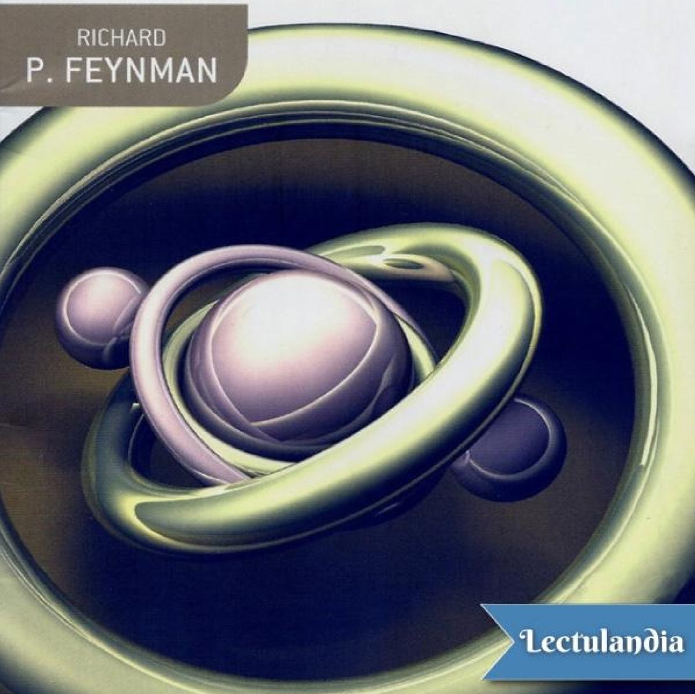

**Caption:** _Sin caption_

---

## FIG_002 · Picture · Página 14

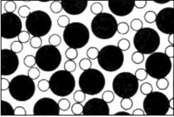

**Caption:** _Sin caption_

---

## FIG_003 · Picture · Página 16

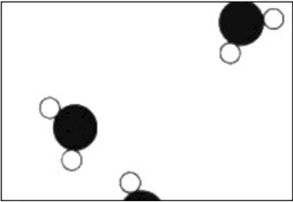

**Caption:** 1.2 Vapor de agua.

---

## FIG_004 · Picture · Página 16

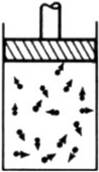

**Caption:** 1.3 Recipiente estándar para mantener gases.

---

## FIG_005 · Picture · Página 18

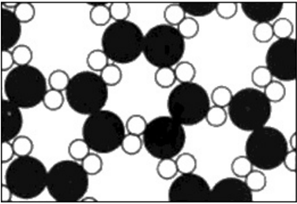

**Caption:** 1.4 Hielo.

---

## FIG_006 · Picture · Página 20

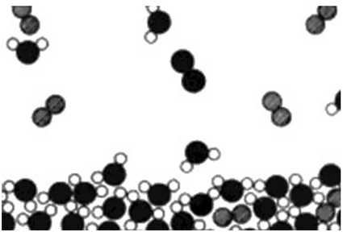

**Caption:** _Sin caption_

---

## FIG_007 · Picture · Página 22

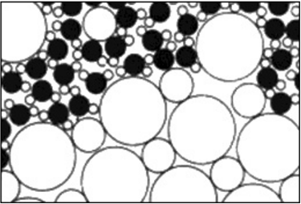

**Caption:** 1.6 Sal disolviéndose en agua (O=Cloro o=Sodio)

---

## FIG_008 · Picture · Página 22

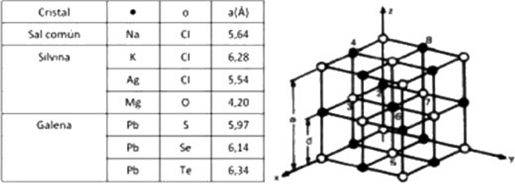

**Caption:** 1.7 Distancia entre primeros vecinos d = a/2

---

## FIG_009 · Picture · Página 24

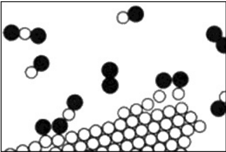

**Caption:** _Sin caption_

---

## FIG_010 · Picture · Página 25

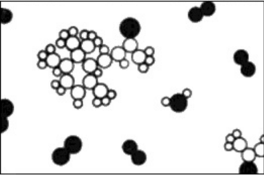

**Caption:** _Sin caption_

---

## FIG_011 · Picture · Página 26

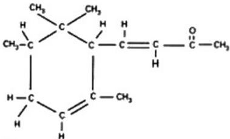

**Caption:** _Sin caption_

---

## FIG_012 · Picture · Página 37

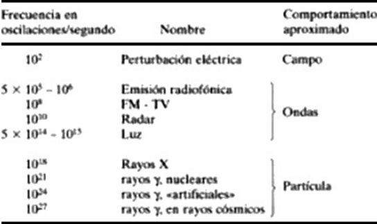

**Caption:** _Sin caption_

---

## FIG_013 · Picture · Página 45

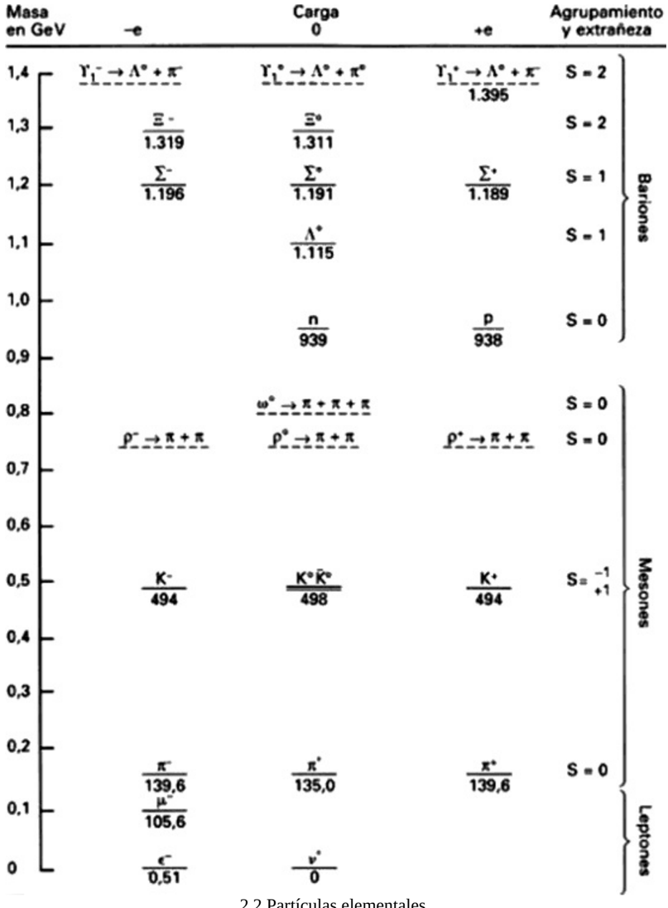

**Caption:** 2.2 Partículas elementales.

---

## FIG_014 · Picture · Página 56

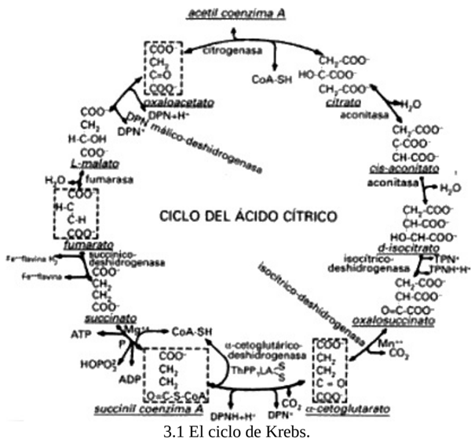

**Caption:** _Sin caption_

---

## FIG_015 · Picture · Página 59

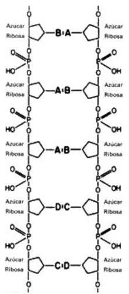

**Caption:** _Sin caption_

---

## FIG_016 · Picture · Página 74

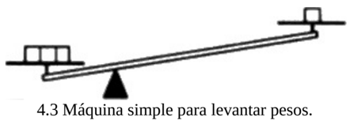

**Caption:** _Sin caption_

---

## FIG_017 · Picture · Página 75

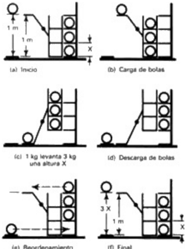

**Caption:** _Sin caption_

---

## FIG_018 · Picture · Página 77

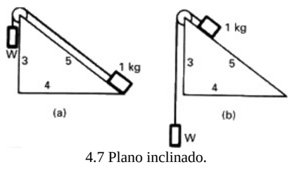

**Caption:** _Sin caption_

---

## FIG_019 · Picture · Página 78

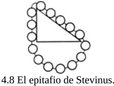

**Caption:** _Sin caption_

---

## FIG_020 · Picture · Página 78

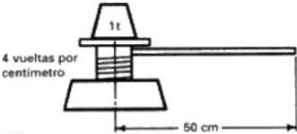

**Caption:** 4.9 Un tornillo elevador.

---

## FIG_021 · Picture · Página 78

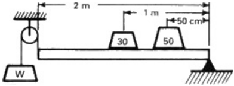

**Caption:** 4.10 Barra con pesos apoyada en un extremo.

---

## FIG_022 · Picture · Página 80

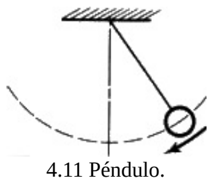

**Caption:** _Sin caption_

---

## FIG_023 · Picture · Página 89

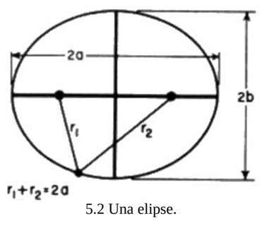

**Caption:** _Sin caption_

---

## FIG_024 · Picture · Página 90

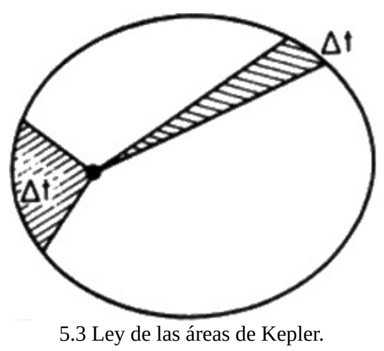

**Caption:** _Sin caption_

---

## FIG_025 · Picture · Página 94

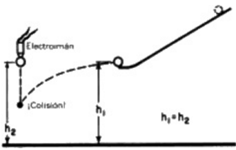

**Caption:** _Sin caption_

---

## FIG_026 · Picture · Página 95

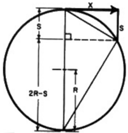

**Caption:** _Sin caption_

---

## FIG_027 · Picture · Página 96

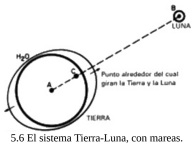

**Caption:** _Sin caption_

---

## FIG_028 · Picture · Página 99

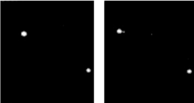

**Caption:** 5.7 Un sistema de estrella doble.

---

## FIG_029 · Picture · Página 100

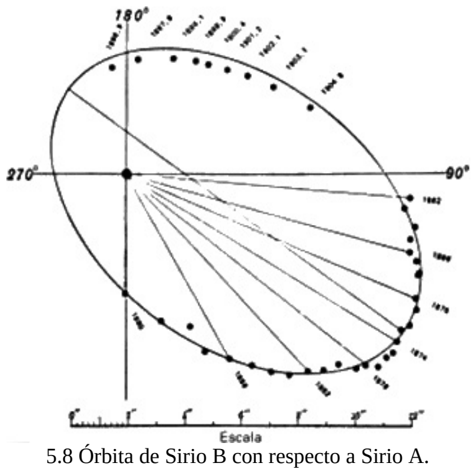

**Caption:** _Sin caption_

---

## FIG_030 · Picture · Página 100

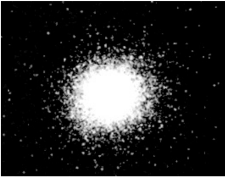

**Caption:** _Sin caption_

---

## FIG_031 · Picture · Página 101

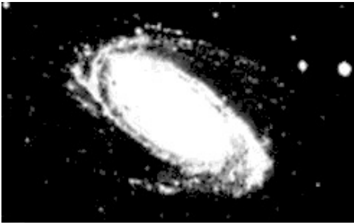

**Caption:** _Sin caption_

---

## FIG_032 · Picture · Página 102

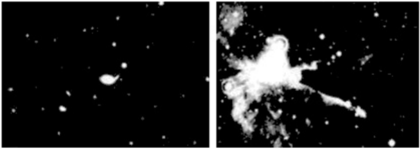

**Caption:** 5.11 Un cúmulo de galaxias y 5.12 Una nube de polvo interestelar.

---

## FIG_033 · Picture · Página 102

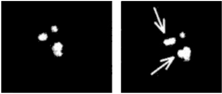

**Caption:** 5.13 ¿Formación de nuevas estrellas?

---

## FIG_034 · Picture · Página 103

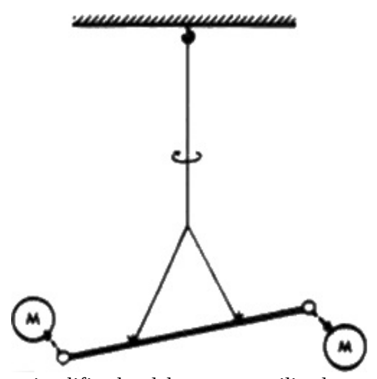

**Caption:** _Sin caption_

---

## FIG_035 · Picture · Página 106

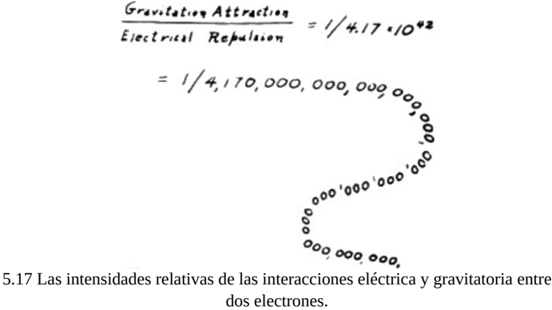

**Caption:** _Sin caption_

---

## FIG_036 · Picture · Página 113

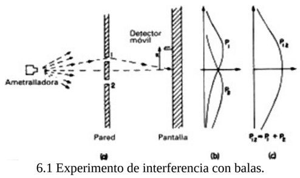

**Caption:** _Sin caption_

---

## FIG_037 · Picture · Página 116

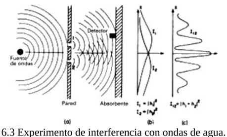

**Caption:** _Sin caption_

---

## FIG_038 · Picture · Página 119

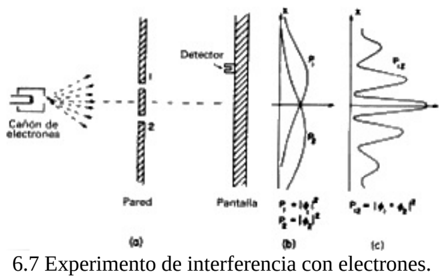

**Caption:** _Sin caption_

---

## FIG_039 · Picture · Página 124

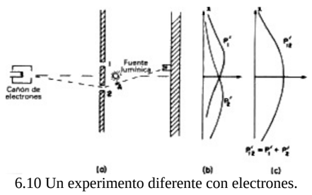

**Caption:** _Sin caption_

---

## FIG_040 · Picture · Página 129

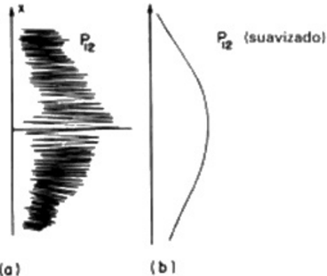

**Caption:** _Sin caption_

---

## FIG_041 · Picture · Página 134

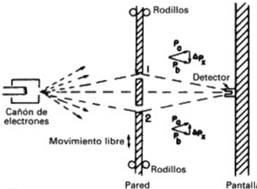

**Caption:** _Sin caption_

---

## FIG_042 · Picture · Página 135

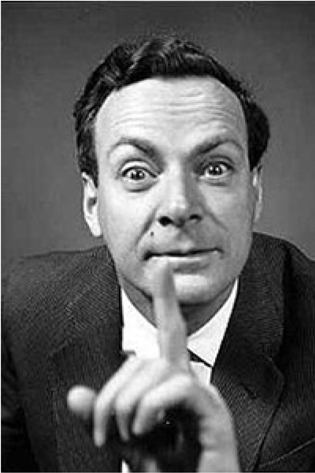

**Caption:** _Sin caption_
