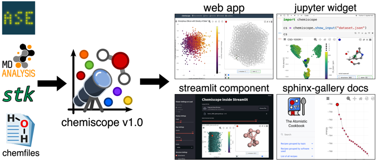
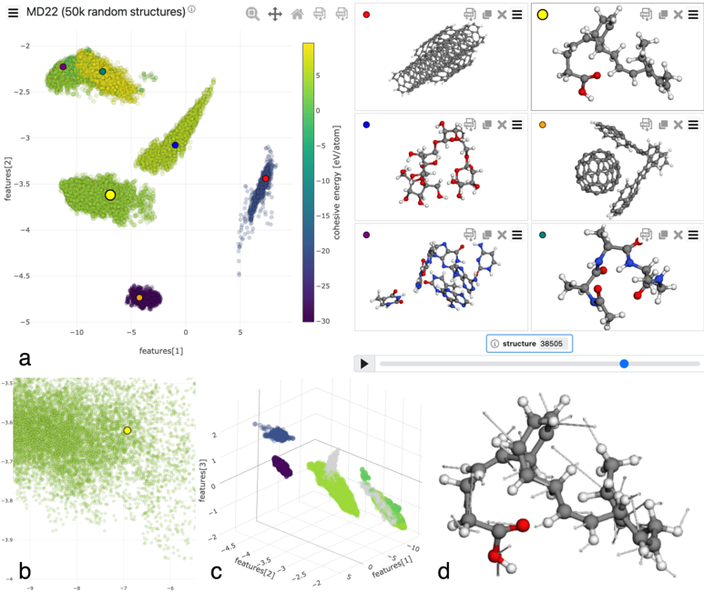

# Figuras extraídas

**Fuente:** `/home/santi/Documentos/ilovepappers/pappers/25-05-papper.pdf`
**Total figuras:** 10

---

## FIG_001 · Picture · Página 1

**Caption:** _Sin caption_

---

## FIG_002 · Picture · Página 1

**Caption:** _Sin caption_

---

## FIG_003 · Picture · Página 1

**Caption:** Figure 1: Overview of Chemiscope 1.0 multi-environment support. The Python API accepts structures from ASE, MDAnalysis, stk, and Chemfiles, along with user-defined properties and visualization settings. These inputs can be rendered as an interactive Jupyter widget, embedded in Streamlit applications, integrated into Sphinx documentation, or exported for the standalone web application at chemiscope.org.

---

## FIG_004 · Picture · Página 2

**Caption:** _Sin caption_

---

## FIG_005 · Picture · Página 3

**Caption:** _Sin caption_

---

## FIG_006 · Picture · Página 3

**Caption:** Figure 2: 50k random structures from the MD22 dataset (Chmiela et al., 2022) visualized with Chemiscope by projecting them into the PET-MAD reduced latent space using chemiscope.explore . Panel a) shows the Chemiscope widget overall, panel b) a zoom-in of the map demonstrating adaptive level-of-detail rendering, panel c) the 3D view with selective coloring by cohesive energy, and panel d) the shape functionality displaying forces as arrows.

---

## FIG_007 · Picture · Página 4

**Caption:** _Sin caption_

---

## FIG_008 · Picture · Página 5

**Caption:** _Sin caption_

---

## FIG_009 · Picture · Página 6

**Caption:** _Sin caption_

---

## FIG_010 · Picture · Página 7

**Caption:** _Sin caption_
