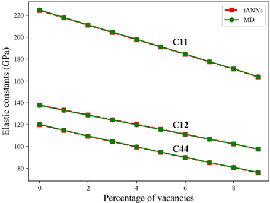
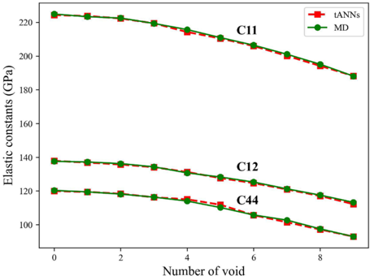
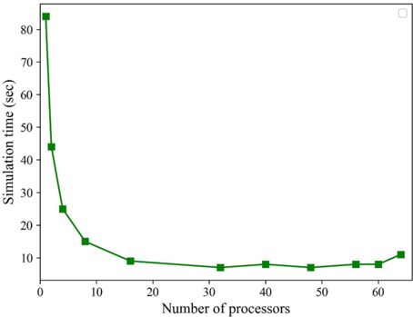
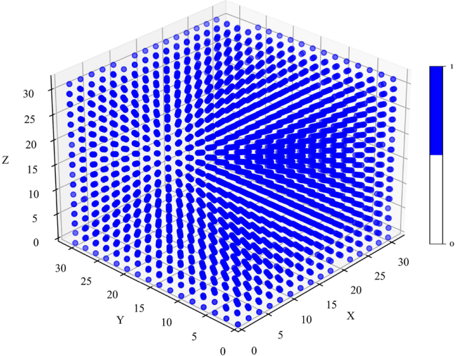
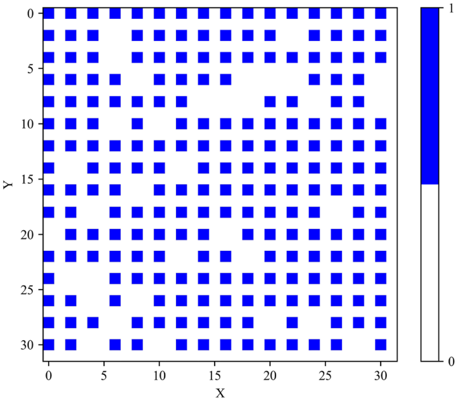
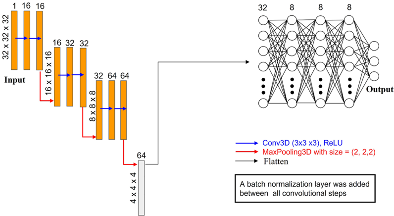

# Figuras extraídas

**Fuente:** `/media/admin/ALMACEN_GRANDE_1/ilovepappers/pappers/3DCNN_predicciones_propiedades_atomisticas_Peivaste_2023.pdf`
**Total figuras:** 8

---

## FIG_001 · Picture · Página 1

**Caption:** _Sin caption_

---

## FIG_002 · Picture · Página 4

**Caption:** Figure 1. Comparative analysis of elastic constants calculation and prediction Using MD and tANNs for Varying Vacancy Percentages. The figure showcases the remarkable performance of our framework across different vacancy percentages, highlighting its accuracy even beyond the training data range.

---

## FIG_003 · Picture · Página 5

**Caption:** Figure 2. Comparative analysis of elastic constants calculation and prediction Using MD and tANNs for varying number of voids. The figure showcases the remarkable performance of our framework across different types of defects.

---

## FIG_004 · Picture · Página 6

**Caption:** Figure 3. Effect of processor count on computation time for a defect-free perfect structure. The graph depicts how computation time decreases with an increasing number of processors, yet it plateaus at a lower limit of 7 s, indicating a minimum achievable computation time.

---

## FIG_005 · Picture · Página 9

**Caption:** Figure 4. Visualization of Atomistic Structures in a 3D Array: Atoms represented by '1' and vacancies by '0' within a 3D grid.

---

## FIG_006 · Picture · Página 10

**Caption:** Figure 5. Visualization of Atomistic Structures in a 2D Array (z = 0): Atoms represented by '1' and vacancies by '0' within a 3D grid.

---

## FIG_007 · Picture · Página 11

**Caption:** Figure 6. The neural network structure employed in this research.

---

## FIG_008 · Picture · Página 14

**Caption:** _Sin caption_
