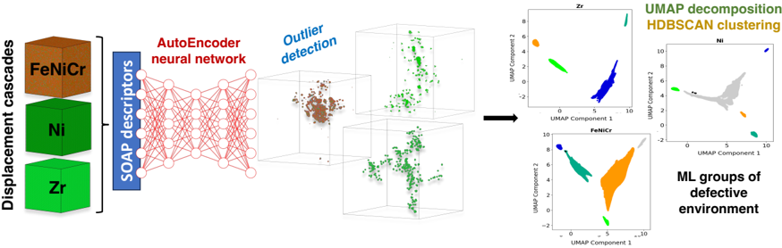
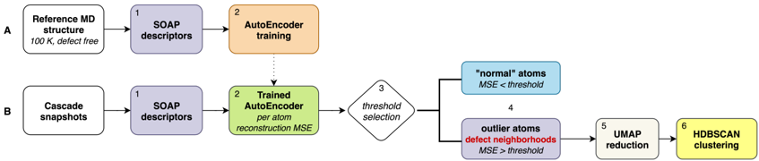
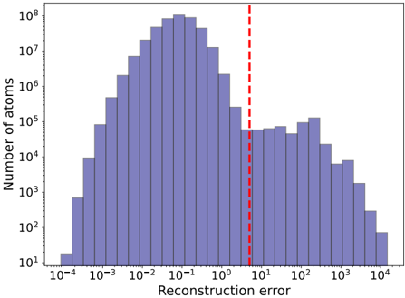
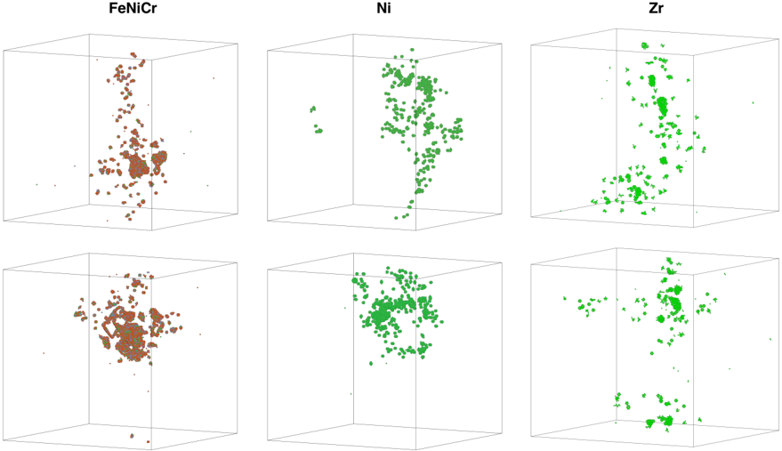
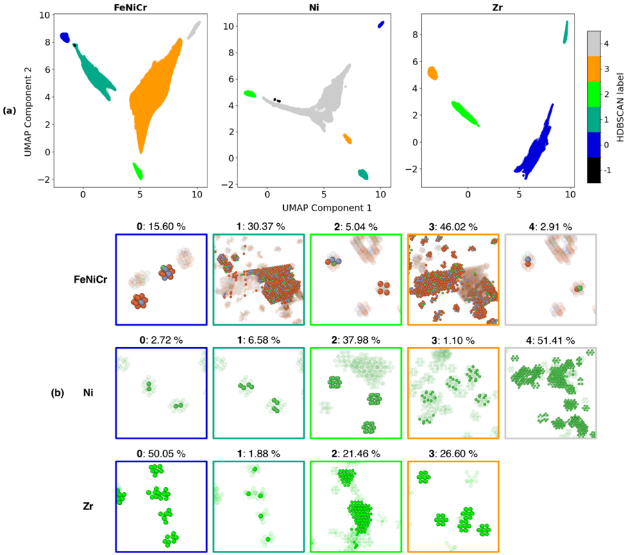
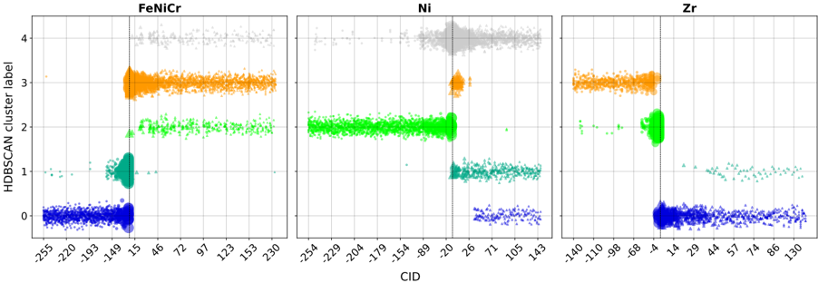
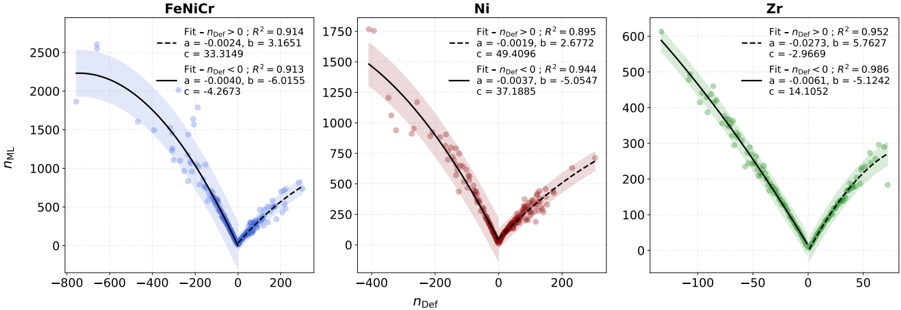
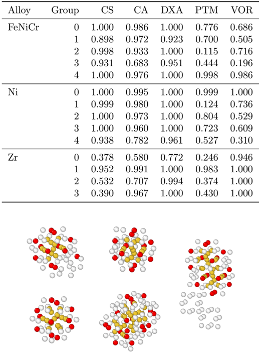

# Figuras extraídas

**Fuente:** `/media/admin/ALMACEN_GRANDE_1/ilovepappers/pappers/Autoencoder_SOAP_cascadas_FeNiCr_DelFre_2025.pdf`
**Total figuras:** 8

---

## FIG_001 · Picture · Página 1

**Caption:** _Sin caption_

---

## FIG_002 · Picture · Página 4

**Caption:** Figure 1: Schematic representation of the two branches workflow (A and B) for ML-assisted defect mapping described in section 2.2. SOAP descriptors are computed (A.1) for a defect-free MD reference structure (fcc or hcp depending the materials) to train an autoencoder neural network (A.2). For each cascade snapshot, SOAP descriptors are computed using the same parameters than the reference structure (B.1). Each SOAP vector then passed through the trained AE (B.2) for which a reconstruction error (MSE) threshold is selected (B.3) to classify atoms as inliers (MSE < threshold) or outliers forming defect neighbourhoods (MSE > threshold) based on the per-atom reconstruction error (B.4). Outlier atoms are then embedded with UMAP (B.5) and grouped with HDBSCAN (B.6) to yield unsupervised defect-type groups.

---

## FIG_003 · Picture · Página 5

**Caption:** Figure 2: Log-log histogram of per-atom reconstruction errors for the Ni dataset, obtained from the autoencoder-based analysis across multiple cascade simulations. The histogram is computed using logarithmically spaced bins, and the vertical axis is also plotted on a logarithmic scale to highlight variations across several orders of magnitude. The dashed vertical line indicates the selected threshold (5.0 in this case), which lies near an inflection in the distribution, separating low-error atoms from a high-error tail linked to defective environments.

---

## FIG_004 · Picture · Página 6

**Caption:** Figure 3: Example of outlier detection in FeNiCr (left), Ni (middle) and Zr (right) displacement cascades (step B.4, see Figure 1). Atoms whose auto-encoder reconstruction error is below 5.0 (fcc systems) or 2.0 (hcp system) are omitted from the view; only atoms flagged as outliers are shown in solid colors.

---

## FIG_005 · Picture · Página 7

**Caption:** Figure 4: (a) Two-dimensional UMAP projection of latent-space SOAP descriptors for outliers in FeNiCr, Ni and Zr systems, colored by HDBSCAN group labels. For FeNiCr and Ni, points labeled as -1 (black) represent samples that HDBSCAN did not assign to any group. Note that the HDBSCAN labels are assigned independently for each material, meaning that the same label in different systems does not necessarily correspond to the same type of defect pattern (b) Examples of representative atomic configurations associated with selected HDBSCAN groups from (a) (label -1 excluded), shown using the same color scheme. The relative size of each group, as a percentage of the outlier dataset, is also indicated. Transparent atoms represent outlier atoms associated to other HDBSCAN labels.

---

## FIG_006 · Picture · Página 9

**Caption:** Figure 5: Cluster-identification (CID, see section 3.2.1 for description) diagnostics for the HDBSCAN groups for one typical cascade for FeNiCr, Ni and Zr. For each material, the histogram displays the distribution of the variable CID = sign( n Def ) × DefID , where sign( n Def ) > 0 (triangles) denotes interstitialdominated clusters and sign( n Def ) < 0 (circles) denotes vacancy-dominated clusters. The vertical dotted line marks CID = 0 . The magnitude | CID | is inversely proportional to aggregate size: small | CID | corresponds to large clusters, large | CID | to small clusters and marker size is inversely proportional to | CID | . Hence, points far to the right represent small interstitial defects, whereas points far to the left correspond to small vacancy defects; values near the origin indicate the largest aggregates of either type. Bars are coloured according to the HDBSCAN labels defined in Fig. 4(a).

---

## FIG_007 · Picture · Página 10

**Caption:** Figure 6: Correlation between the number of outlier atoms per cluster ( n ML , as identified by the machine learning approach) and the number of defects ( n Def ) within each cluster for the three materials, with n Def defined as the signed sum of defects (interstitial counted as +1 and vacancy as -1 ). Second-order polynomial fits are used to calibrate the relationship, enabling estimation of either the number of atoms or the number of defects in a cluster. Fits are performed separately for interstitial-rich ( n Def > 0 , dashed lines) and vacancy-rich ( n Def < 0 , solid lines) clusters. Shaded regions indicate ± 2 σ confidence intervals. Fitted equations and corresponding R 2 values are shown in the legend, where a quantifies the quadratic contribution, b the linear contribution, and c the constant offset.

---

## FIG_008 · Picture · Página 14

**Caption:** Table 4: Recall of six conventional detectors for every ML-defined HDBSCAN label (noise group (label -1) omitted). Each value is the fraction of ML-flagged atoms in the group that the detector also classifies as outliers.
