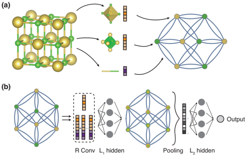
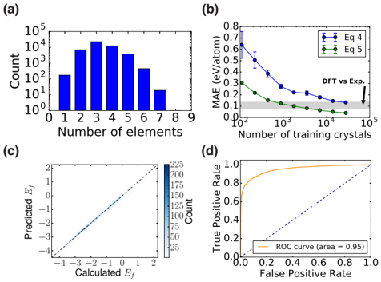
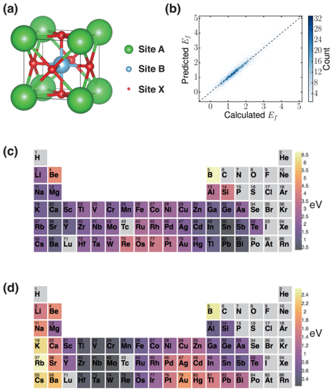
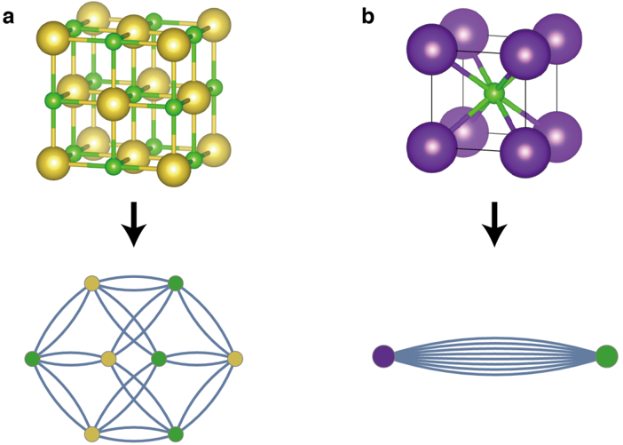
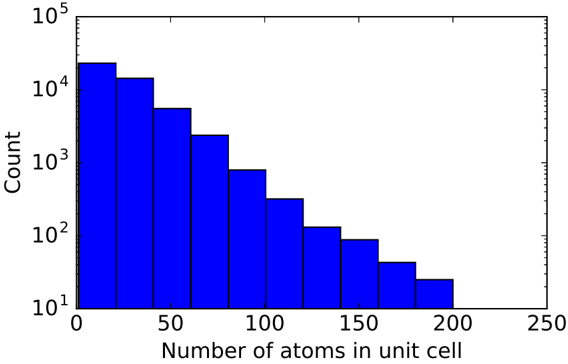
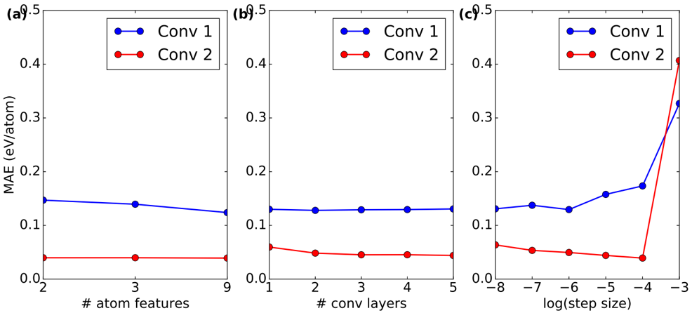
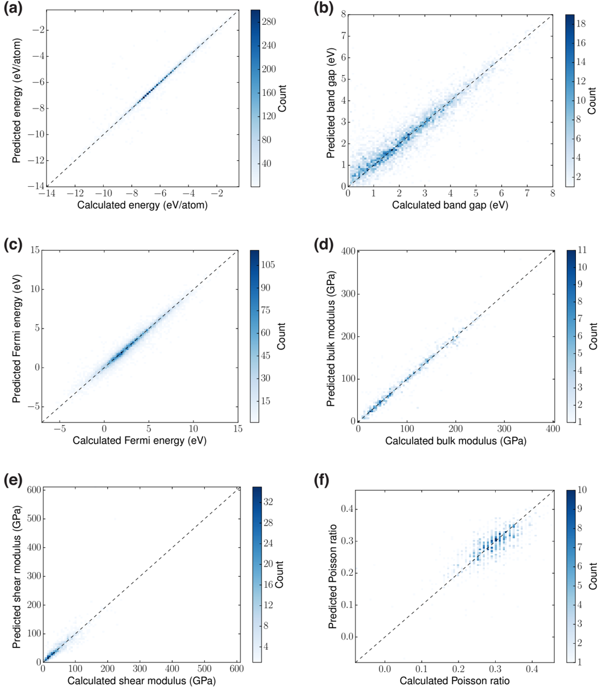
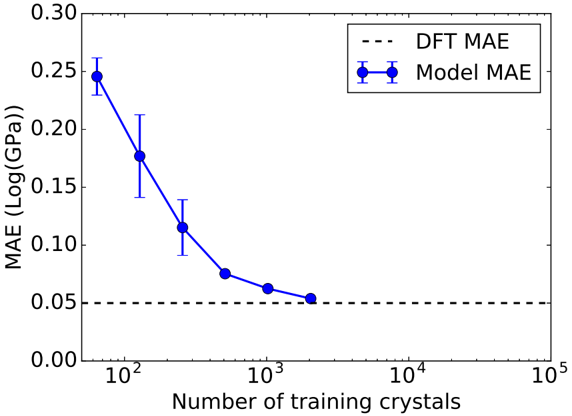
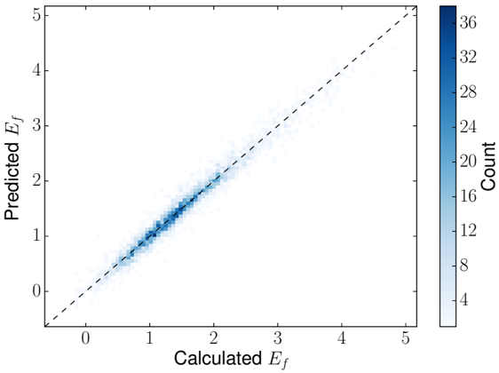

# Figuras extraídas

**Fuente:** `/media/admin/ALMACEN_GRANDE_1/ilovepappers/pappers/CGCNN_cristales_Xie_Grossman_2018.pdf`
**Total figuras:** 9

---

## FIG_001 · Picture · Página 1

**Caption:** FIG. 1. Illustration of the crystal graph convolutional neural network (CGCNN). (a) Construction of the crystal graph. Crystals are converted to graphs with nodes representing atoms in the unit cell and edges representing atom connections. Nodes and edges are characterized by vectors corresponding to the atoms and bonds in the crystal, respectively. (b) Structure of the convolutional neural network on top of the crystal graph. R convolutional layers and L 1 hidden layers are built on top of each node, resulting in a new graph with each node representing the local environment of each atom. After pooling, a vector representing the entire crystal is connected to L 2 hidden layers, followed by the output layer to provide the prediction.

---

## FIG_002 · Picture · Página 2

**Caption:** FIG. 2. The performance of CGCNN on the Materials Project database[11]. (a) Histogram representing the distribution of the number of elements in each crystal. (b) Mean absolute error (MAE) as a function of training crystals for predicting formation energy per atom using different convolution functions. The shaded area denotes the MAE of DFT calculation compared with experiments[18]. (c) 2D histogram representing the predicted formation per atom against DFT calculated value. (d) Receiver operating characteristic (ROC) curve visualizing the result of metal-semiconductor classification. It plots the proportion of correctly identified metals (true positive rate) against the proportion of wrongly identified semiconductors (false positive rate) under different thresholds.

---

## FIG_003 · Picture · Página 4

**Caption:** FIG. 3. Extraction of site energy of perovskites from total energy above hull. (a) Structure of perovskites. (b) 2D histogram representing the predicted total formation against DFT calculated value. (c, d) Periodic table with the color of each element representing the mean of the site energy when the element occupies A site (c) or B site (d).

---

## FIG_004 · Picture · Página 10

**Caption:** FIG. S1. The crystal structures and crystal graphs of NaCl (a) and KCl (b).

---

## FIG_005 · Picture · Página 10

**Caption:** FIG. S2. Histogram representing the distribution of the number of atoms in the primitive cells.

---

## FIG_006 · Picture · Página 11

**Caption:** FIG. S3. The effect of different hyperparameters on the validation mean absolute errors (MAEs). The blue points denotes models using convolution function Eq. 4, and the red points denotes models using Eq. 5. (a) Number of atom features. The 2 features include group number and period number, the 3 features additionally include electronegativity, and the 9 features include all properties in Table II. (b) Number of convolutional layers. (c) Logarithm of the step size.

---

## FIG_007 · Picture · Página 12

**Caption:** FIG. S4. 2D histogram visualizing the predictive performance of six properties. (a) Total energy per atom. (b) Band gap. (c) Fermi energy. (d) Bulk moduli. (e) Shear moduli. (e) Poisson ratio.

---

## FIG_008 · Picture · Página 13

**Caption:** FIG. S5. The MAE of predicted bulk modulus with respect to DFT values against the number of training crystals. The dashed line shows the MAE of DFT calculations with respect to experimental results [S24], which is 0.050 Log(GPa).

---

## FIG_009 · Picture · Página 13

**Caption:** FIG. S6. 2D histogram visualizing the performance of predicting formation energy of perovskites using a full pooling layer with Eq. 4 as the convolution function.
