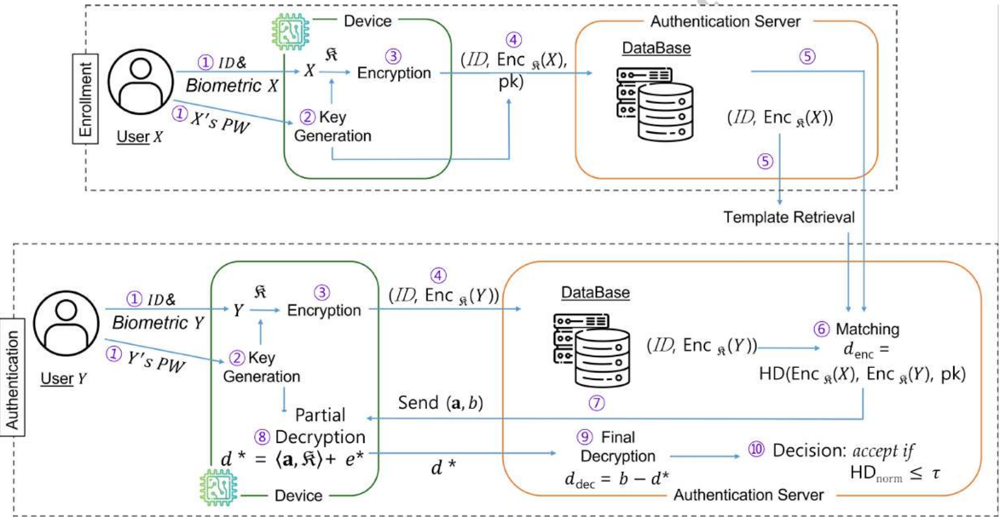
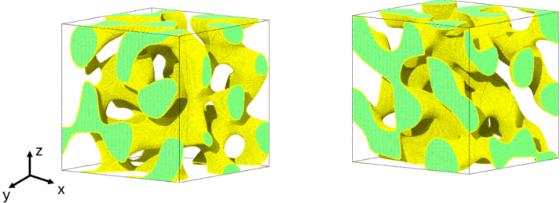
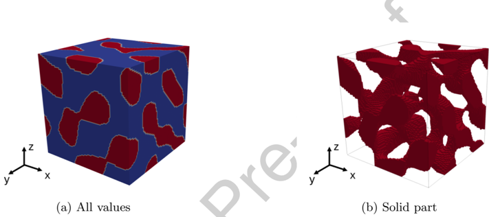
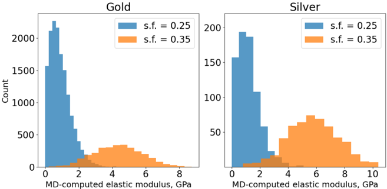
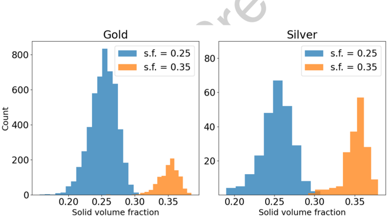
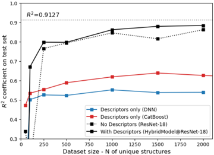
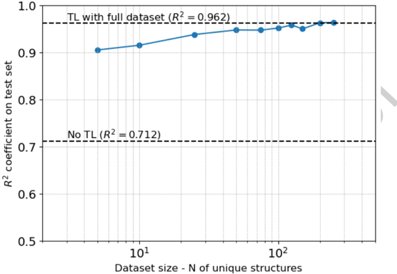
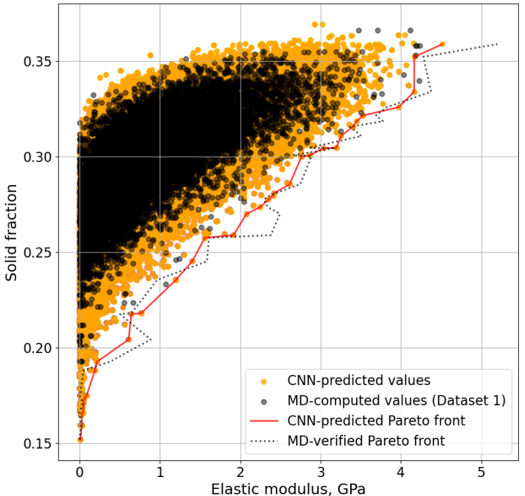

# Figuras extraídas

**Fuente:** `/media/admin/ALMACEN_GRANDE_1/ilovepappers/pappers/CNN3D_constantes_elasticas_nanoporosos_Zorkaltsev_2025.pdf`
**Total figuras:** 9

---

## FIG_001 · Picture · Página 1

**Caption:** _Sin caption_

---

## FIG_002 · Picture · Página 2

**Caption:** _Sin caption_

---

## FIG_003 · Picture · Página 8

**Caption:** Fig. 1 : Typical NPG structures with solid volume fraction of 0.25 (left) and 0.35 (right). (Color: Yellow - surface atoms and Green - FCC atoms).

---

## FIG_004 · Picture · Página 13

**Caption:** Fig. 2 : Nanoporous structure represented by a 3D binary array: (a) All values, (b) Solid part.

---

## FIG_005 · Picture · Página 14

**Caption:** Fig. 3 : Distributions of MD-computed elastic constants C ii in the datasets. Each nanoporous structure is represented by three elastic constant values.

---

## FIG_006 · Picture · Página 14

**Caption:** Fig. 4 : Distributions of as-built solid fraction in the datasets. Each nanoporous structure is represented by one solid fraction value.

---

## FIG_007 · Picture · Página 18

**Caption:** _Sin caption_

---

## FIG_008 · Picture · Página 20

**Caption:** Fig. 6 : R 2 test score as a function of fine-tuning structures number.

---

## FIG_009 · Picture · Página 22

**Caption:** Fig. 7 : CNN-predicted elastic modulus values of 100.000 NPG structures plotted against solid fraction, with MD-computed values from Dataset 1 as a reference.
