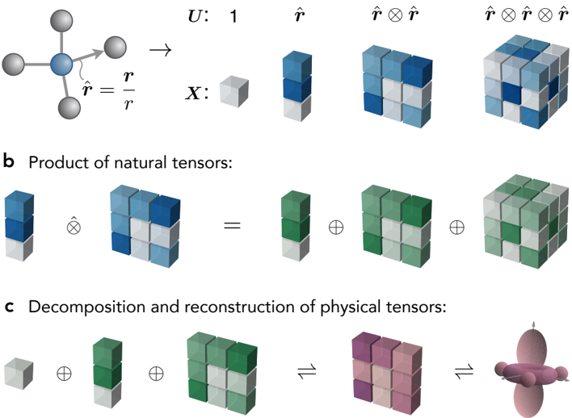
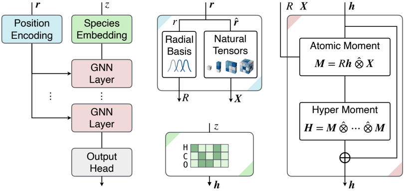
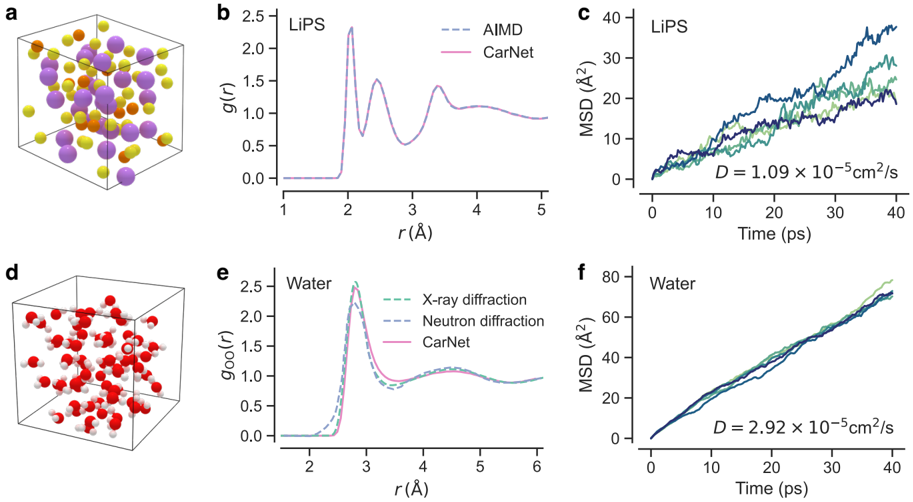
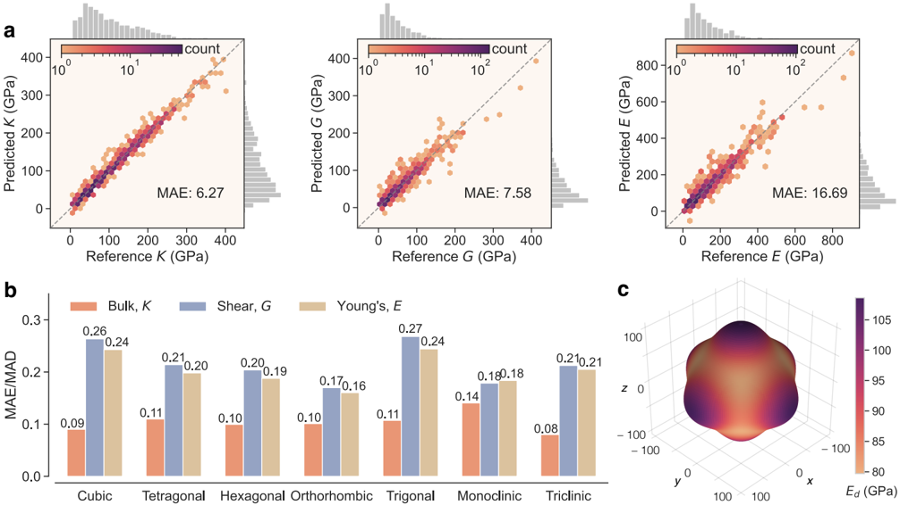
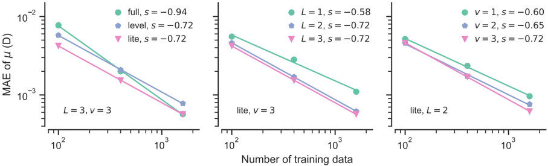

# Figuras extraídas

**Fuente:** `/media/admin/ALMACEN_GRANDE_1/ilovepappers/pappers/CarNet_tensores_cartesianos_Chen_2025.pdf`
**Total figuras:** 5

---

## FIG_001 · Picture · Página 3

**Caption:** FIG. 1. Schematic illustration of Cartesian natural tensor operations. a . Construction of natural tensors of different ranks from a unit vector ˆ r . b . Tensor product between a rank-1 and a rank-2 natural tensor generates three natural tensors of ranks 1, 2, and 3. c . Any physical tensor (e.g., the nuclear shielding tensor) can be decomposed into a set of natural tensors and, conversely, reconstructed from them. ⊗ is the product between ordinary tensors, ˆ ⊗ is the product between natural tensors, and ⊕ is the direct sum of natural tensors.

---

## FIG_002 · Picture · Página 4

**Caption:** FIG. 2. Overview of the CarNet model architecture. The relative distance vector r of an atom from its neighbor is encoded using a set of radial basis and natural tensors. The atomic species z is encoded using a learnable embedding to generate the initial atom features h . With the radial part R , the angular part X , and the atom features h , each GNN layer first constructs the atomic moment and then the hyper moment using natural tensor products. Finally, the atomic features are mapped to the target properties using an output head.

---

## FIG_003 · Picture · Página 5

**Caption:** FIG. 3. MD simulation results of bulk LiPS and water systems. a -c : Crystal structure, RDF, and MSD of Li + ions versus time of LiPS. d -f : Simulation cell, RDF of oxygen-oxygen pairs, and MSD versus time of bulk water. The MD simulations using CarNet were performed at a temperature of 520 K for LiPS and 300 K for water. The reference AIMD and experimental results are at the same temperatures, except for the X-ray diffraction data, which is at 295 K [42]. Five MD simulations with different initial velocities were performed, and the reported diffusion coefficients D are the average over these runs. The water cell in panel d is shown for demonstration; the actual MD simulation used a 2 × 2 × 2 replication of this cell. Simulation cells are plotted using AtomViz [43]. Atom colors: purple (Li), orange (P), yellow (S), red (O), and white (H). RDF: radial distribution function; MSD: mean square displacement.

---

## FIG_004 · Picture · Página 7

**Caption:** FIG. 4. Performance of CarNet in predicting elastic properties . a . Predicted bulk modulus K , shear modulus G , and Young's modulus E compared with reference DFT values (84 elements). b . Normalized error by crystal system. c . Directional Young's modulus E d of CaS predicted by the model. The cubic symmetry of rocksalt CaS is clearly reflected in the predicted E d . MAE is the mean absolute error, and MAD is the mean absolute deviation.

---

## FIG_005 · Picture · Página 8

**Caption:** FIG. 5. Learning curve for ethanol dipole moment determination. MAE in the dipole moment µ training as a function of the size of the training set for models with: a . tensor product mode 'full', 'level' and 'lite'; b . maximum tensor rank L = 1 , 2 , 3; c . maximum correlation degree v = 1 , 2 , 3. The slope s of each linearly fitted curve in log-log space is also reported.
