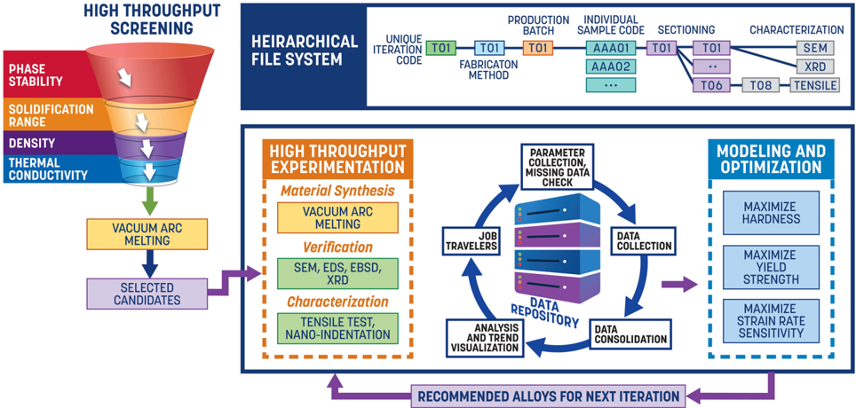
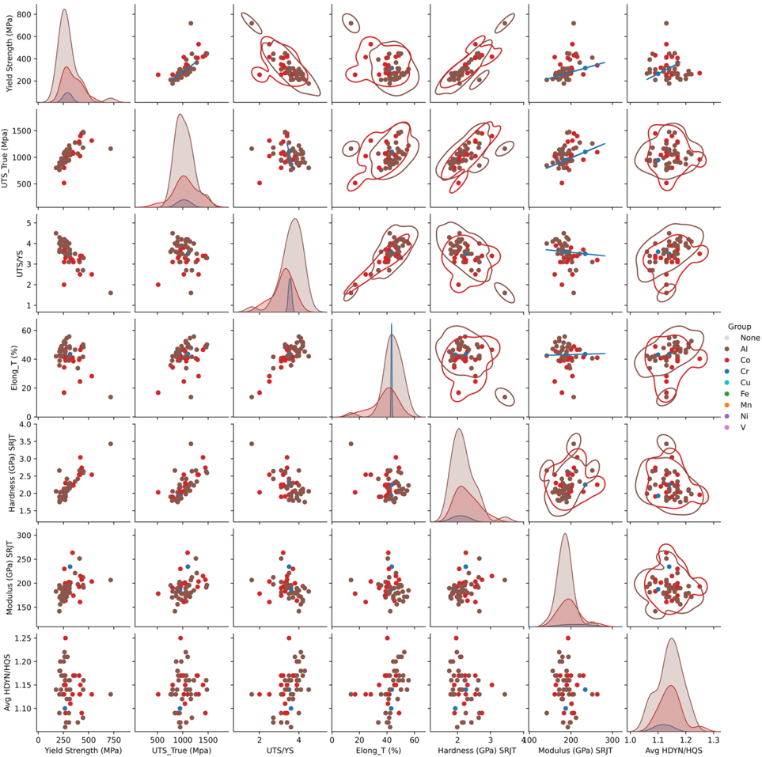
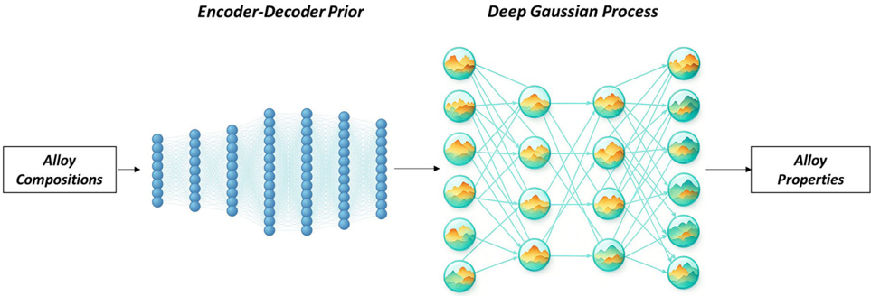
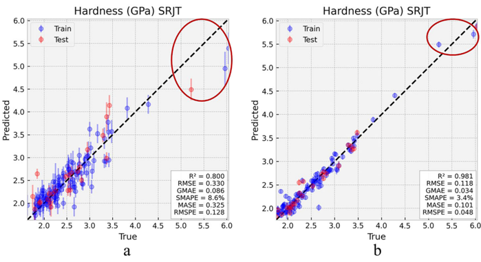
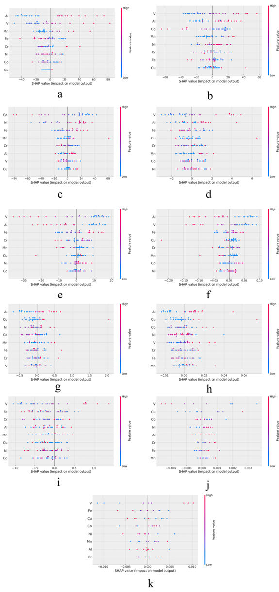
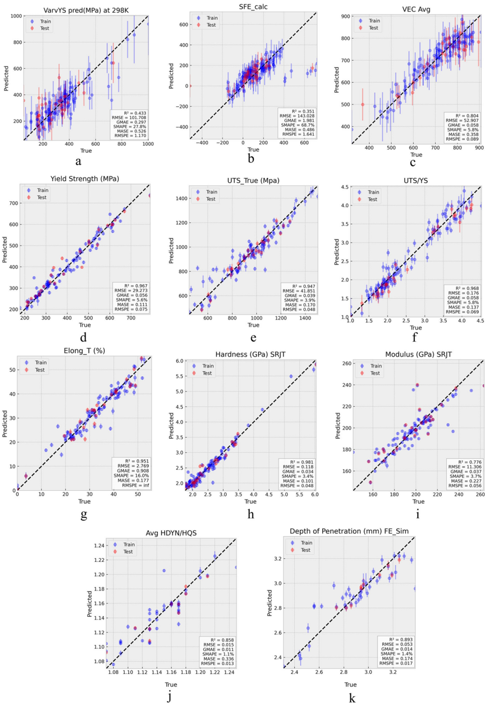
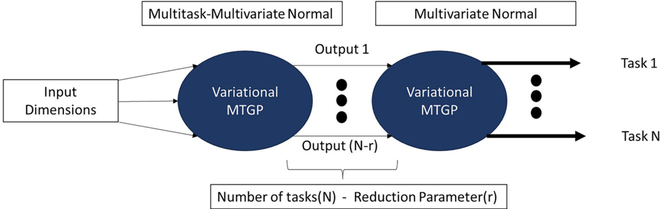
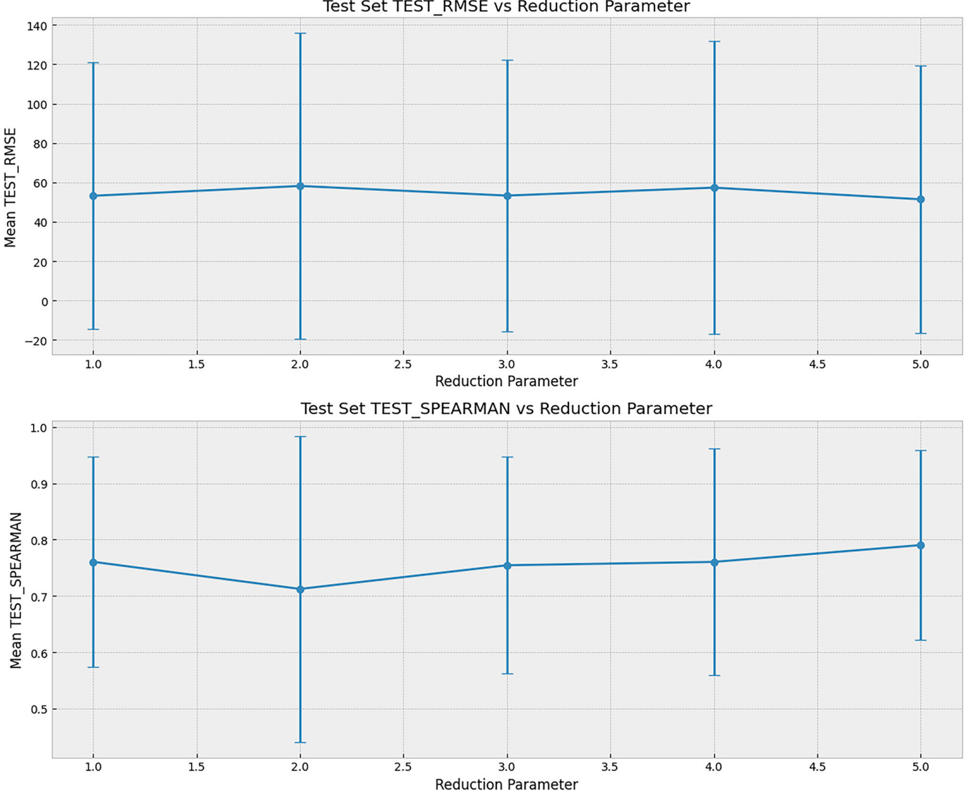

# Figuras extraídas

**Fuente:** `/media/santi/ALMACEN_GRANDE_1/ilovepappers/pappers/DGP_multitarea_HEA_Alvi_2025.pdf`
**Total figuras:** 11

---

## FIG_001 · Picture · Página 1

**Caption:** _Sin caption_

---

## FIG_002 · Picture · Página 1

**Caption:** _Sin caption_

---

## FIG_003 · Picture · Página 1

**Caption:** _Sin caption_

---

## FIG_004 · Picture · Página 3

**Caption:** Fig. 1 | Schematic overview of the BIRDSHOT data acquisition work fl ow. The dataset results from a multi-institutional effort combining alloy synthesis, mechanical testing across various strain rates (including nanoindentation, strain

---

## FIG_005 · Picture · Página 5

**Caption:** Fig. 2 | Pairwise plot illustrating correlations between different experimental properties. This plot shows pairwise relations between yield strength, ultimate tensile strength, ratio of ultimate tensile strength and yield strength, elongation, hardness, modulus and ratio of hardness under dynamic and quasi-static conditions.

---

## FIG_006 · Picture · Página 6

**Caption:** Fig. 3 | Schematic representation of the two-layered variational deep Gaussian process (DGP) architecture with encoder-decoder based prior injection. Each variational multi-task Gaussian process (MTGP) layer reduces dimensionality from input to latent representation, governed by the reduction parameter.

---

## FIG_007 · Picture · Página 9

**Caption:** Fig. 4 | The fi gure illustrates difference in fi tting performance for hardness between two DGP-all models. a Without prior injection, the points within the red circle are further from the actual value and b With prior injection, the points within the red circle tend to be closer to the actual value.

---

## FIG_008 · Picture · Página 10

**Caption:** _Sin caption_

---

## FIG_009 · Picture · Página 11

**Caption:** Fig. 6 | HDGP-P-All model results. a Predicted VarvYS at 298 K; b SFEcalculation; c AverageVEC; d Yield strength (MPa); e TrueUTS(MPa); f UTS/YSratio; g Elongation; h Hardness (GPa); i Modulus (GPa); j Average HDYN HQS; k Depth of penetration (mm).

---

## FIG_010 · Picture · Página 12

**Caption:** Fig. 7 | Schematic representation of the two-layered variational deep Gaussian process (DGP) architecture. Each variational multi-task Gaussian process (MTGP) layer reduces dimensionality from input to latent representation, governed by the reduction parameter.

---

## FIG_011 · Picture · Página 13

**Caption:** Fig. 8 | The fi gure illustrates RMSE and spearman rank coef fi cient for different reduction parameters. Figure at the top shows mean RMSE for test set over all tasks with respect to different reduction parameter for HDGP-NP-All. Bottom fi gure
