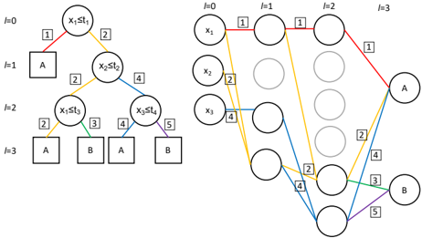
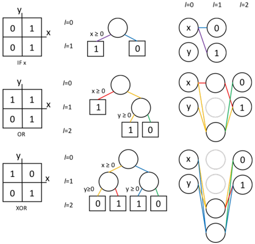
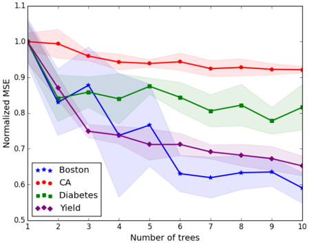
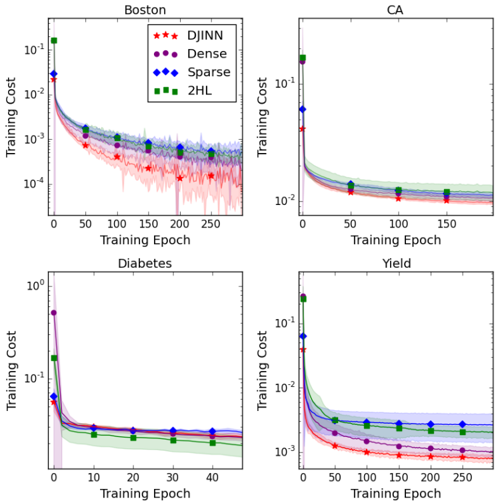
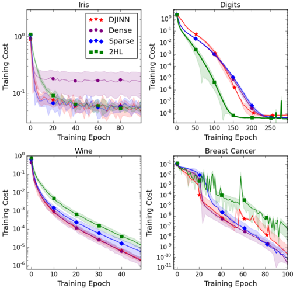

# Figuras extraídas

**Fuente:** `/media/santi/ALMACEN_GRANDE_1/ilovepappers/pappers/DJINN_init_redes_arboles_Humbird_2018.pdf`
**Total figuras:** 5

---

## FIG_001 · Picture · Página 3

**Caption:** Fig. 1. Illustration of the DJINN mapping for a simple decision tree. Gray neurons are initially unconnected; if biases are randomly initialized to negative values, the neurons cannot learn and are thus not included in the final DJINN architecture.

---

## FIG_002 · Picture · Página 4

**Caption:** Fig. 2. Truth tables, decision trees, and DJINN-initialized neural networks for logical operations IF(x), OR, and XOR. Decision paths in the tree are mapped to paths through the neural network, indicated by color. Gray neurons are initially unconnected; if biases are randomly initialized to negative values, the neurons cannot learn and are thus not included in the final DJINN architecture.

---

## FIG_003 · Picture · Página 5

**Caption:** Fig. 3. MSE (normalized to the MSE of one tree) as a function of the number of trees included in the DJINN ensemble for various regression datasets. The performance of the model improves as the number of trees is increased.

---

## FIG_004 · Picture · Página 7

**Caption:** Fig. 4. Cost (MSE for data scaled to (0,1)) as a function of training epoch for regression datasets. DJINN weights are observed to start at, and often converges to, a lower cost than the shallow network, or networks with DJINN architecture and other weight initialization techniques.

---

## FIG_005 · Picture · Página 8

**Caption:** Fig. 5. Cost (cross entropy with logits) as a function of training epoch for classification datasets.
