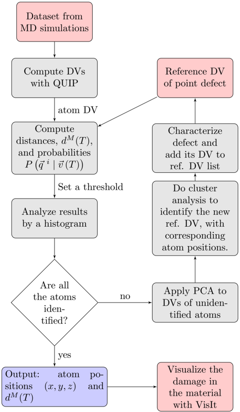
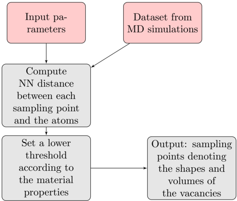
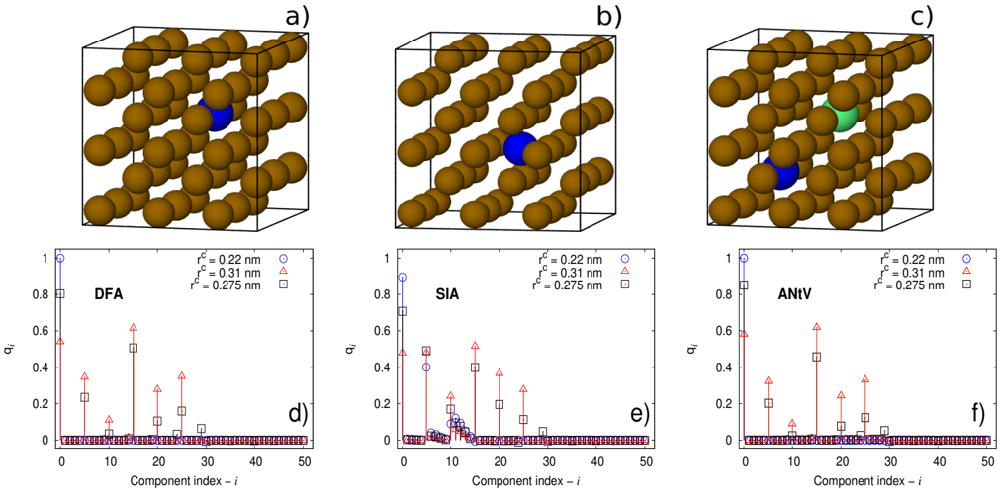
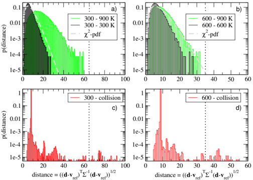
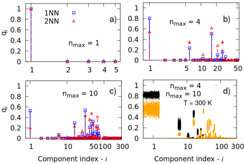
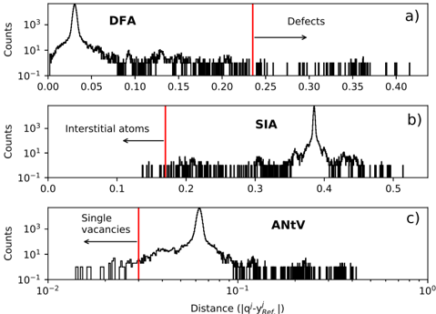
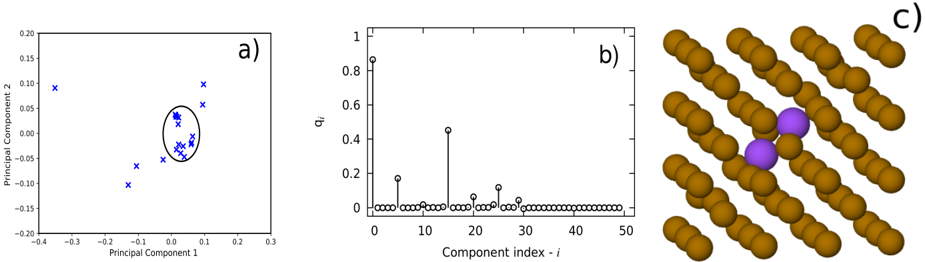
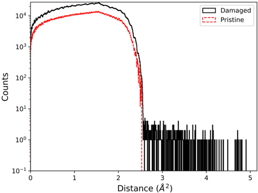
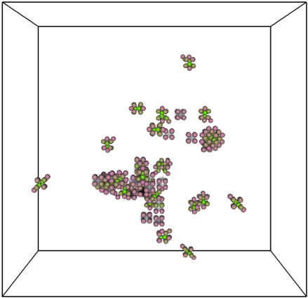

# Figuras extraídas

**Fuente:** `/media/santi/ALMACEN_GRANDE_1/ilovepappers/pappers/FaVAD_fingerprints_defectos_vonToussaint_2020.pdf`
**Total figuras:** 9

---

## FIG_001 · Picture · Página 4

**Caption:** Figure 1: Workflow for analyzing the damaged material sample by calculating the DV. Unclassified atoms are characterized by a principal component analysis (PCA), which defines its DV and geometry.

---

## FIG_002 · Picture · Página 4

**Caption:** Figure 2: Workflow for calculating vacancy spatial volume by computing nearest neighbours (NN) distance between numerical sampling points and the atoms locations.

---

## FIG_003 · Picture · Página 5

**Caption:** Figure 3: Fe geometries used to compute the reference DVs: A Fe atom depicted as a blue sphere represents an atom in a lattice position for the DFA classification (panel a), in an interstitial site (panel b) for the SIA, and next to a single vacancy (panel c) for the ANtV. A green sphere represents a vacancy in the lattice structure. Amplitudes of reference descriptor vectors as a function of their components are shown in panels d-f) for different values of the cutoff parameter r c .

---

## FIG_004 · Picture · Página 6

**Caption:** Figure 4: (Color on-line) Normalized distance distributions of the atom DVs with respect to the reference descriptor vectors for iron lattices at different temperatures. In panel a) the distributions with respect to a reference DV calculated for a lattice at 300 K is given. Displayed is the density for the atoms underlying the reference vector calculation, i.e. the distance distribution for a lattice at 300 K. As is indicated by the dashed line, this distribution follows closely the expected χ 2 -density (c.f. Eq.6 ). Panel a) shows also the distance density of a lattice at 900 K which reflects the effect of atomic thermal motion. The upper boundary of the density provides a good first guess for a reasonable distance threshold (highlighted by the vertical dotted line). In panel b) the same quantities are displayed, although this time with respect to the reference descriptor vector computed from a sample at 600 K. The lower two panels display the distance distribution of the iron sample after the collision cascade. There is a clear separation between the large majority of the atoms and a small fraction at larger distances. For more details please refer to the text.

---

## FIG_005 · Picture · Página 7

**Caption:** Figure 5: (Color on-line) DVs of the defect free atom (DFA) classification for different values of n max and two different cut-off-radii ( r c = 0 . 275 nm (labelled as 1NN) and r c = 0 . 31 nm (2NN). Beyond a certain n max the relative differences between the two representations of the two different density fields for the most pronounced vector components are decreasing, thus hampering the stability of the identification. At the same time the number of vector components increases combinatorically (please note the logarithmic scale on the abscissa).

---

## FIG_006 · Picture · Página 8

**Caption:** _Sin caption_

---

## FIG_007 · Picture · Página 9

**Caption:** Figure 7: (Color on-line) A principal component analysis is applied to the DVs of the unclassified atoms and the obtained results are shown in a). The DV of the unclassified atom is presented in b), which is found by performing a cluster analysis in a). The geometry of the unclassified atom is shown in panel c). Atoms in the new classification are represented by purple spheres, while lattice atoms are depicted as brown spheres.

---

## FIG_008 · Picture · Página 9

**Caption:** Figure 8: Comparison of the nearest distance distribution for a defect-free (pristine) sample and the damaged iron sample. The sampling grid had a lattice spacing of 0.0775 nm in each direction, corresponding to N = 200 3 sampling points. For each sample point the distance to the nearest atom is computed using a KD-tree algorithm which reduces the numerical effort from N 2 to N log N . The sharp cut-off of the distribution of the pristine sample at around 2.5 ˚ A 2 supports a threshold value slightly above, e.g. 3 ˚ A 2 . Sample points with distances to the nearest atom larger than this threshold are considered to be located at/near a vacancy site or in a void structure.

---

## FIG_009 · Picture · Página 10

**Caption:** Figure 9: Visualization of the damage in the material. Spheres correspond to Fe atoms, where each colour channel describes a different combination of d M for each defect classification. Cloud-like regions represent vacancies in the volume.
