# Figuras extraídas

**Fuente:** `/home/santi/Documentos/ilovepappers/pappers/libro.pdf`
**Total figuras:** 12

---

## FIG_001 · Picture · Página 1

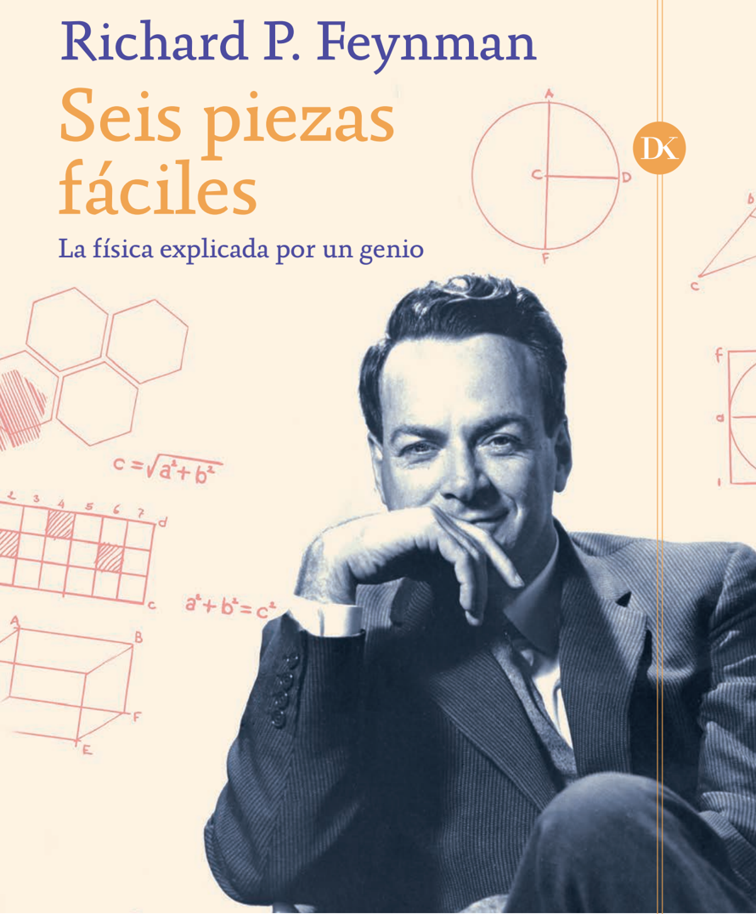

**Caption:** _Sin caption_

---

## FIG_002 · Picture · Página 2

**Caption:** _Sin caption_

---

## FIG_003 · Picture · Página 8

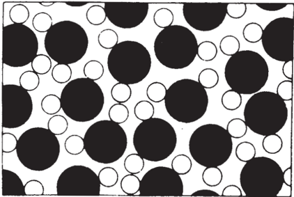

**Caption:** Agua ampliada mil millones de veces

---

## FIG_004 · Picture · Página 10

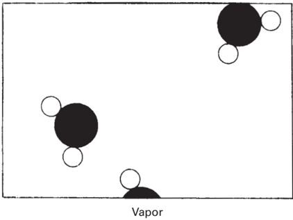

**Caption:** Figura 1.2.

---

## FIG_005 · Picture · Página 11

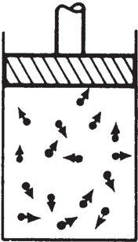

**Caption:** Figura 1.3.

---

## FIG_006 · Picture · Página 13

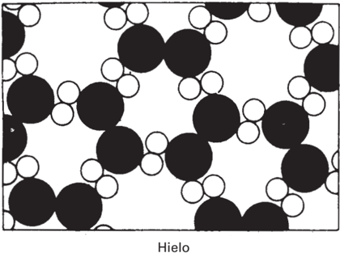

**Caption:** Figura 1.4.

---

## FIG_007 · Picture · Página 15

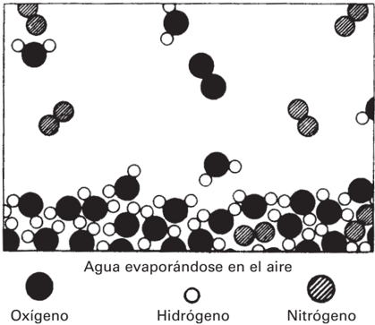

**Caption:** Figura 1.5.

---

## FIG_008 · Picture · Página 17

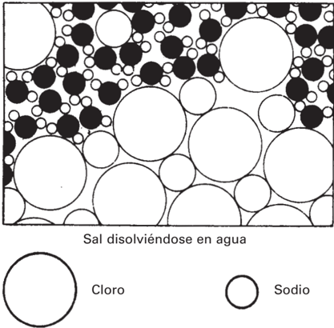

**Caption:** Figura 1.6.

---

## FIG_009 · Picture · Página 18

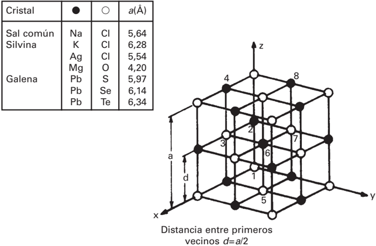

**Caption:** Figura 1.7.

---

## FIG_010 · Picture · Página 20

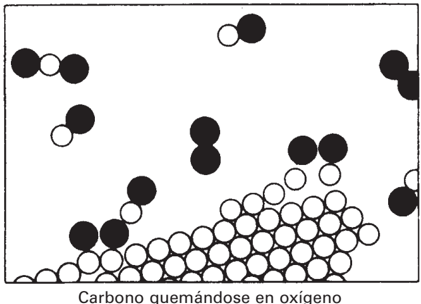

**Caption:** Figura 1.8.

---

## FIG_011 · Picture · Página 22

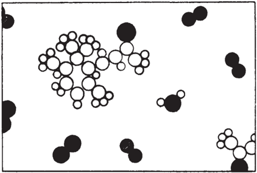

**Caption:** _Sin caption_

---

## FIG_012 · Picture · Página 23

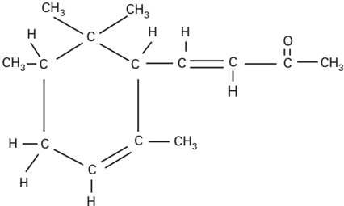

**Caption:** 1.10. La sustancia representada es α -irona.
