# Figuras extraídas

**Fuente:** `/media/santi/ALMACEN_GRANDE_1/ilovepappers/pappers/Fotocatalizadores_alternativos_TiO2_Hernandez_2009.pdf`
**Total figuras:** 15

---

## FIG_001 · Picture · Página 2

**Caption:** Silvia Surez

---

## FIG_002 · Picture · Página 2

**Caption:** Mara D : Hernndez -Alonso

---

## FIG_003 · Picture · Página 2

**Caption:** Juan M : Coronado

---

## FIG_004 · Picture · Página 2

**Caption:** Fernando Fresno

---

## FIG_005 · Picture · Página 3

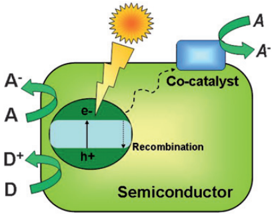

**Caption:** Fig. 2 Pictorial diagram showing the main events of photocatalysis over semiconductors.

---

## FIG_006 · Picture · Página 3

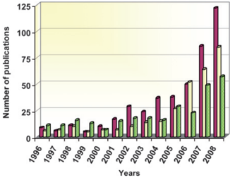

**Caption:** Fig. 1 Annual evolution of the number of publications devoted to photocatalysis with alternative materials to TiO2. ZnO ( ), sulfides ( ) and mixed oxides containing Nb, V, Ti or Ta ( ). Data source: ISI web of knowledge.

---

## FIG_007 · Picture · Página 4

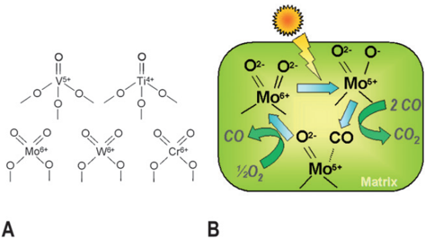

**Caption:** Fig. 3 Examples of single site photocatalytic centres (A), and pictorial diagram (B) showing the mechanism of CO photo-oxidation over singlesite photocatalysts with Mo centres. (Based on ref. 28).

---

## FIG_008 · Picture · Página 5

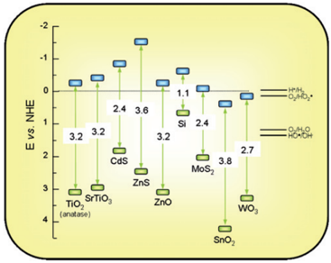

**Caption:** Fig. 4 Band gaps (eV) and redox potentials, using the normal hydrogen electrode (NHE) as a reference, for several semiconductors (Based on the data in ref. 8,10-12).

---

## FIG_009 · Picture · Página 5

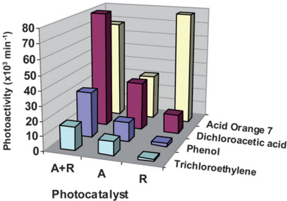

**Caption:** Fig. 5 Photoactivity expressed as the initial rate for the decomposition of three different pollutants in aqueous solution using different TiO2 commercial photocatalysts with the structures: anatase (A) supplied by Millenium, rutile (R), or a mixture of rutile and anatase (R + A; Degussa P25). Data taken from ref. 46.

---

## FIG_010 · Picture · Página 7

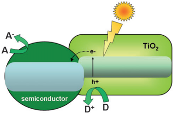

**Caption:** Fig. 6 Mechanism for charge separation on TiO2 coupled with a different semiconductor.

---

## FIG_011 · Picture · Página 8

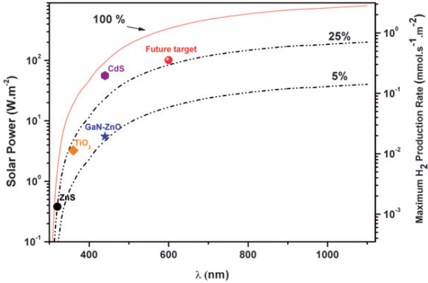

**Caption:** Fig. 7 Incident solar power as a function of the photons wavelength as obtained from the integration of the 1.5 AM reference spectrum 74 . Dashed lines represent the solar power accumulated at each wavelength considering photon efficiencies of 5% and 25%. The different symbol marks some of the current or future achievements of photocatalysis for H2 production using TiO2, ZnS, CdS or (Ga0.88Zn0.12)(N0.88O0.12) as photocatalyst. It should be noted that these values are significantly overestimated because total photon absorption is considered and consequently H2 production rates would be appreciably lower in practice.

---

## FIG_012 · Picture · Página 9

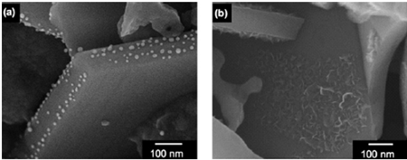

**Caption:** Fig. 8 SEM images of (a) Au and (b) NiO x loaded on BaLa4Ti4O15 photocatalysts by a photo-deposition method. (Reproduced from ref. 94).

---

## FIG_013 · Picture · Página 13

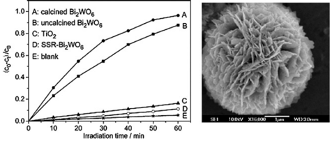

**Caption:** Fig. 9 Left panel: Photocatalytic degradation of aqueous rhodamine B over flower-shaped Bi2WO6 (A); uncalcined (B); TiO2 Degussa P25 (C); and solid-state synthesized Bi2WO6 (D). Right: SEM image of uncalcined hydrothermally treated Bi2WO6 superstructure. Figure adapted from ref. 143.

---

## FIG_014 · Picture · Página 16

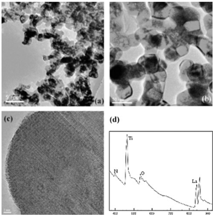

**Caption:** Fig. 10 Transmission electron micrographs of the oxynitride nanoparticles ammonolyzed at (a) 800  C and (b) 1000  C. In (c) a high resolution TEM image of the sample treated in NH3 at 800  C is shown. In (d) a typical electron energy loss spectrum clearly shows the presence of nitrogen in the crystallites. (Reproduced from ref. 177).

---

## FIG_015 · Picture · Página 22

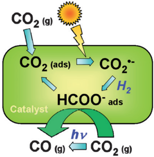

**Caption:** Fig. 11 Pictorial diagram showing the proposed mechanism of CO2 photoreduction, using either H2 or CH4 as the reductant, over MgO or ZrO2. From ref. 286-288
