# Figuras extraídas

**Fuente:** `/media/santi/ALMACEN_GRANDE_1/ilovepappers/pappers/Grafos_MD_silice_Gaigeot_PCCP_2025.pdf`
**Total figuras:** 22

---

## FIG_001 · Picture · Página 1

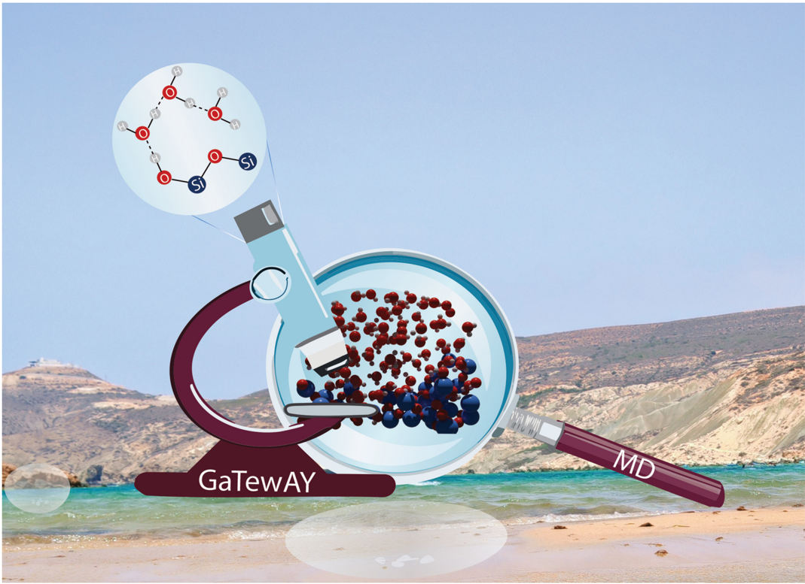

**Caption:** _Sin caption_

---

## FIG_002 · Picture · Página 1

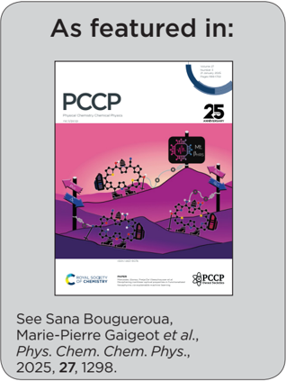

**Caption:** _Sin caption_

---

## FIG_003 · Picture · Página 1

**Caption:** _Sin caption_

---

## FIG_004 · Picture · Página 1

**Caption:** _Sin caption_

---

## FIG_005 · Picture · Página 1

**Caption:** _Sin caption_

---

## FIG_006 · Picture · Página 2

**Caption:** _Sin caption_

---

## FIG_007 · Picture · Página 2

**Caption:** _Sin caption_

---

## FIG_008 · Picture · Página 2

**Caption:** _Sin caption_

---

## FIG_009 · Picture · Página 2

**Caption:** _Sin caption_

---

## FIG_010 · Picture · Página 2

**Caption:** _Sin caption_

---

## FIG_011 · Picture · Página 3

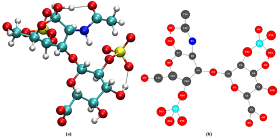

**Caption:** Fig. 1 Illustration of the passage from a 3D conformation (a) to a 2DMolGraph (b). (a) One snapshot in the 3D representation of the gas phase molecule (C14H20NO18S2) extracted from a MD trajectory. (b) Associated topological 2D-MolGraph. In the left panel, carbon atoms are represented in green, nitrogen atoms in blue, oxygen atoms in red, hydrogen atoms in light gray, and sulfur atoms in yellow. In the 2D MolGraph, the conventions are the following. Vertices are colored in dark gray, blue, red, and light blue, corresponding respectively to a carbon atom, nitrogen atom, oxygen atom, and sulfur atoms. Hydrogen atoms are not included in vertices, their knowledge is included only through directed arcs that represent hydrogen bonds. The edges are colored and represented in black lines for a covalent bond and in red dashed lines (arc) for hydrogen bonds, this latter edge being directed from the donor to the acceptor of the H-bond.

---

## FIG_012 · Picture · Página 4

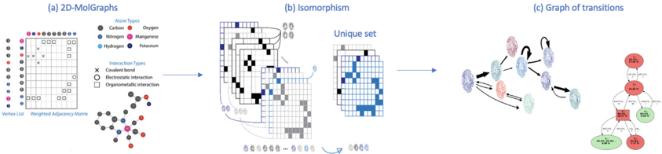

**Caption:** Fig. 2 Identification of conformations over a given MD trajectory, following the sequences of (a) the 2D-MolGraph representation of the 3D-structures (at each snapshot of the MD), (b) isomorphism tests (fingerprinting) of the calculated graphs, (c) generation of the complete graph network (the graph of transitions).

---

## FIG_013 · Picture · Página 5

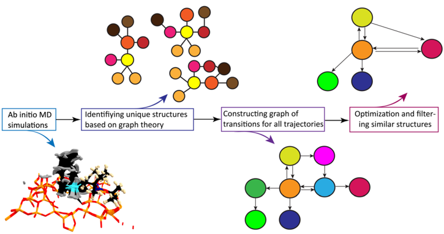

**Caption:** Fig. 3 The generalized workflow for the autonomous exploration of the organometallic catalyst active site.

---

## FIG_014 · Picture · Página 6

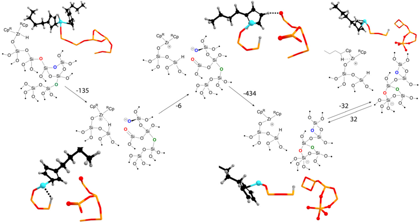

**Caption:** Fig. 4 The network of states of the silica-supported zirconocene hydride catalyst discovered with molecular dynamics and graph theory. ''RCp'' stands for n -butylcyclopentadienyl. In some 3D representations, the Cp in the front of the viewer is not shown for clarity.

---

## FIG_015 · Picture · Página 7

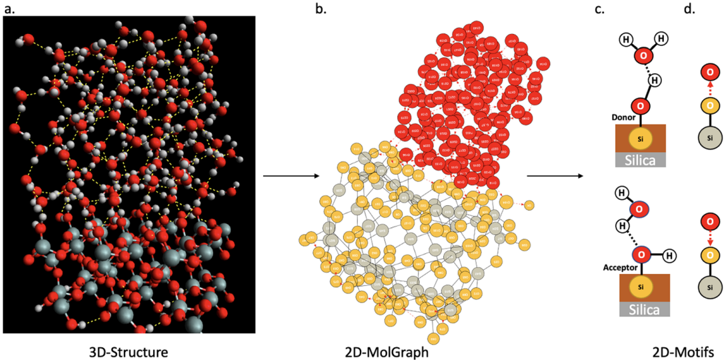

**Caption:** Fig. 5 Illustration of the passage from a 3D structure (a) to a 2D-MolGraph (b), to 2D-Motifs (c and d) schematically represented in (c) and with their associated 2D-MolGraphs in (d). The snapshot in (a) is a 3D representation of the (110)-quartz/liquid water interface taken from our ab initio MD simulation. Silicon atoms are in grey, oxygens in red, hydrogens in white. The associated 2D-MolGraph is reported in (b). By convention, oxygens of water are the red vertices, oxygens of the silica top-surface are the orange vertices, silicon atoms are the grey vertices. The atomistic schemes in (c) show two geometrical motifs that were extracted from the motif analysis: one motif (c-top) corresponds to an out-of-plane Si-OH at the top-surface of silica that is acting as a H-bond donor to a water molecule in the BIL, the second motif (c-bottom) is composed of an in-plane Si-OH at the top-surface of silica that is acting as a H-bond acceptor with a water molecule. The associated 2D-MolGraphs are respectively in d-top and d-bottom, see Section 2 for the definitions of vertices and edges in 2D-MolGraphs.

---

## FIG_016 · Picture · Página 8

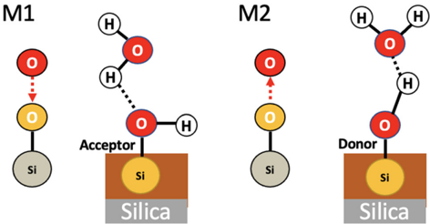

**Caption:** Fig. 7 Illustration of two 2-partner motifs that are recognized in the BIL of the (110)-quartz/liquid water interface. The chemical and geometrical compositions of the two motifs are schematized in the figure, the 2DMotif topological graphs associated with each motif are also reported. These 2D-Motif graphs are composed of 3 vertices (thus of size 3) and 2 edges (one edge for a covalent bond, one edge for a hydrogen bond). See Section 2 for more details on the definitions of our graphs. Motifs M 1 and M 2 are composed of one silanol (SiOH) and one water molecule. Motif M 1 (left) has its silanol acting as the acceptor of a hydrogen bond from a water molecule, while this silanol acts as the donor of H-bond to water in motif M 2 (right).

---

## FIG_017 · Picture · Página 8

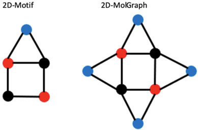

**Caption:** Fig. 6 Illustration of concepts for the coverage of occurrences of a given 2D-Motif (left) within a 2D-MolGraph (right). See text for details.

---

## FIG_018 · Picture · Página 9

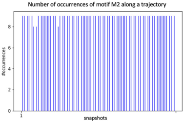

**Caption:** _Sin caption_

---

## FIG_019 · Picture · Página 9

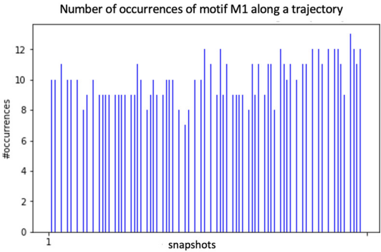

**Caption:** Fig. 8 Distribution of the number of occurrences/instances of the 2D-Motifs M 1 (left) and M 2 (right) for the set of 2D-MolGraphs/conformations/ snapshots analyzed over a 10 ps trajectory of the (110)-quartz/liquid water interface (analyses performed every 250 snapshots). See Fig. 7 for the description of the 2D-Motifs M 1 and M 2.

---

## FIG_020 · Picture · Página 9

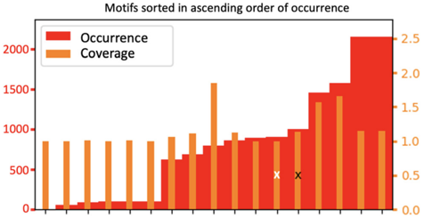

**Caption:** Fig. 9 Distribution of the number of occurrences and coverage rate between motifs of size 3 that contain at least one hydrogen bond and one oxygen atom of the surface, that are being recognized over the 100 conformations extracted from the (110)-quartz/liquid water interface trajectory. The black and white crosses respectively report the ranking of motif M1 and M2.

---

## FIG_021 · Picture · Página 10

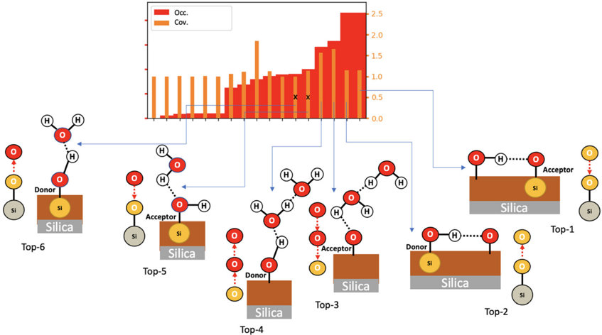

**Caption:** _Sin caption_

---

## FIG_022 · Picture · Página 11

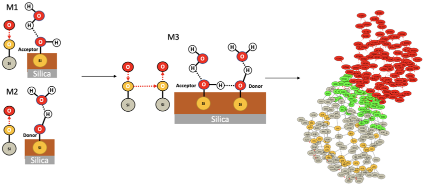

**Caption:** Fig. 11 Illustration of one 4-partner motif ( M 3) made of the union of two 2-partner motifs ( M 1 and M 2) that are H-bonded together through silanol    silanol. For one given snapshot taken randomly out of the 10 ps trajectory, the instances of M 3 found at the (110)-quartz/liquid water interface are reported through the green vertices of the 2D-MolGraph (right side).
