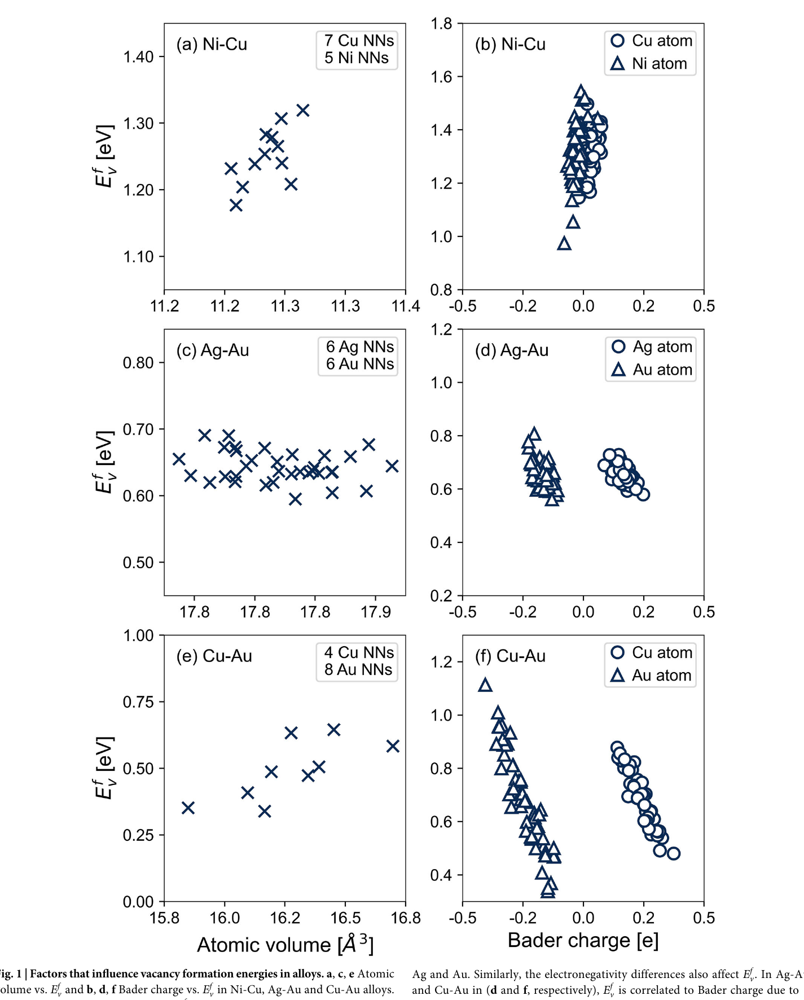
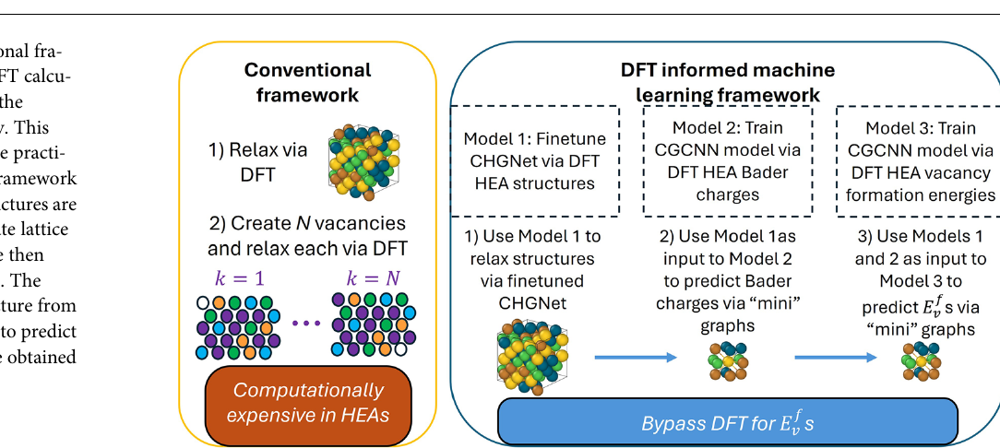
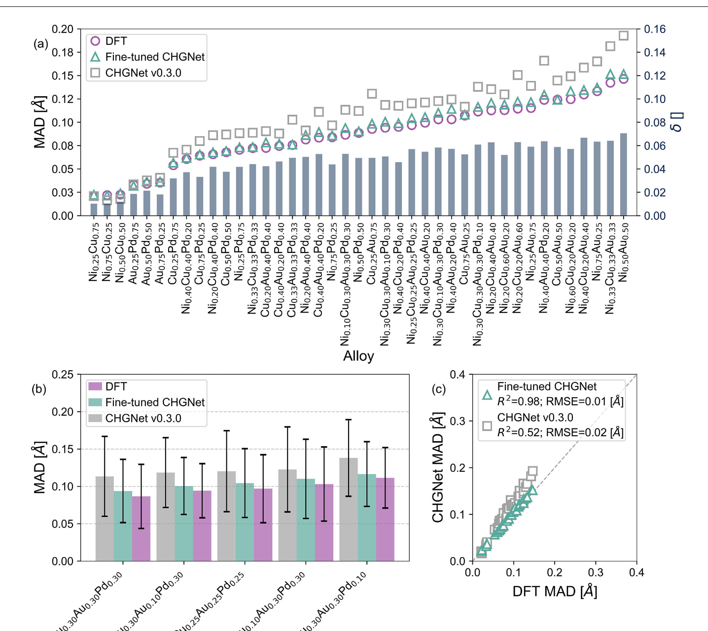
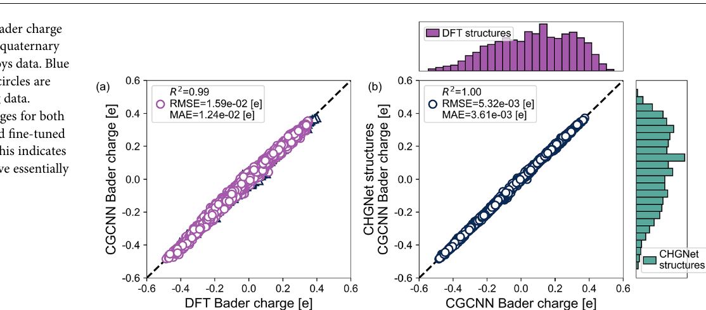
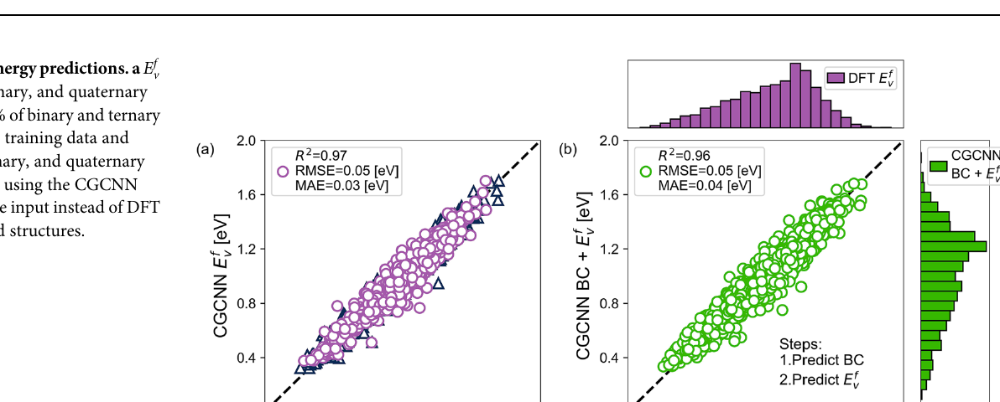
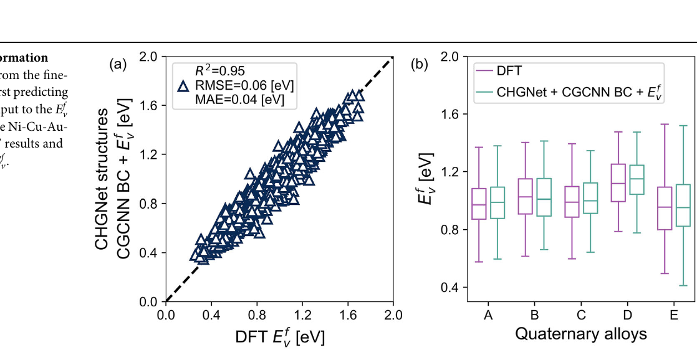
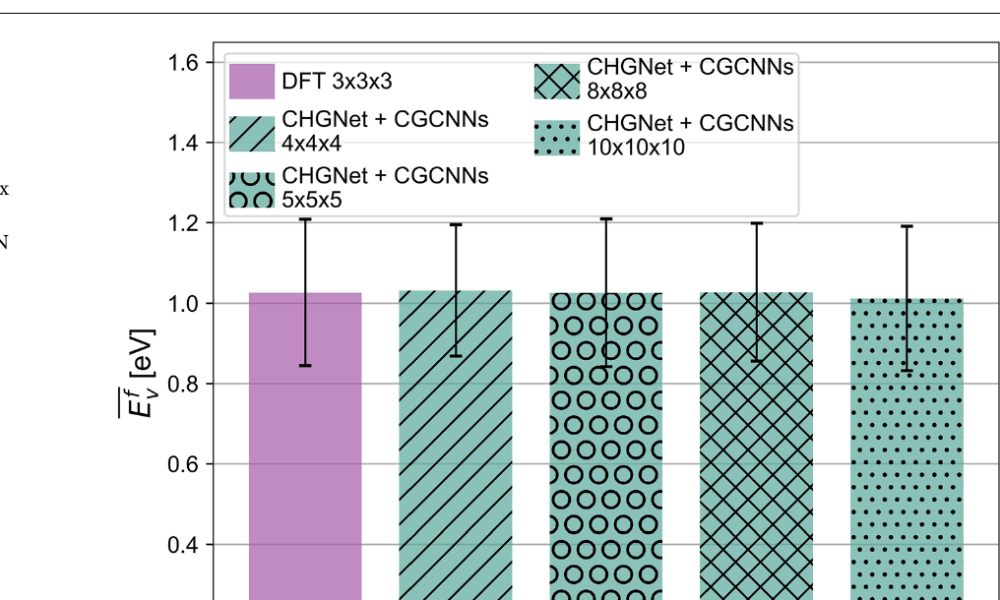
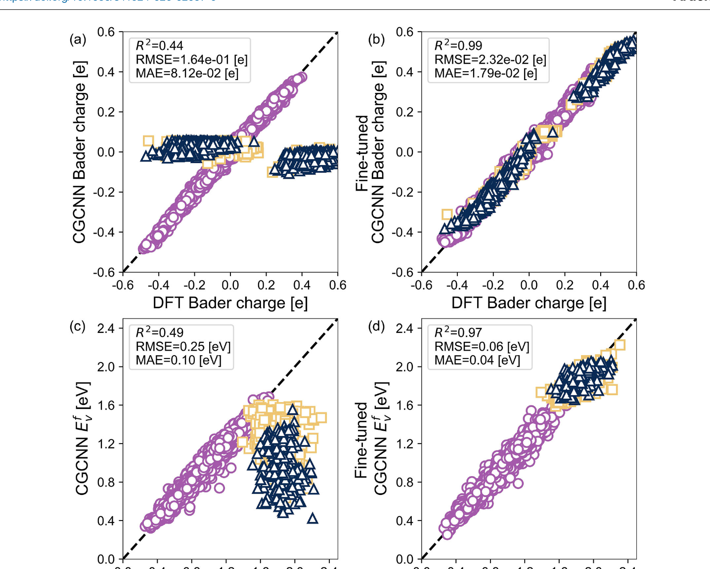

# Figuras extraidas (captions en espanol)

**Fuente:** `/home/santi/Documents/ilovepappers/pappers/Linton.pdf`
**Total figuras:** 8

---

## FIG_001 · Picture · Pagina 3

**Caption:** Figura 1 | Factores que influyen en las energias de formacion de vacancias. a, c, e Volumen atomico vs. E_v^f y b, d, f carga de Bader vs. E_v^f en aleaciones Ni-Cu, Ag-Au y Cu-Au. En Ni-Cu y Cu-Au (a, e) E_v^f aumenta con el volumen atomico; en Ag-Au (c) no hay correlacion por volumenes similares. Las diferencias de electronegatividad correlacionan E_v^f con la carga de Bader en Ag-Au y Cu-Au (d, f), pero no en Ni-Cu (b).

---

## FIG_002 · Picture · Pagina 4

**Caption:** Figura 2 | Marco del modelo. El marco convencional relaja el supercell con DFT y calcula E_v^f por vacancia (costoso en HEAs). El marco propuesto: CHGNet ajustado (Modelo 1) relaja estructuras, CGCNN predice cargas de Bader (Modelo 2) y E_v^f (Modelo 3) con mini-grafos, evitando la DFT.

---

## FIG_003 · Picture · Pagina 5

**Caption:** Figura 3 | Distorsion de red con CHGNet. a MAD (izq) y delta (der) para las 41 aleaciones; cuadrados CHGNet v0.3.0, triangulos CHGNet ajustado, circulos DFT. b MAD con desviacion estandar para las 5 cuaternarias. c MAD DFT vs CHGNet: el modelo ajustado mejora frente a v0.3.0 en las 41 aleaciones.

---

## FIG_004 · Picture · Pagina 6

**Caption:** Figura 4 | Predicciones de carga de Bader. a Cargas de Bader en binarias, ternarias y cuaternarias entrenando con 70% de binarias (triangulos: entrenamiento; circulos: prueba). b Cargas de Bader para estructuras relajadas con DFT (x) vs CHGNet ajustado (y): predicciones esencialmente identicas.

---

## FIG_005 · Picture · Pagina 6

**Caption:** Figura 5 | Predicciones de E_v^f. a E_v^f en todas las aleaciones entrenando con 80% de binarias y ternarias (triangulos: entrenamiento; circulos: prueba). b E_v^f usando cargas de Bader predichas por CGCNN como entrada en lugar de las de DFT.

---

## FIG_006 · Picture · Pagina 6

**Caption:** Figura 6 | Evitando la DFT para predecir E_v^f. a E_v^f desde CHGNet ajustado prediciendo primero las cargas de Bader y usandolas como entrada al modelo de E_v^f de la Fig. 5. b Diagramas de caja de E_v^f para las 5 aleaciones Ni-Cu-Au-Pd: DFT vs CHGNet + CGCNN BC + E_v^f.

---

## FIG_007 · Picture · Pagina 7

**Caption:** Figura 7 | Extension a supercells mayores. E_v^f promedio y desviacion para NiCuAuPd equiatomico: DFT en 3x3x3 (108 atomos) y predicciones en 4x4x4 (256), 5x5x5 (500), 8x8x8 (2048) y 10x10x10 (4000 atomos) con CHGNet ajustado, carga de Bader CGCNN y modelo de E_v^f CGCNN.

---

## FIG_008 · Picture · Pagina 8

**Caption:** Figura 8 | Ajuste fino y validacion en Ni-Co-Cr no vistas. Circulos morados: Ni-Cu-Au-Pd; cuadrados dorados: Ni0.50Co0.50, Ni0.75Cr0.25, Ni0.33Co0.33Cr0.33; triangulos azules: quasirandom y SRO (MPContribs). a/b Carga de Bader modelo base/ajustado. c/d E_v^f modelo base/ajustado: tras reentrenar con Ni-Co-Cr las predicciones (d) son precisas.
