# Figuras extraídas

**Fuente:** `/media/santi/ALMACEN_GRANDE_1/ilovepappers/pappers/MD_cascadas_CuNi_irradiacion_Wei_2025.pdf`
**Total figuras:** 30

---

## FIG_001 · Picture · Página 1

**Caption:** _Sin caption_

---

## FIG_002 · Picture · Página 1

**Caption:** _Sin caption_

---

## FIG_003 · Picture · Página 1

**Caption:** _Sin caption_

---

## FIG_004 · Picture · Página 1

**Caption:** _Sin caption_

---

## FIG_005 · Picture · Página 1

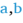

**Caption:** _Sin caption_

---

## FIG_006 · Picture · Página 1

**Caption:** _Sin caption_

---

## FIG_007 · Picture · Página 1

**Caption:** _Sin caption_

---

## FIG_008 · Picture · Página 1

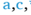

**Caption:** _Sin caption_

---

## FIG_009 · Picture · Página 2

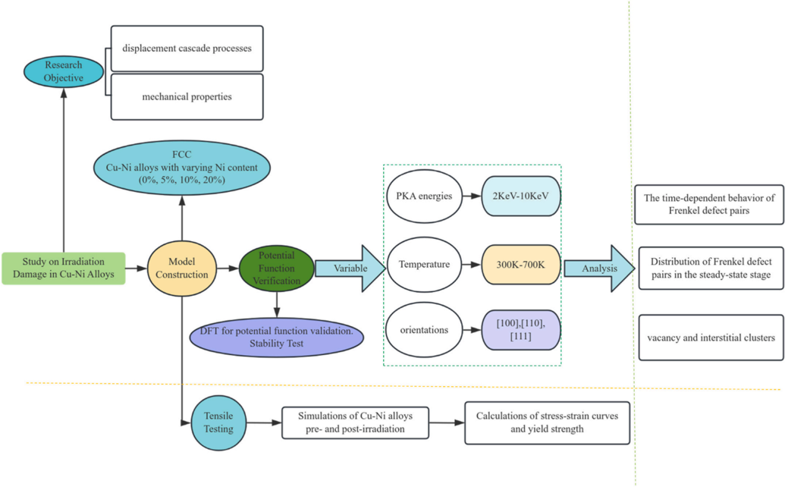

**Caption:** Fig. 1. Detailed flow chart of the simulation framework used in this study.

---

## FIG_010 · Picture · Página 3

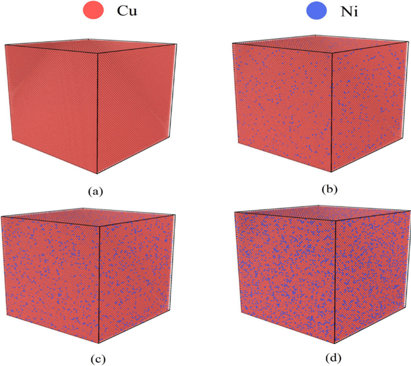

**Caption:** _Sin caption_

---

## FIG_011 · Picture · Página 5

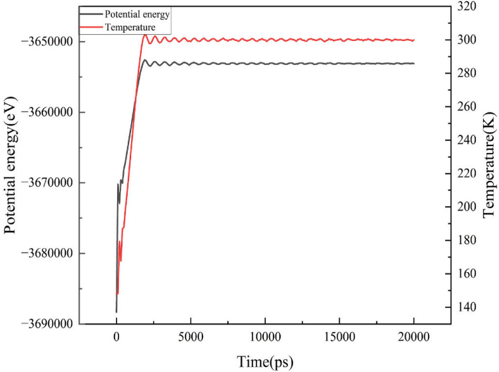

**Caption:** Fig. 3. Variations in the temperature and potential energy of the simulation system during the relaxation period.

---

## FIG_012 · Picture · Página 6

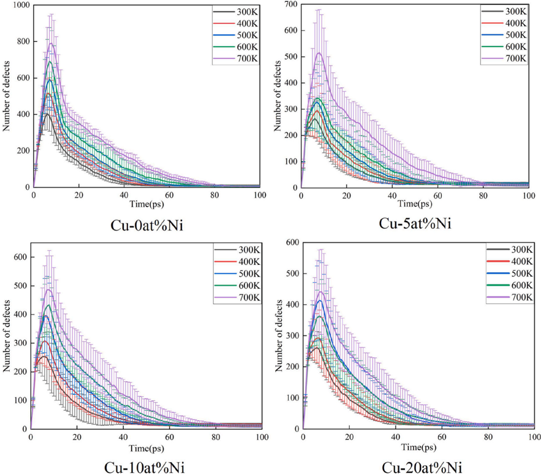

**Caption:** Fig. 4. The change of the Frenkel defect logarithm of (a) Cu- 0 at%Ni, (b) Cu-5at%Ni, (c) Cu-10at%Ni and (d) Cu-20at%Ni in the direction [100] with time at different temperatures and at PKA energy of 4 keV.

---

## FIG_013 · Picture · Página 6

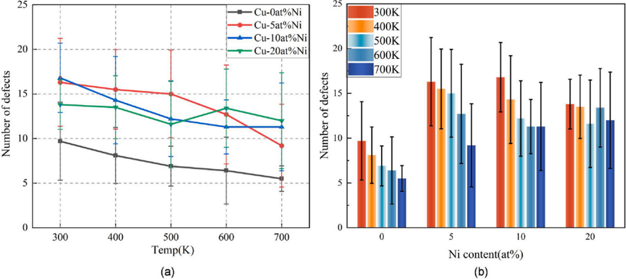

**Caption:** Fig. 5. Number of Frenkel defect pairs in Cu -Ni alloys during the stable stage at different temperatures. (a) Defect count as a function of temperature for Cu alloys with varying Ni contents. (b) Defect count at different temperatures for Cu -Ni alloys with varying Ni contents.

---

## FIG_014 · Picture · Página 7

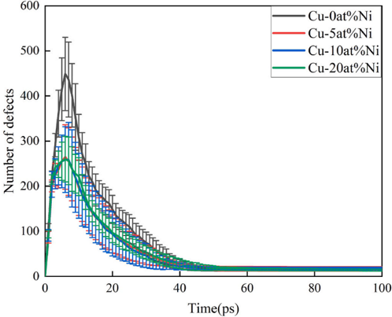

**Caption:** Fig. 6. The number of Frenkel defect pairs in Cu and Cu -Ni alloys changes over time with PKA energy of 4 keV along the [100] direction at 300 K.

---

## FIG_015 · Picture · Página 7

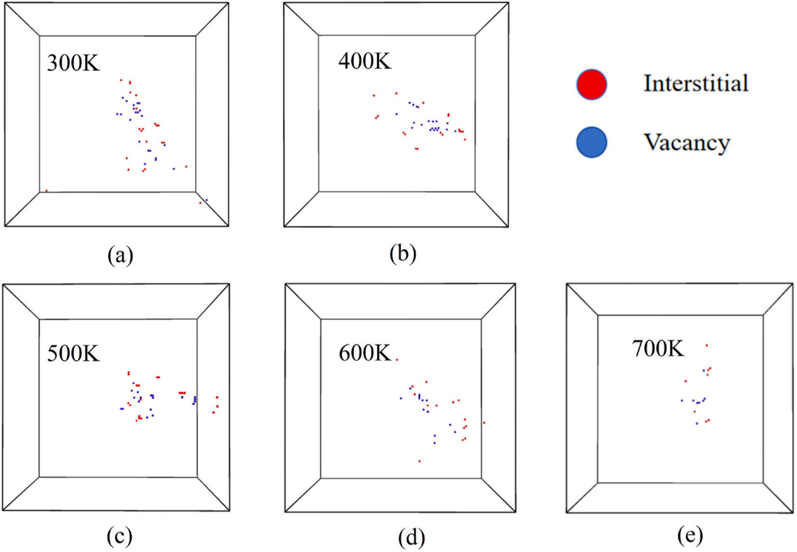

**Caption:** Fig. 7. The final distribution of Frenkel defect pairs(t = 100ps) in Cu-10at%Ni alloy at different temperatures with PKA energy of 4 keV and along the [100] direction, where red and blue circles represent interstitial atoms and vacancies, respectively.

---

## FIG_016 · Picture · Página 8

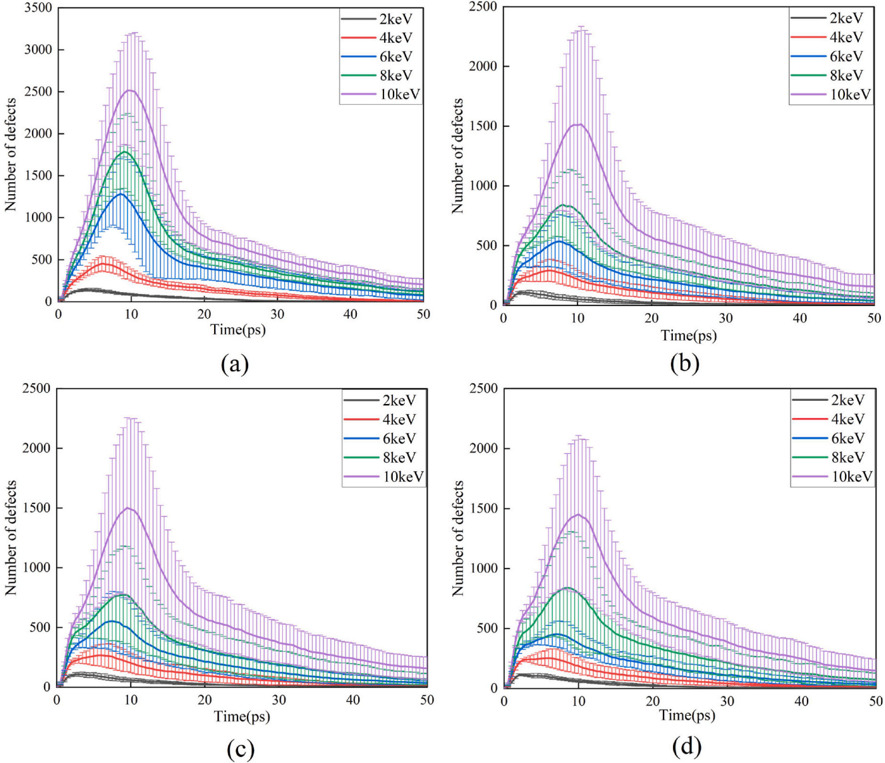

**Caption:** Fig. 8. The number of Frenkel defect pairs of (a) Cu-0at%Ni, (b) Cu-5at%Ni, (c) Cu-10at%Ni and (d) Cu-20at%Ni under different PKA energy irradiation changes with time at 300 K.

---

## FIG_017 · Picture · Página 8

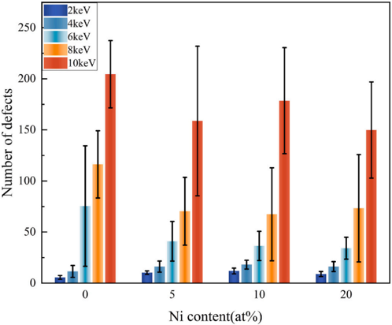

**Caption:** Fig. 9. The number of Frenkel defect pair(t = 50ps) as a function of Ni content with different PKA energies at 300 K.

---

## FIG_018 · Picture · Página 9

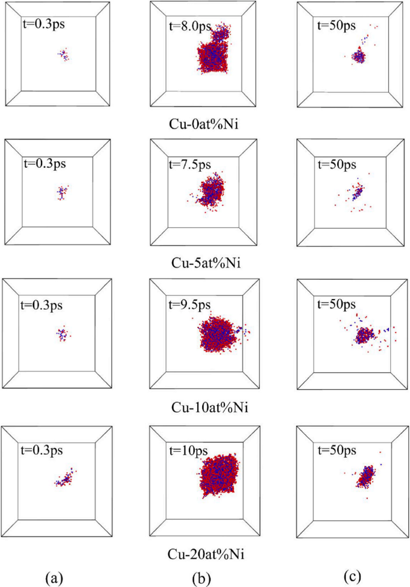

**Caption:** Fig. 10. The number of Frenkel defect pairs in Cu and Cu -Ni alloys at 300 K with a PKA energy of 10 keV along the [100] direction, (a) initial stage, (b) peak stage and (c) stable stage, where red and blue circles represent interstitial atoms and vacancies, respectively.

---

## FIG_019 · Picture · Página 10

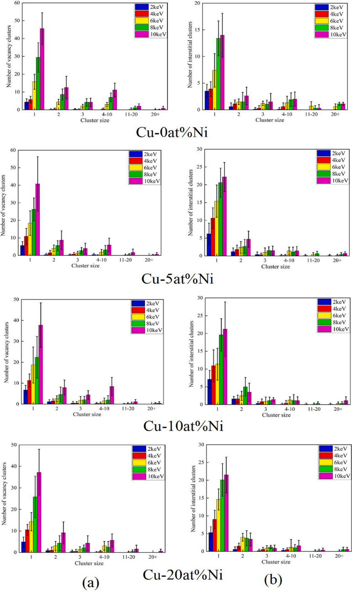

**Caption:** Fig. 11. (a) Vacant clusters and (b) interstitial clusters in Cu and Cu -Ni alloys during displacement damage process with different PKA energies along the [100] direction at 300 K.

---

## FIG_020 · Picture · Página 11

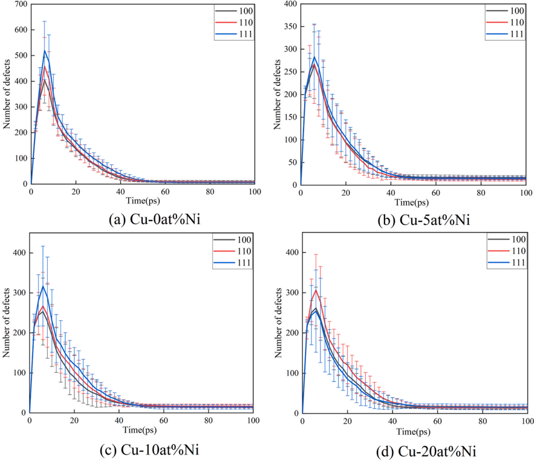

**Caption:** Fig. 12. The number of Frenkel defects in (a) Cu-0at%Ni, (b) Cu-5at%Ni, (c) Cu-10at%Ni and (d) Cu-20at%Ni varies with time when the PKA energy in different directions is 4 keV at 300 K.

---

## FIG_021 · Picture · Página 12

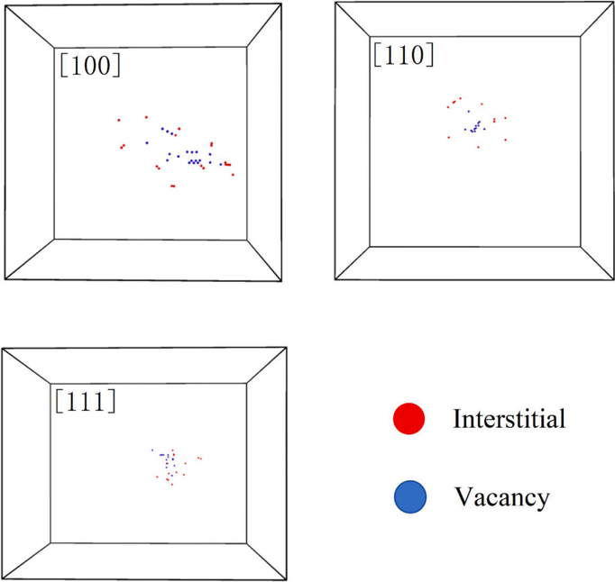

**Caption:** Fig. 13. The final distribution of the number of Frenkel defects(t = 100ps) in Cu-10at%Ni alloy with PKA energy of 4 keV at 300 K and along different directions, where red and blue circles represent interstitial atoms and vacancies, respectively.

---

## FIG_022 · Picture · Página 12

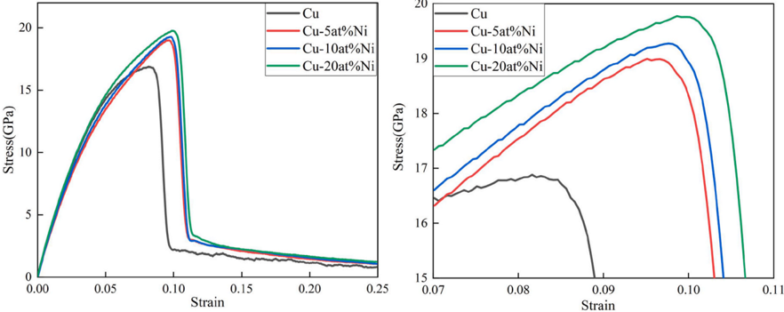

**Caption:** Fig. 14. (a) Stress-strain curves and (b) enlarged stress-strain curves around yield strength for Cu and Cu -Ni alloys at 300 K.

---

## FIG_023 · Picture · Página 13

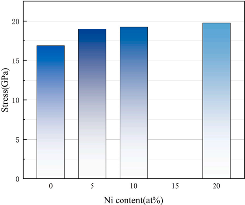

**Caption:** Fig. 15. The yield strength of Cu -Ni alloys changes with Ni content at 300 K.

---

## FIG_024 · Picture · Página 13

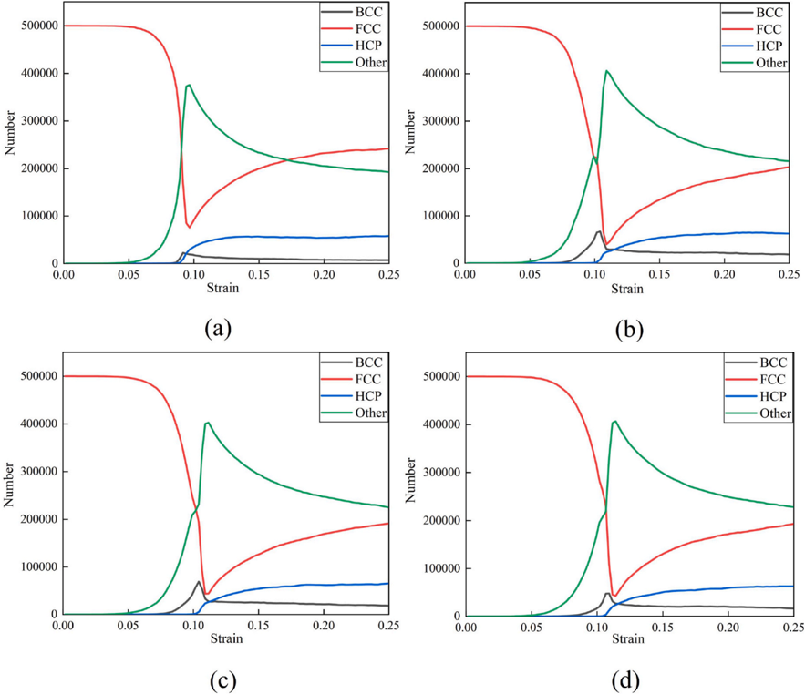

**Caption:** Fig. 16. Structural phase transitions observed in (a) Cu- 0 at%Ni, (b) Cu-5at%Ni, (c) Cu-10at%Ni and (d) Cu-20at%Ni during tensile deformation.

---

## FIG_025 · Picture · Página 14

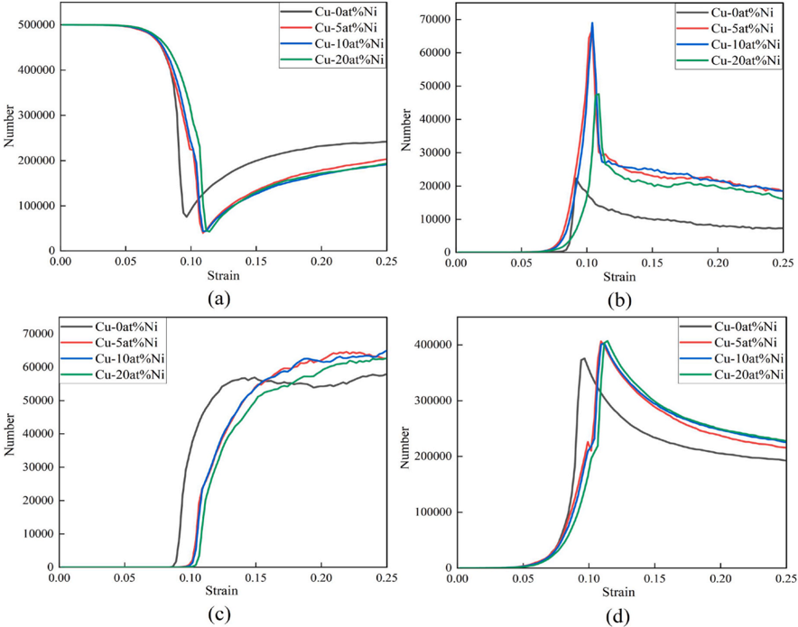

**Caption:** Fig. 17. Comparison of phase change structures of Cu and Cu -Ni alloys during the tensile process, where (a) FCC, (b) BCC, (c) HCP and (d) Other.

---

## FIG_026 · Picture · Página 15

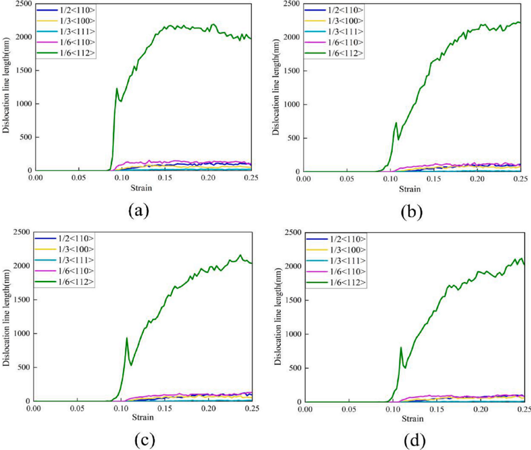

**Caption:** Fig. 18. The length of the dislocation line generated by (a) Cu-0at%Ni, (b) Cu-5at%Ni, (c) Cu-10at%Ni and (d) Cu-20at%Ni varies with strain during tensile process.

---

## FIG_027 · Picture · Página 16

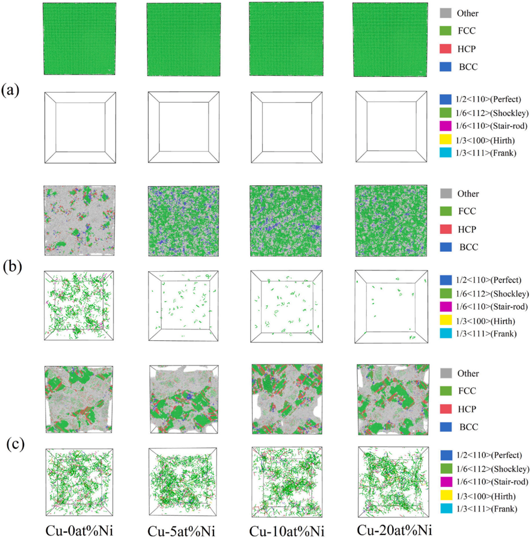

**Caption:** Fig. 19. The Microstructural diagrams of phase structure and dislocations produced in Cu and Cu -Ni alloys during tensile stretching, where (a) strain = 0.02 (b) strain = 0.09 (c) strain = 0.25.

---

## FIG_028 · Picture · Página 17

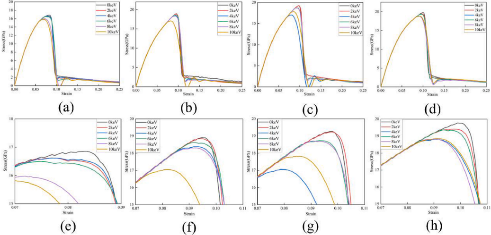

**Caption:** Fig. 20. Stress-strain curves of (a) Cu-0at%Ni, (b) Cu-5at%Ni, (c) Cu-10at%Ni and (d) Cu-20at%Ni after irradiation with different PKA energies in the direction [100] at 300 K, (e),(f),(g) and (h) are amplified corresponding graphs near the yield strength in (a), (b), (c) and (d), respectively.

---

## FIG_029 · Picture · Página 18

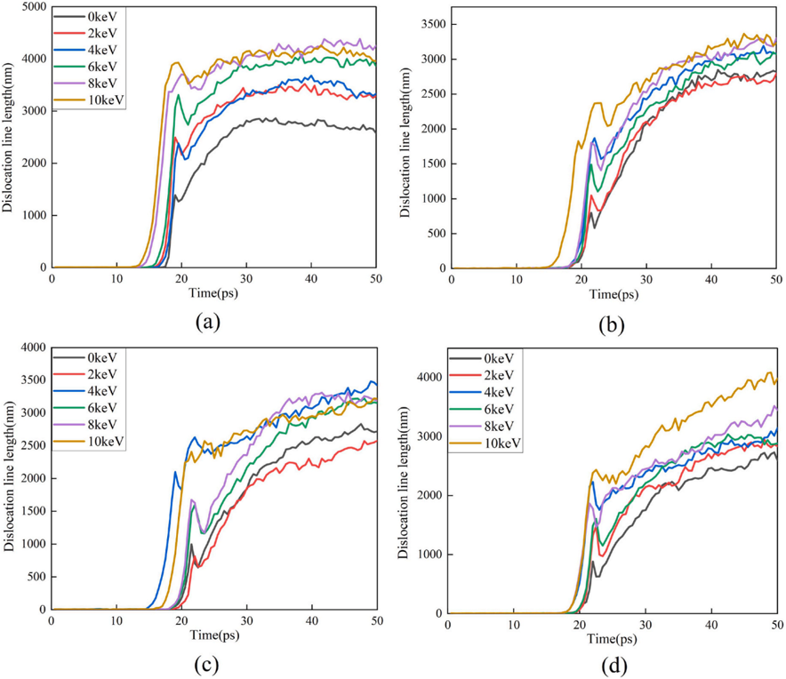

**Caption:** Fig. 21. The lengths of dislocation lines during the stretching of (a) Cu-0at%Ni, (b) Cu-5at%Ni, (c) Cu-10at%Ni and (d) Cu-20at%Ni under different PKA energy irradiations as a function of time.

---

## FIG_030 · Picture · Página 18

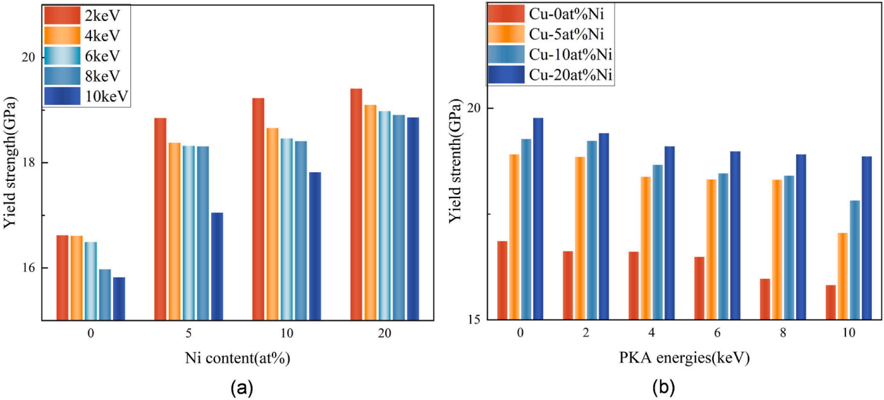

**Caption:** Fig. 22. Yield strength (GPa) of Cu and Cu -Ni alloys after 300 K irradiation with different PKA energies along the [100] direction. (a) Stress vs. Ni content for varying irradiation energies. (b) Stress vs. PKA energy for Cu alloys with different Ni contents.
