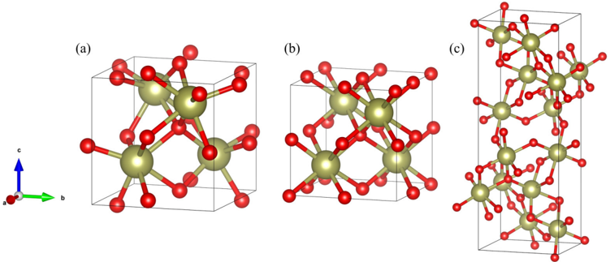
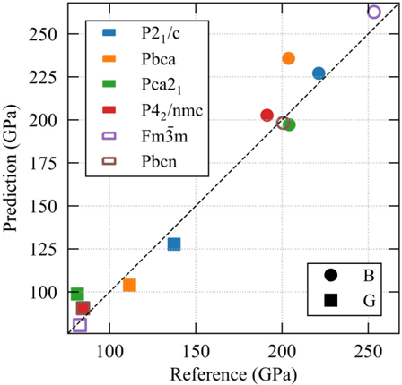
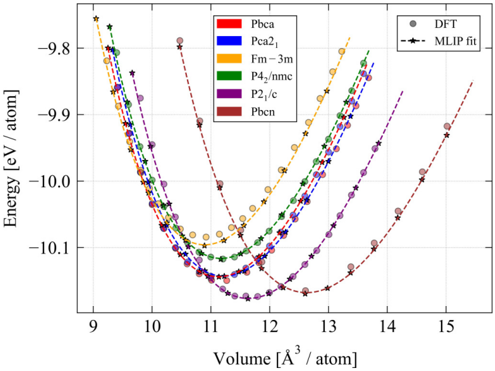
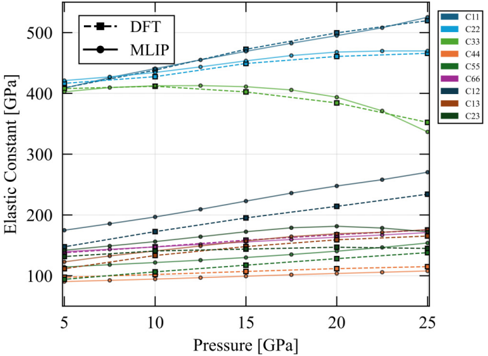
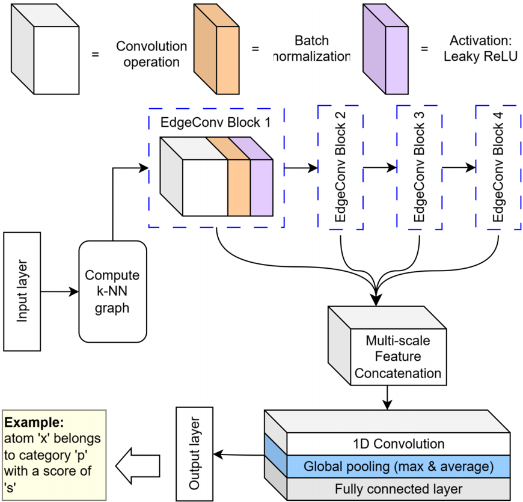
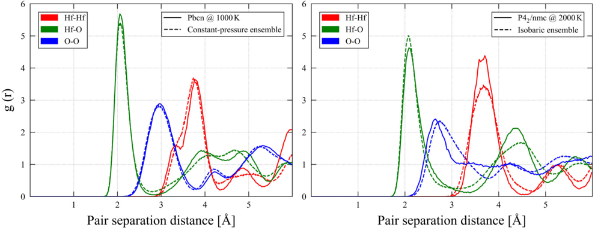
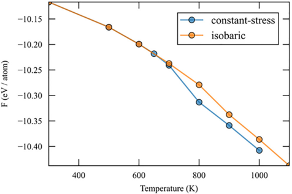
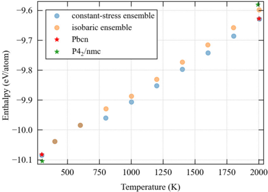
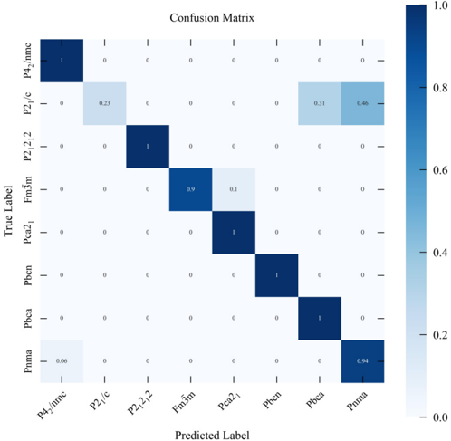
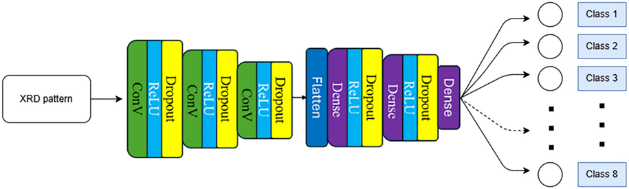

# Figuras extraídas

**Fuente:** `/media/santi/ALMACEN_GRANDE_1/ilovepappers/pappers/MLIP_HfO2_ferroelectrico_Kankanamalage_2026.pdf`
**Total figuras:** 11

---

## FIG_001 · Picture · Página 1

**Caption:** _Sin caption_

---

## FIG_002 · Picture · Página 3

**Caption:** FIG. 1. Crystal structures of different phases of HfO2: (a) Ferroelectric Orthorhombic ( Pca 21) phase, (b) Tetragonal ( P 42 / nmc ) phase, and (c) Orthorhombic ( Pbcn ) phase. Gold spheres represent Hf atoms, and red spheres represent O atoms. The Pca 21 phase exhibits a noncentrosymmetric structure with spontaneous polarization, while the P 42 / nmc and Pbcn phases are centrosymmetric and nonpolar. The Pbcn phase is considered the parent structure of Pca 21 connected through a soft polar mode [2], highlighting their structural relationship.

---

## FIG_003 · Picture · Página 4

**Caption:** FIG. 3. Predicted bulk modulus (B) and shear modulus (G) from the MLIP model compared against DFT reference values for six HfO2 polymorphs. All quantities were computed at 0 K and 0 GPa. DFT reference values are taken from Ref. [19]. The Pbcn and Fm ¯ 3 m phases-denoted by open symbols-were not included in the MLIP training dataset, showing the model's transferability to previously unseen structures.

---

## FIG_004 · Picture · Página 4

**Caption:** FIG. 2. Equations of state (energy vs volume) for HfO2 polymorphs: Pbca , Pca 21, Fm ¯ 3 m , P 42 / nmc , P 21 / c , and Pbcn . Circular markers show DFT reference data, while star markers indicate calculations from the developed MLIP. The third-order Birch-Murnaghan fits to the MLIP data are also shown as dashed curves. The close agreement between MLIP and DFT curves across all volumes highlights the MLIP's accuracy in reproducing the DFT equation of state. Note that Fm ¯ 3 m and Pbcn phases were not included in the training set.

---

## FIG_005 · Picture · Página 5

**Caption:** FIG. 4. Pressure dependence of the nine independent elastic constants Cij of the Pca 21 phase of HfO2. DFT results are shown as dashed lines with square markers, while MLIP predictions are solid lines with circle markers. Line colors identify each Cij component as listed in the right legend.

---

## FIG_006 · Picture · Página 6

**Caption:** FIG. 5. Schematic of the DGCNN architecture. The model constructs a k-nearest neighbor graph and processes it through four stages of edge-convolution operations. The outputs from these convolutional stages are merged, and only the maximum and average responses are pooled to create a descriptor of each atom's local environment. This descriptor is then used to assign each atom to its corresponding class.

---

## FIG_007 · Picture · Página 7

**Caption:** FIG. 6. Comparison of Radial distribution functions (RDFs)-Left: constant-stress ensemble and pure Pbcn phase, both at ∼ 1000 K and 0 GPa. Right: isobaric ensemble and pure P 42 / nmc phase, both at ∼ 2000 K and 0 GPa. The systems were first equilibrated for 120 ps, followed by time-averaging of the RDFs to ensure statistical reliability.

---

## FIG_008 · Picture · Página 9

**Caption:** _Sin caption_

---

## FIG_009 · Picture · Página 9

**Caption:** FIG. 7. Left: enthalpy of the system of the two ensembles as a function of temperature. The graph includes (marked with stars) systems containing pure P 42 / nmc and Pbcn phases as reference points. Right: Helmholtz free energy of the two ensembles at comparable temperatures.

---

## FIG_010 · Picture · Página 12

**Caption:** FIG. 8. Confusion matrix of the hold-out dataset for the model with input cluster size = 16.

---

## FIG_011 · Picture · Página 12

**Caption:** FIG. 9. No-pooling convolutional neural network (NPCNN) architecture. The input is the XRD pattern, and the output is the desired classification: eight space groups.
