# Figuras extraídas

**Fuente:** `/media/santi/ALMACEN_GRANDE_1/ilovepappers/pappers/ML_vacancias_difusion_HEA_Reimer_2025.pdf`
**Total figuras:** 29

---

## FIG_001 · Picture · Página 1

**Caption:** _Sin caption_

---

## FIG_002 · Picture · Página 1

**Caption:** _Sin caption_

---

## FIG_003 · Picture · Página 1

**Caption:** _Sin caption_

---

## FIG_004 · Picture · Página 1

**Caption:** _Sin caption_

---

## FIG_005 · Picture · Página 1

**Caption:** _Sin caption_

---

## FIG_006 · Picture · Página 1

**Caption:** _Sin caption_

---

## FIG_007 · Picture · Página 1

**Caption:** _Sin caption_

---

## FIG_008 · Picture · Página 1

**Caption:** _Sin caption_

---

## FIG_009 · Picture · Página 1

**Caption:** _Sin caption_

---

## FIG_010 · Picture · Página 1

**Caption:** _Sin caption_

---

## FIG_011 · Picture · Página 1

**Caption:** _Sin caption_

---

## FIG_012 · Picture · Página 2

**Caption:** _Sin caption_

---

## FIG_013 · Picture · Página 2

**Caption:** _Sin caption_

---

## FIG_014 · Picture · Página 2

**Caption:** _Sin caption_

---

## FIG_015 · Picture · Página 2

**Caption:** _Sin caption_

---

## FIG_016 · Picture · Página 2

**Caption:** _Sin caption_

---

## FIG_017 · Picture · Página 2

**Caption:** _Sin caption_

---

## FIG_018 · Picture · Página 2

**Caption:** _Sin caption_

---

## FIG_019 · Picture · Página 3

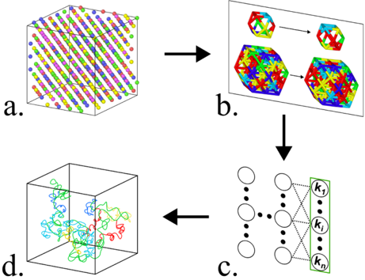

**Caption:** FIG. 1. The workflow used in this work: (a) An MD HEA system produced trajectories from which two vacancy surroundings were extracted to compare the influence of various neighbouring atoms on vacancy transitions (Appendix A), (b) vacancy region datasets were converted to graph format, (c) the resulting dataset of states and chosen transition atoms was fed through a GCN to construct a trained model, and (d) model learned dynamics were used to generate accelerated synthetic trajectories of vacancy defect diffusion in the HEA system.

---

## FIG_020 · Picture · Página 5

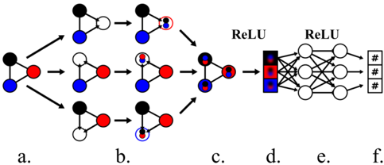

**Caption:** FIG. 3. Network structure used in this work: (a) A graph input, (b) a convolutional layer that collects information on the host and neighbor nodes [white and black/blue/red in (b) respectively], (c) the output graph features and ReLU activation, (d) flattened node features from graph, (e) a linear layer with ReLU activation, and (f) an output layer that returns a single float value prediction for the rate constant per input atom/node. The tricolored graph nodes are stand-ins for one-hot encoded atom features such as those shown in Fig. 9(b).

---

## FIG_021 · Picture · Página 5

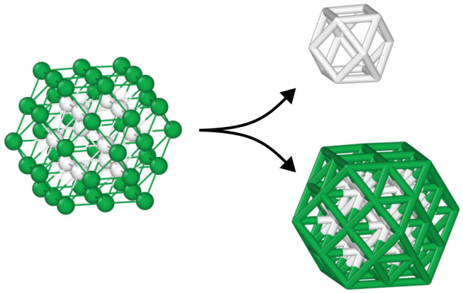

**Caption:** FIG. 2. Configurations of FCC regions of interest for the 1-NNI (upper right) and 2-NNI (lower right). In the 1-NNI model, the environment consists of 12 nearest-neighbor atoms of the vacancy, while in the 2-NNI model, the environment includes 54 atoms, incorporating both the first and second graph neighbors of the vacancy. The 12 allowed transition target atoms are colored in white.

---

## FIG_022 · Picture · Página 6

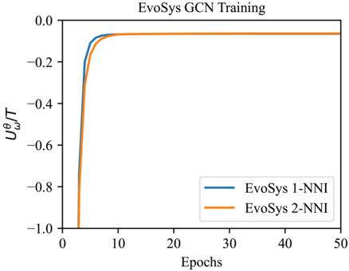

**Caption:** FIG. 4. Log-likelihood loss plots for both EvoSys training setups. Training runs were plotted together as the unknown true dynamics of the MD system were the same in both setups, enabling direct comparison.

---

## FIG_023 · Picture · Página 7

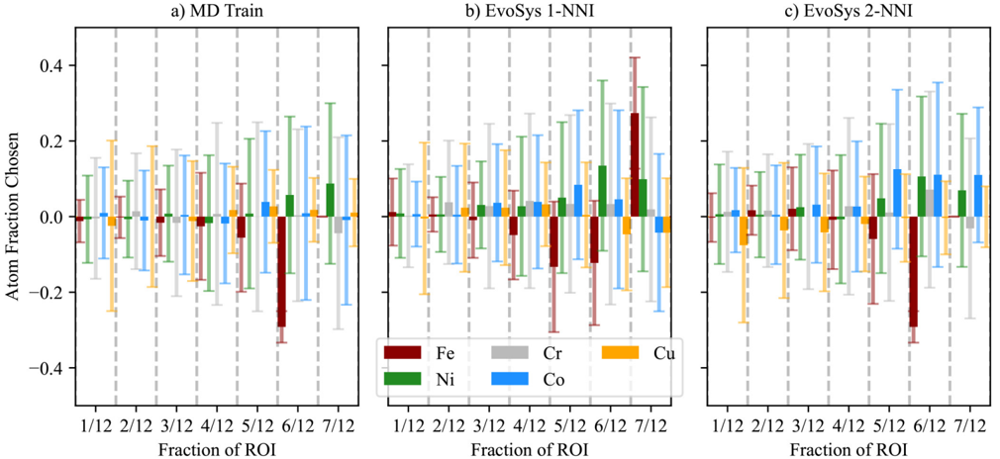

**Caption:** FIG. 5. Mean transition preferences per-atom as a function of their fraction of the vacancy 1-NNI composition for each dataset (i.e., how often element ' X ' jumped when it occupied ' Y ' /12 of the allowed target atoms). Showing data for (a) MD training, (b) EvoSys 1-NNI, and (c) EvoSys 2-NNI datasets. Values presented in terms of difference with the MD baseline dataset.

---

## FIG_024 · Picture · Página 8

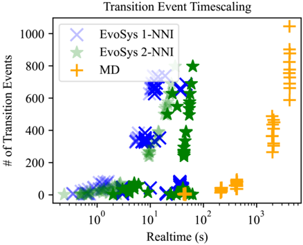

**Caption:** FIG. 7. Number of transition events detected as a function of simulation realtime for the EvoSys 1-NNI and 2-NNI and MD (Baseline) setups. Faded EvoSys points indicate timing reported via from inside the Python script, in contrast to times reported from the bash script, which are presented in solid points.

---

## FIG_025 · Picture · Página 8

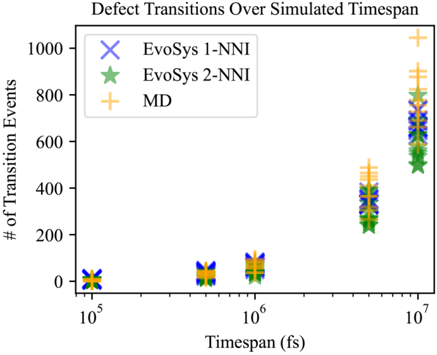

**Caption:** FIG. 6. Number of transition events detected as a function of simulated time for EvoSys 1-NNI and 2-NNI and MD Baseline setups. Each plot shows the results of 10 trajectories.

---

## FIG_026 · Picture · Página 9

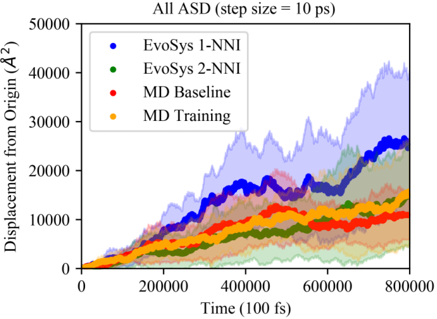

**Caption:** FIG. 8. ASD measured in 10 ps intervals for each dataset, averaged across 10 trajectories. Shaded regions indicate standard deviation. Values are tabulated in Table IV .

---

## FIG_027 · Picture · Página 11

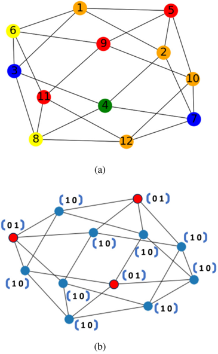

**Caption:** FIG. 9. NX graph representations of the vacancy defect 1-NNI environment: (a) A layout captured for an arbitrary vacancy state, showing node colors based on features (atom types) and node IDs from number tags assigned by OVITO; (b) an arbitrary vacancy graph layout for a binary alloy demonstrating the one-hot encoding scheme.

---

## FIG_028 · Picture · Página 11

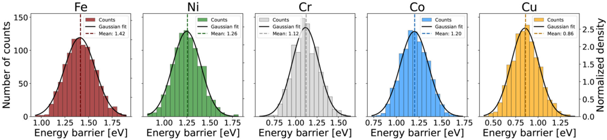

**Caption:** FIG. 10. Histograms of vacancy migration energy barriers for each elemental species (Fe, Ni, Cr, Co, and Cu) in the equiatomic FeNiCrCoCu HEA. The distributions represent the frequency of vacancy jump events as a function of energy barrier. Each histogram is fitted with a Gaussian distribution function, and the corresponding mean energy barrier for each element is reported.

---

## FIG_029 · Picture · Página 12

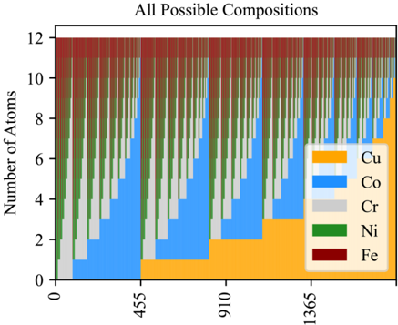

**Caption:** Unique Compositions (Ordered by Cu)
