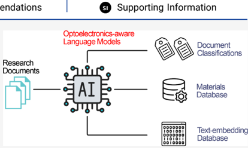
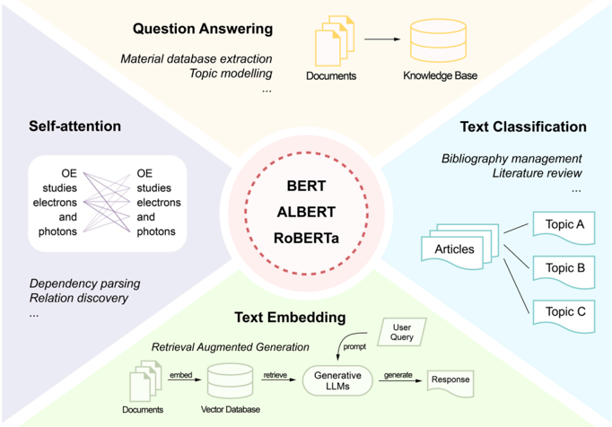
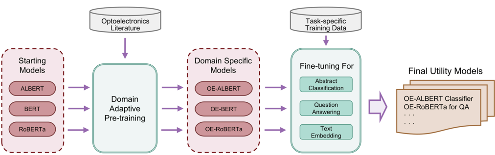
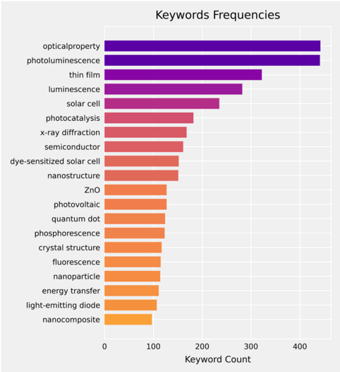
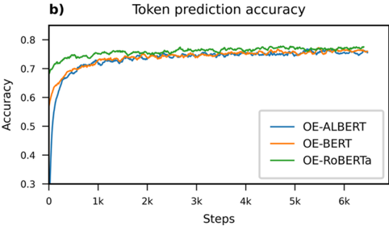
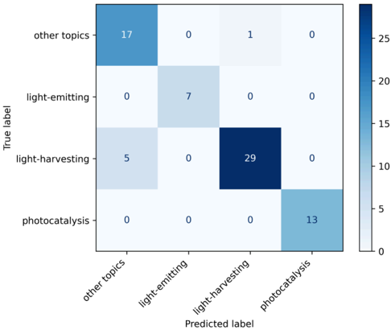
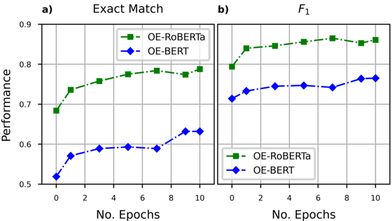
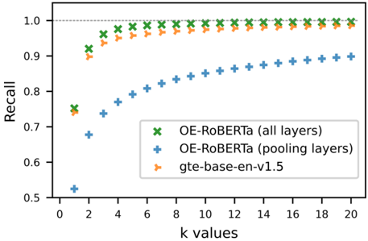

# Figuras extraídas

**Fuente:** `/media/santi/ALMACEN_GRANDE_1/ilovepappers/pappers/OE-BERT_DAPT_optoelectronica_Huang_2025.pdf`
**Total figuras:** 19

---

## FIG_001 · Picture · Página 1

**Caption:** _Sin caption_

---

## FIG_002 · Picture · Página 1

**Caption:** _Sin caption_

---

## FIG_003 · Picture · Página 1

**Caption:** _Sin caption_

---

## FIG_004 · Picture · Página 1

**Caption:** _Sin caption_

---

## FIG_005 · Picture · Página 1

**Caption:** _Sin caption_

---

## FIG_006 · Picture · Página 1

**Caption:** _Sin caption_

---

## FIG_007 · Picture · Página 1

**Caption:** _Sin caption_

---

## FIG_008 · Picture · Página 1

**Caption:** _Sin caption_

---

## FIG_009 · Picture · Página 1

**Caption:** _Sin caption_

---

## FIG_010 · Picture · Página 1

**Caption:** _Sin caption_

---

## FIG_011 · Picture · Página 2

**Caption:** Figure 1. Applications of BERT-like models in academic research. Left. BERT-like models are built with the transformer architecture, which computes the attention between text tokens. The attention scores can be exploited to conduct dependency parsing and relation discovery. The models can also be fine-tuned to tackle specialized downstream tasks. Top. The question-answering (QA) capability of BERT-like models can be applied to tasks such as text-mining for material databases and topic modeling for research trend analysis. Right. The models can also be fine-tuned to perform text classification, which has wide application in literature review and bibliography management. Bottom. BERT-like models can be modified to produce contextual text embeddings that can be used in document retrieval based on the embedding similarities. The advancement in LLMs and RAG systems have also promoted the application of embedding models.

---

## FIG_012 · Picture · Página 2

**Caption:** _Sin caption_

---

## FIG_013 · Picture · Página 2

**Caption:** Figure 2. Training pipeline for the optoelectronics-adapted language models developed in this study. The starting BERT-like models, pretrained on general English text (ALBERT, BERT, and RoBERTa) were domain adaptive pretrained on optoelectronics research literature, yielding the OEadapted models. Each resulting OE model was then fine-tuned on three downstream tasks: abstract classification, question-answering, and textembedding, using task-specific training data sets. The resulting nine models represent the final utility models; such as the OE-RoBERTa model that serves for QA or the OE-ALBERT model that serves for abstract classification.

---

## FIG_014 · Picture · Página 4

**Caption:** Figure 3. Keyword frequency bar chart for normalized keywords found in 20k Science Direct publications about optoelectronics These 20 normalized keywords outlined three major mutually exclusive categories in terms of material functions: light-emitting, lightharvesting, and photocatalysis categories.

---

## FIG_015 · Picture · Página 5

**Caption:** _Sin caption_

---

## FIG_016 · Picture · Página 5

**Caption:** Figure 4. Pretraining loss and token prediction accuracy progress of BERT, ALBERT, and RoBERTa when further pretrained on optoelectronics literature in order to produce OE-BERT, OEALBERT and OE-RoBERTa, respectively. All three language models achieved a similar masked token prediction accuracy at the end of the DAPT process, while their progress of loss values are more separated with the OE-RoBERTa model affording the lowest loss value.

---

## FIG_017 · Picture · Página 7

**Caption:** Figure 5. Confusion matrix of the classification results on titles concatenated with abstracts from top cited optoelectronics papers in 2023, using the OE-RoBERTa case-lowered classification model. Most confusions occur between the 'light-harvesting' class and the 'other topics' class.

---

## FIG_018 · Picture · Página 8

**Caption:** Figure 6. Performance evolution on the TADF-numerical QA data set of the OE-BERT and OE-RoBERTa models against the progress of their optoelectronics DAPT process as defined by the number of epochs of the DAPT process. a) The progressive evolution of the Exact Match metric. b) The progressive evolution of the F 1 metric. The metric scores of OE-BERT and OE-RoBERTa evolves highly parallel for both Exact Match and F 1 .

---

## FIG_019 · Picture · Página 10

**Caption:** Figure 7. Recall @k results plotted against k for 1 ≤ k ≤ 20 when testing on the test set of the OE-Ttl-Abs-303k data set using the gte-base-en-v1.5 model, the OE-RoBERTa embedding model (all layers fine-tuned), and the OE-RoBERTa embedding model (pooling layers fine-tuned). The OE-RoBERTa embedding model that had all its layers fine-tuned outperformed the state-of-theart embedding model that is of a similar size, gte-base-env1.5 , on this optoelectronics in-domain retrieval task.
