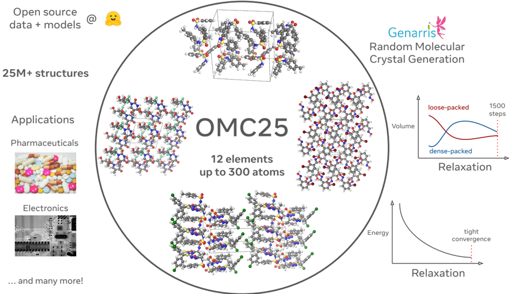
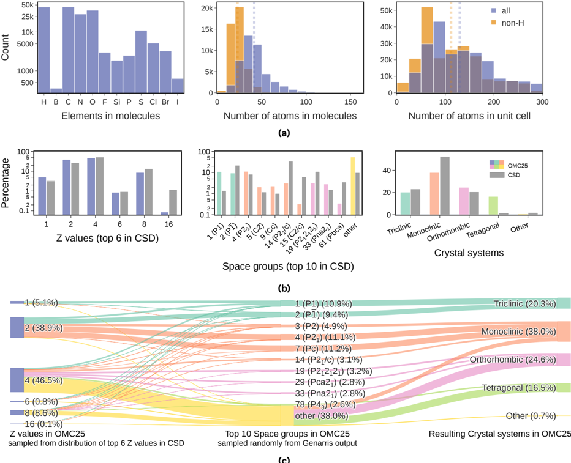
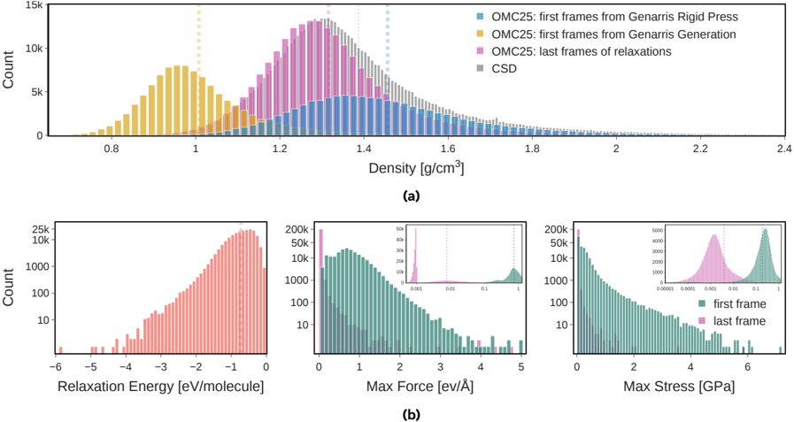
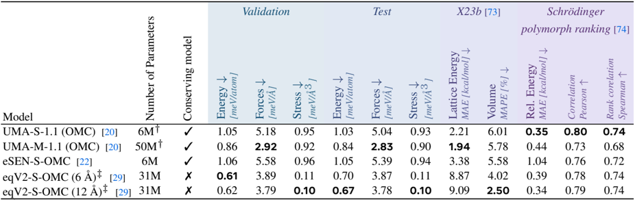
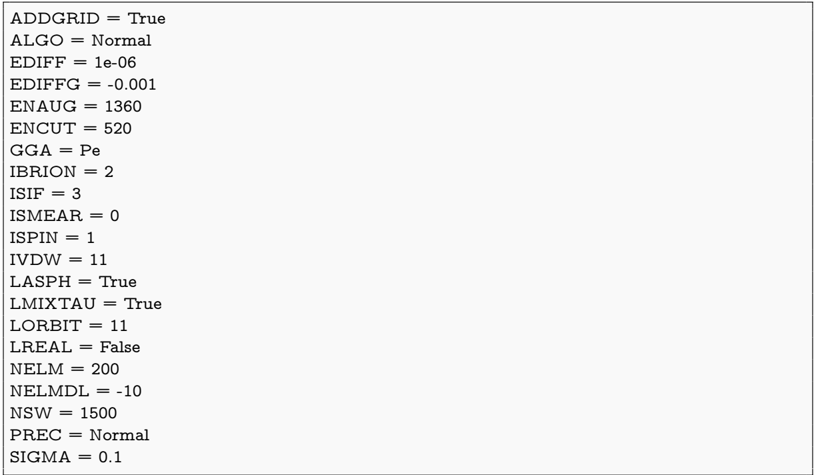
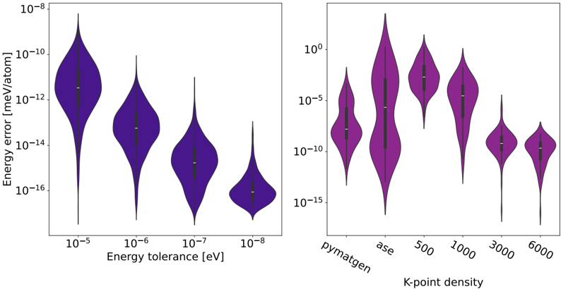
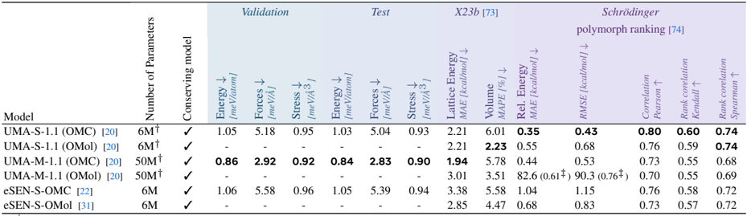
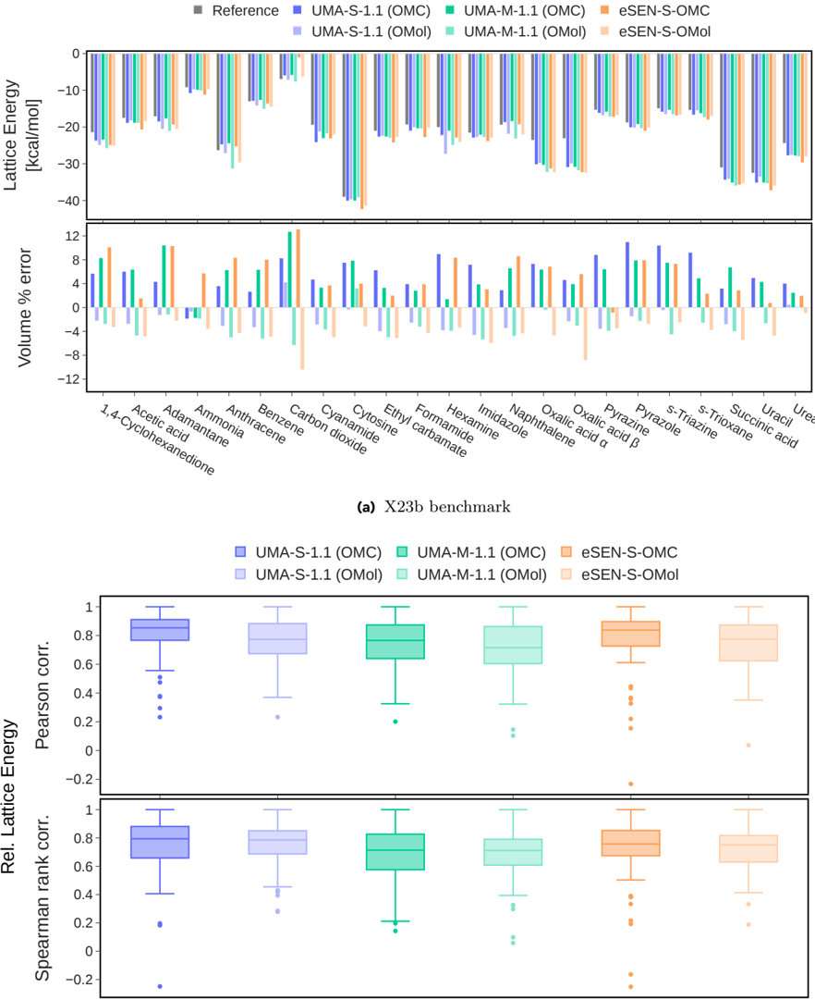

# Figuras extraídas

**Fuente:** `/media/santi/ALMACEN_GRANDE_1/ilovepappers/pappers/OMC25_cristales_moleculares_Meta_2025.pdf`
**Total figuras:** 8

---

## FIG_001 · Picture · Página 2

**Caption:** Figure 1 Overview of the OMC25 dataset: generation method, structure relaxations, statistics, and application areas.

---

## FIG_002 · Picture · Página 7

**Caption:** _Sin caption_

---

## FIG_003 · Picture · Página 8

**Caption:** Figure 3 Comparison of properties from the first and last frames of relaxation trajectories of molecular crystals in the OMC25 training split: (a) showing density of the last frames and the first frames for different Genarris steps; overlayed is the distribution of densities of organic entries in CSD 6.00, (b) showing relaxation energy (the difference of energy between the initial and final frames), maximum per-atom residual force, and maximum unit cell stress. Average values are presented with vertical dotted lines.

---

## FIG_004 · Picture · Página 9

**Caption:** Table 3 MLIP evaluations: validation and test metrics, as well as X23b and Schrödinger polymorph ranking evaluations. The energy, force, and stress errors are presented as mean absolute errors (MAEs) for the validation and test metrics. For the X23b evaluation, the energy represents the lattice energy of the crystal, and the mean absolute percentage error (MAPE) is reported for the molar volume. For the Schrödinger polymorph ranking evaluation, the energies are normalized to the number of molecules in the unit cell. The bolded values show the best performing models, where the evaluation followed the community standards.

---

## FIG_005 · Picture · Página 18

**Caption:** Listing S2 Example INCAR settings for the DFT relaxations with VASP.

---

## FIG_006 · Picture · Página 18

**Caption:** Figure S1 Convergence study for the DFT settings used in this work. We show the effect of each parameter on the energy of the structure compared to the most tightly converged settings set to 10 -9 eV energy tolerance and 9,000 k-point density per atom.

---

## FIG_007 · Picture · Página 19

**Caption:** Table S1 Extended MLIP evaluation results for OMC25 and OMol25 [31] models: validation and test metrics, as well as X23b benchmark and Schrödinger polymorph ranking task. For UMA models [20], we used both the OMC and OMol tasks. The bolded values show the best performing models.

---

## FIG_008 · Picture · Página 20

**Caption:** _Sin caption_
