# Figuras extraídas

**Fuente:** `/media/santi/ALMACEN_GRANDE_1/ilovepappers/pappers/PartNet_anotacion_regiones_3D_Yi.pdf`
**Total figuras:** 13

---

## FIG_001 · Picture · Página 1

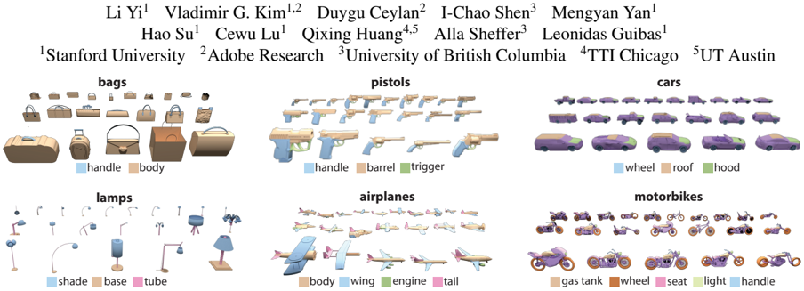

**Caption:** Figure 1: We use our method to create detailed per-point labeling of 31963 models in 16 shape categories in ShapeNetCore.

---

## FIG_002 · Picture · Página 2

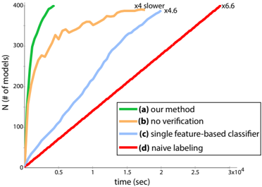

**Caption:** Figure 2: This figure illustrates the number of correctly-labeled models (y-axis) as people spend more time providing input (xaxis) for a representative collection. Our result corresponds to the highest-performing curve (a), and we provide two variants of our method, one that does not include verification (b), and one that only uses local geometric features to train a single classifier for the entire dataset (c). We also show baseline cost of manually labeling every model (d). Note that all variants take substantially longer to annotate the entire dataset.

---

## FIG_003 · Picture · Página 4

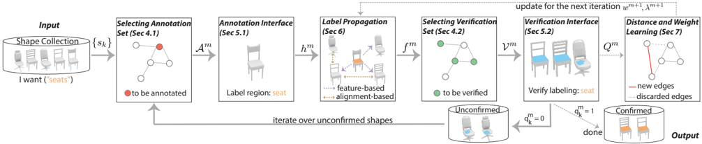

**Caption:** Figure 3: This figure summarizes our pipeline. Given the input dataset we select annotation set and use our UI to obtain human labels. We automatically propagate these labels to the rest of the shapes and then query the users to verify most confident propagations. We then use these verifications to improve our propagation technique.

---

## FIG_004 · Picture · Página 5

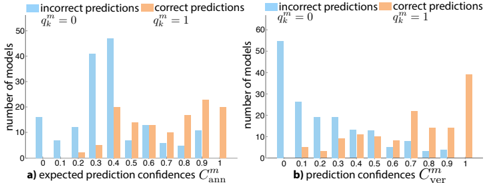

**Caption:** _Sin caption_

---

## FIG_005 · Picture · Página 5

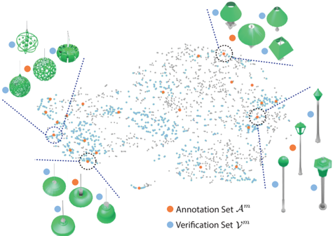

**Caption:** Figure 4: At each iteration our method selects an annotation set (in orange) and a verification set (in blue) from the shape network (in gray). The models selected for annotation are distributed over the network to provide good coverage of shape variations. In contrast, models selected for verification tend to cluster close to annotated models since labels can be more reliably propagated between them.

---

## FIG_006 · Picture · Página 6

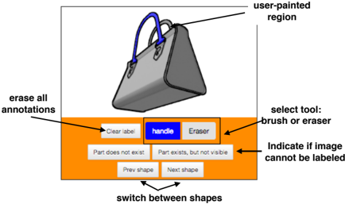

**Caption:** Figure 6: User interface for acquiring semantic labeling. Our interface is designed for crowdsourcing and is therefore very lightweight and simple; the user only annotates a single label, on a single shape, from a single viewpoint.

---

## FIG_007 · Picture · Página 7

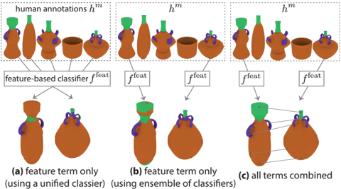

**Caption:** Figure 7: Given a set of human annotated models (top) and two unlabeled shapes (bottom), the labels can be propagated by (a) using only the feature-based classifier trained on all annotated models, (b) using only the most similar model to train the classifier, and (c) using correspondences and smoothness terms. Incorporating both (b) and (c) significantly improves the result in comparison to currently used alternatives (a).

---

## FIG_008 · Picture · Página 7

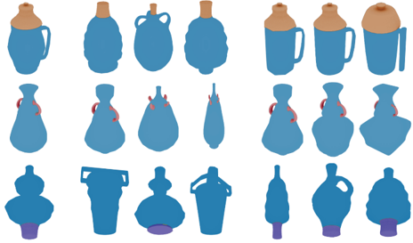

**Caption:** _Sin caption_

---

## FIG_009 · Picture · Página 8

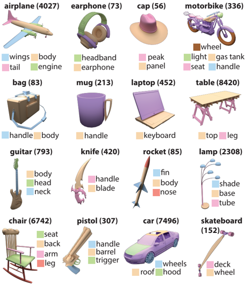

**Caption:** Figure 9: We use our method to get part labels for more than 30,000 models in 16 shape categories in ShapeNetCore. We denote the number of models in each category in parentheses.

---

## FIG_010 · Picture · Página 9

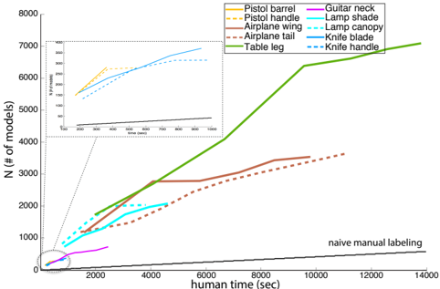

**Caption:** Figure 10: Number of positively-verified labeled shapes (y-axis) as a function of human input time (x-axis) for representative labels in our data. As expected the graph is monotonically increasing, and flattens out as time progresses and the algorithm encounters more diverse models. Note the relative inefficiency of manual labeling.

---

## FIG_011 · Picture · Página 9

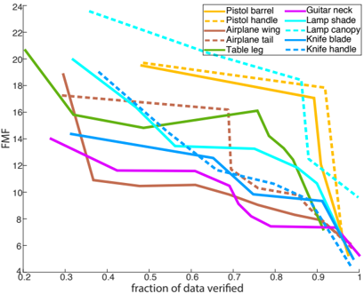

**Caption:** Figure 11: Force-multiplication factor (FMF, y-axis) over time. Predictably FMF drops as the system annotates a higher fraction of the model collection (x-axis).

---

## FIG_012 · Picture · Página 10

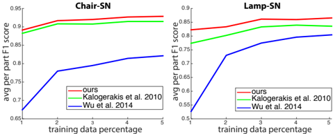

**Caption:** Figure 12: Our automatic label propagation tool demonstrates a superior performance in comparison to previous techniques (adapted to handle ShapeNetCore data).

---

## FIG_013 · Picture · Página 11

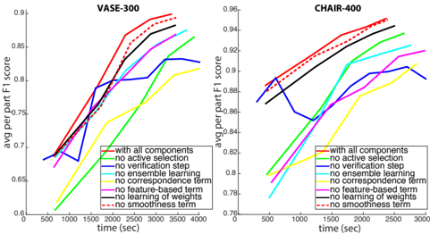

**Caption:** Figure 13: Comparison of different variants of our method where each curve corresponds to a result obtained without some feature, and x-axis is human input time and y-axis is average per-part F1score. See text for details.
