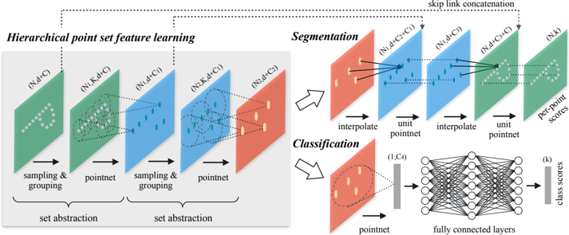
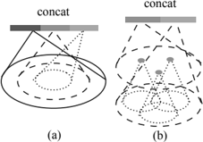
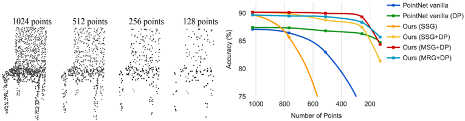
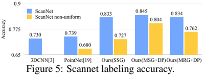
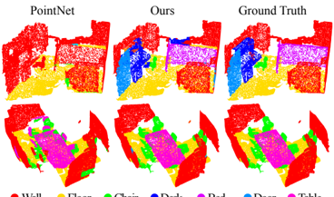
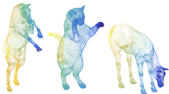
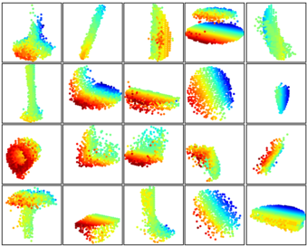
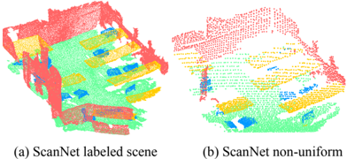

# Figuras extraídas

**Fuente:** `/media/santi/ALMACEN_GRANDE_1/ilovepappers/pappers/PointNet++_Qi_2017.pdf`
**Total figuras:** 9

---

## FIG_001 · Picture · Página 2

**Caption:** Figure 1: Visualization of a scan captured from a Structure Sensor (left: RGB; right: point cloud).

---

## FIG_002 · Picture · Página 3

**Caption:** Figure 2: Illustration of our hierarchical feature learning architecture and its application for set segmentation and classification using points in 2D Euclidean space as an example. Single scale point grouping is visualized here. For details on density adaptive grouping, see Fig. 3

---

## FIG_003 · Picture · Página 4

**Caption:** _Sin caption_

---

## FIG_004 · Picture · Página 6

**Caption:** Figure 4: Left: Point cloud with random point dropout. Right: Curve showing advantage of our density adaptive strategy in dealing with non-uniform density. DP means random input dropout during training; otherwise training is on uniformly dense points. See Sec.3.3 for details.

---

## FIG_005 · Picture · Página 6

**Caption:** _Sin caption_

---

## FIG_006 · Picture · Página 7

**Caption:** Wall Floor Chair Desk Bed Door Table Figure 6: Scannet labeling results. [20] captures the overall layout of the room correctly but fails to discover the furniture. Our approach, in contrast, is much better at segmenting objects besides the room layout.

---

## FIG_007 · Picture · Página 7

**Caption:** Figure 7: An example of nonrigid shape classification. (a) Horse (b) Cat (C) Horse

---

## FIG_008 · Picture · Página 8

**Caption:** Figure 8: 3D point cloud patterns learned from the first layer kernels. The model is trained for ModelNet40 shape classification (20 out of the 128 kernels are randomly selected). Color indicates point depth (red is near, blue is far).

---

## FIG_009 · Picture · Página 12

**Caption:** Figure 9: Virtual scan generated from ScanNet
