# Figuras extraídas

**Fuente:** `/media/santi/ALMACEN_GRANDE_1/ilovepappers/pappers/PointNet_Qi_2017.pdf`
**Total figuras:** 24

---

## FIG_001 · Picture · Página 1

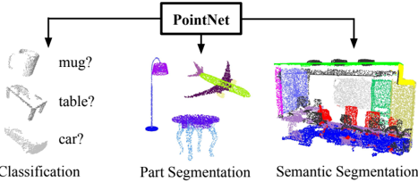

**Caption:** Figure 1. Applications of PointNet. We propose a novel deep net architecture that consumes raw point cloud (set of points) without voxelization or rendering. It is a unified architecture that learns both global and local point features, providing a simple, efficient and effective approach for a number of 3D recognition tasks.

---

## FIG_002 · Picture · Página 3

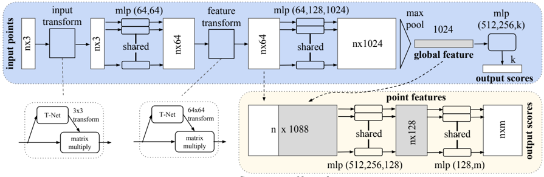

**Caption:** _Sin caption_

---

## FIG_003 · Picture · Página 5

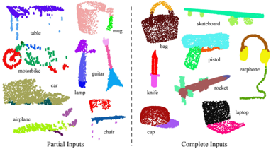

**Caption:** Figure 3. Qualitative results for part segmentation. We visualize the CAD part segmentation results across all 16 object categories. We show both results for partial simulated Kinect scans (left block) and complete ShapeNet CAD models (right block).

---

## FIG_004 · Picture · Página 7

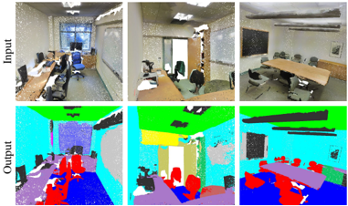

**Caption:** Figure 4. Qualitative results for semantic segmentation. Top row is input point cloud with color. Bottom row is output semantic segmentation result (on points) displayed in the same camera viewpoint as input.

---

## FIG_005 · Picture · Página 7

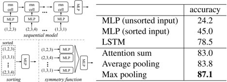

**Caption:** Figure 5. Three approaches to achieve order invariance. Multilayer perceptron (MLP) applied on points consists of 5 hidden layers with neuron sizes 64,64,64,128,1024, all points share a single copy of MLP. The MLP close to the output consists of two layers with sizes 512,256.

---

## FIG_006 · Picture · Página 8

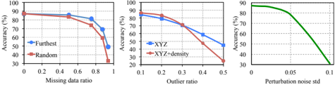

**Caption:** Figure 6. PointNet robustness test. The metric is overall classification accuracy on ModelNet40 test set. Left: Delete points. Furthest means the original 1024 points are sampled with furthest sampling. Middle: Insertion. Outliers uniformly scattered in the unit sphere. Right: Perturbation. Add Gaussian noise to each point independently.

---

## FIG_007 · Picture · Página 8

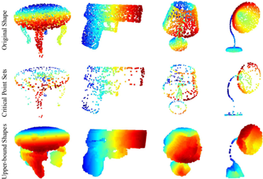

**Caption:** Figure 7. Critical points and upper bound shape. While critical points jointly determine the global shape feature for a given shape, any point cloud that falls between the critical points set and the upper bound shape gives exactly the same feature. We color-code all figures to show the depth information.

---

## FIG_008 · Picture · Página 10

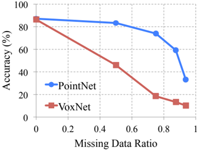

**Caption:** _Sin caption_

---

## FIG_009 · Picture · Página 11

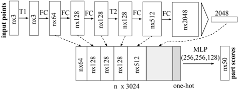

**Caption:** mlp (64,128,128) mlp (64,128,1024) input feature Classification Network Figure 9. Network architecture for part segmentation. T1 and T2 are alignment/transformation networks for input points and features. FC is fully connected layer operating on each point. MLP is multi-layer perceptron on each point. One-hot is a vector of size 16 indicating category of the input shape.

---

## FIG_010 · Picture · Página 11

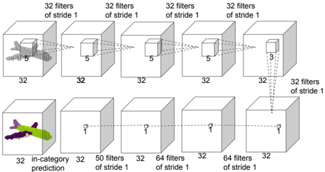

**Caption:** Figure 10. Baseline 3D CNN segmentation network. The network is fully convolutional and predicts part scores for each voxel.

---

## FIG_011 · Picture · Página 12

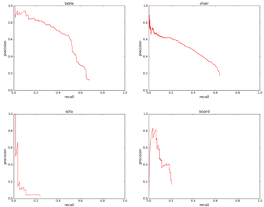

**Caption:** Figure 11. Precision-recall curves for object detection in 3D point cloud. We evaluated on all six areas for four categories: table, chair, sofa and board. IoU threshold is 0.5 in volume.

---

## FIG_012 · Picture · Página 12

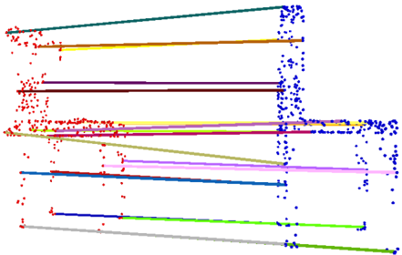

**Caption:** Figure 13. Shape correspondence between two chairs. For the clarity of the visualization, we only show 20 randomly picked correspondence pairs.

---

## FIG_013 · Picture · Página 12

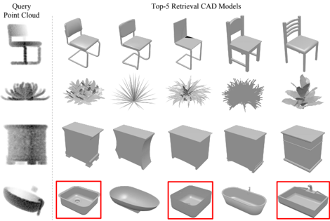

**Caption:** Figure 12. Model retrieval from point cloud. For every given point cloud, we retrieve the top-5 similar shapes from the ModelNet test split. From top to bottom rows, we show examples of chair, plant, nightstand and bathtub queries. Retrieved results that are in wrong category are marked by red boxes.

---

## FIG_014 · Picture · Página 12

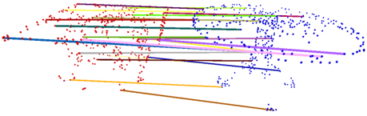

**Caption:** Figure 14. Shape correspondence between two tables. For the clarity of the visualization, we only show 20 randomly picked correspondence pairs.

---

## FIG_015 · Picture · Página 12

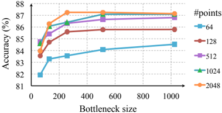

**Caption:** Figure 15. Effects of bottleneck size and number of input points. The metric is overall classification accuracy on ModelNet40 test set.

---

## FIG_016 · Picture · Página 13

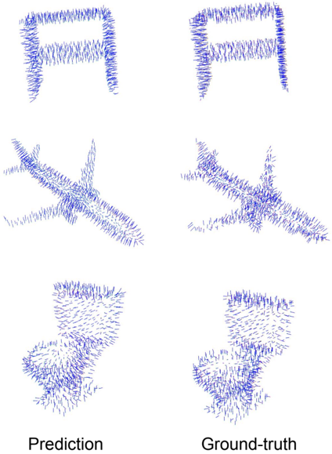

**Caption:** Figure 16. PointNet normal reconstrution results. In this figure, we show the reconstructed normals for all the points in some sample point clouds and the ground-truth normals computed on the mesh.

---

## FIG_017 · Picture · Página 14

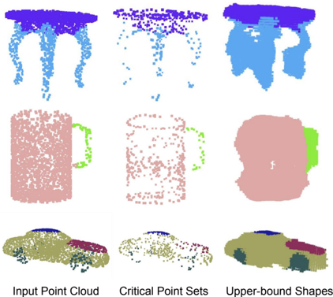

**Caption:** Figure 17. The consistency of segmentation results. We illustrate the segmentation results for some sample given point clouds S , their critical point sets C S and upper-bound shapes N S . We observe that the shape family between the C S and N S share a consistent segmentation results.

---

## FIG_018 · Picture · Página 14

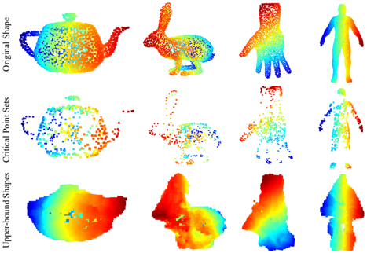

**Caption:** Figure 18. The critical point sets and the upper-bound shapes for unseen objects. We visualize the critical point sets and the upper-bound shapes for teapot, bunny, hand and human body, which are not in the ModelNet or ShapeNet shape repository to test the generalizability of the learnt per-point functions of our PointNet on other unseen objects. The images are color-coded to reflect the depth information.

---

## FIG_019 · Picture · Página 15

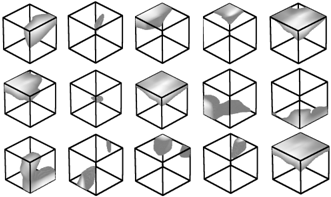

**Caption:** Figure 19. Point function visualization. For each per-point function h , we calculate the values h ( p ) for all the points p in a cube of diameter two located at the origin, which spatially covers the unit sphere to which our input shapes are normalized when training our PointNet. In this figure, we visualize all the points p that give h ( p ) > 0 . 5 with function values color-coded by the brightness of the voxel. We randomly pick 15 point functions and visualize the activation regions for them.

---

## FIG_020 · Picture · Página 16

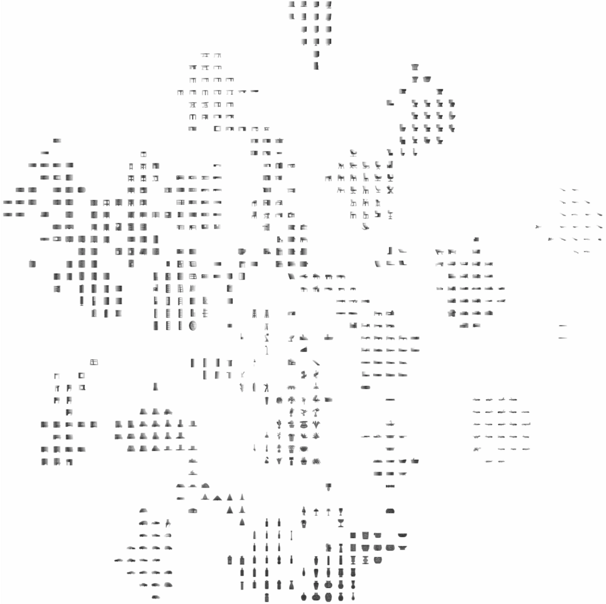

**Caption:** Figure 20. 2D embedding of learnt shape global features. We use t-SNE technique to visualize the learnt global shape features for the shapes in ModelNet40 test split.

---

## FIG_021 · Picture · Página 17

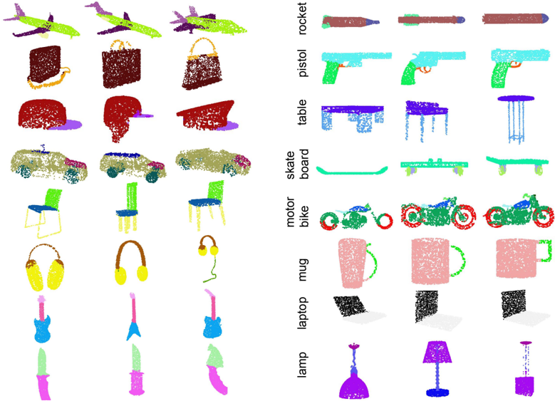

**Caption:** Figure 21. PointNet segmentation results on complete CAD models.

---

## FIG_022 · Picture · Página 17

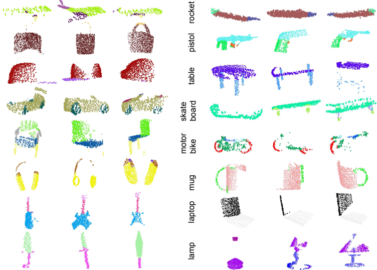

**Caption:** Figure 22. PointNet segmentation results on simulated Kinect scans.

---

## FIG_023 · Picture · Página 18

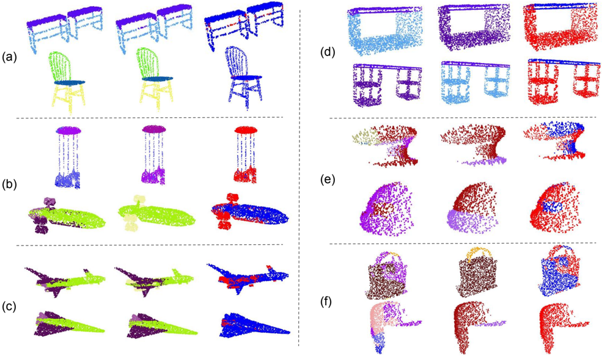

**Caption:** Figure 23. PointNet segmentation failure cases. In this figure, we summarize six types of common errors in our segmentation application. The prediction and the ground-truth segmentations are given in the first and second columns, while the difference maps are computed and shown in the third columns. The red dots correspond to the wrongly labeled points in the given point clouds. (a) illustrates the most common failure cases: the points on the boundary are wrongly labeled. In the examples, the label predictions for the points near the intersections between the table/chair legs and the tops are not accurate. However, most segmentation algorithms suffer from this error. (b) shows the errors on exotic shapes. For examples, the chandelier and the airplane shown in the figure are very rare in the data set. (c) shows that small parts can be overwritten by nearby large parts. For example, the jet engines for airplanes (yellow in the figure) are mistakenly classified as body (green) or the plane wing (purple). (d) shows the error caused by the inherent ambiguity of shape parts. For example, the two bottoms of the two tables in the figure are classified as table legs and table bases (category other in [29]), while ground-truth segmentation is the opposite. (e) illustrates the error introduced by the incompleteness of the partial scans. For the two caps in the figure, almost half of the point clouds are missing. (f) shows the failure cases when some object categories have too less training data to cover enough variety. There are only 54 bags and 39 caps in the whole dataset for the two categories shown here.

---

## FIG_024 · Picture · Página 19

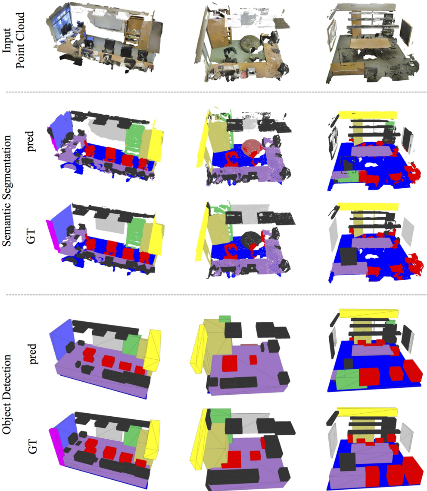

**Caption:** Figure 24. Examples of semantic segmentation and object detection. First row is input point cloud, where walls and ceiling are hided for clarity. Second and third rows are prediction and ground-truth of semantic segmentation on points, where points belonging to different semantic regions are colored differently (chairs in red, tables in purple, sofa in orange, board in gray, bookcase in green, floors in blue, windows in violet, beam in yellow, column in magenta, doors in khaki and clutters in black). The last two rows are object detection with bounding boxes, where predicted boxes are from connected components based on semantic segmentation prediction.
