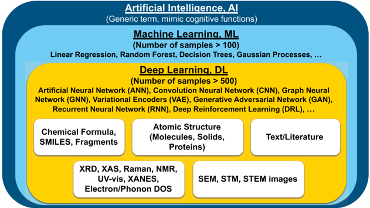
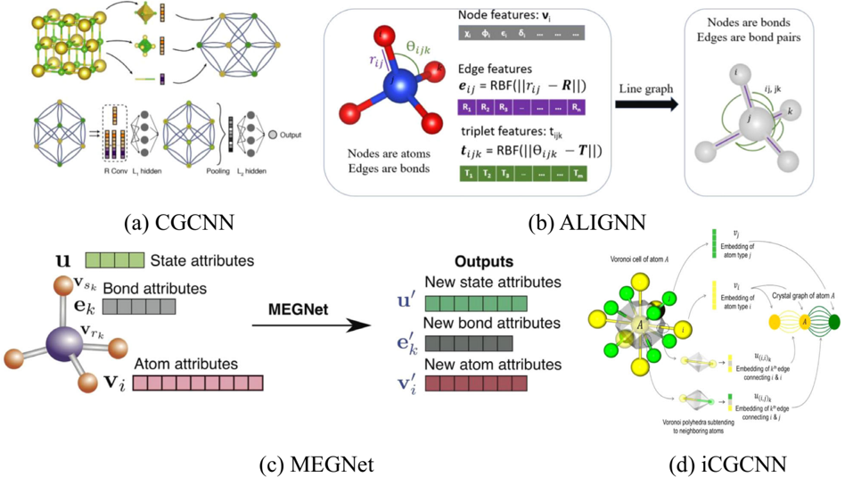
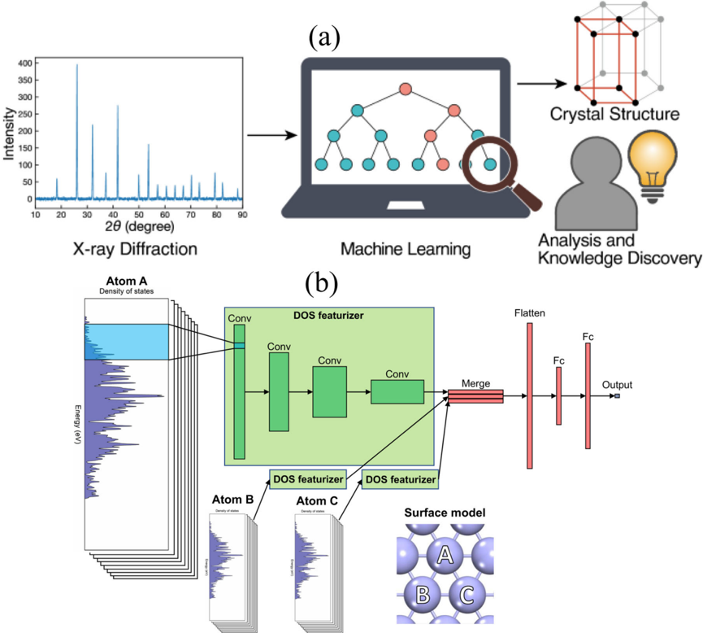
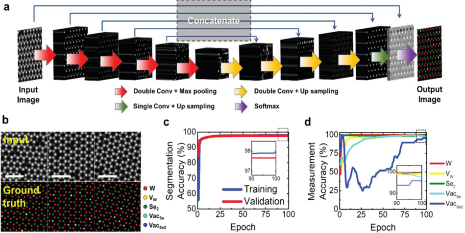
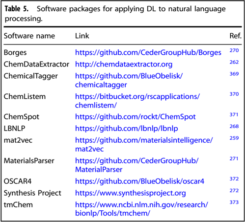
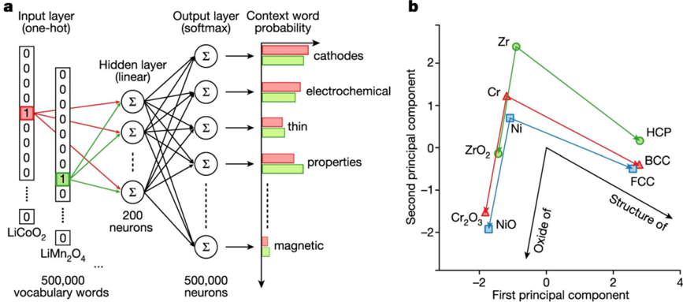

# Figuras extraídas

**Fuente:** `/media/santi/ALMACEN_GRANDE_1/ilovepappers/pappers/Review_DL_materiales_Choudhary_2022.pdf`
**Total figuras:** 35

---

## FIG_001 · Picture · Página 1

**Caption:** _Sin caption_

---

## FIG_002 · Picture · Página 1

**Caption:** _Sin caption_

---

## FIG_003 · Picture · Página 1

**Caption:** _Sin caption_

---

## FIG_004 · Picture · Página 2

**Caption:** _Sin caption_

---

## FIG_005 · Picture · Página 2

**Caption:** Fig. 1 Schematic showing an overview of arti fi cial intelligence (AI), machine learning (ML), and deep learning (DL) methods and its applications in materials science and engineering. Deep learning is considered a part of machine learning, which is contained in an umbrella term arti fi cial intelligence.

---

## FIG_006 · Picture · Página 3

**Caption:** _Sin caption_

---

## FIG_007 · Picture · Página 4

**Caption:** _Sin caption_

---

## FIG_008 · Picture · Página 5

**Caption:** _Sin caption_

---

## FIG_009 · Picture · Página 6

**Caption:** _Sin caption_

---

## FIG_010 · Picture · Página 7

**Caption:** _Sin caption_

---

## FIG_011 · Picture · Página 7

**Caption:** Fig. 2 Schematic representations of an atomic structure as a graph. a CGCNN model in which crystals are converted to graphs with nodes representing atoms in the unit cell and edges representing atom connections. Nodes and edges are characterized by vectors corresponding to the atoms and bonds in the crystal, respectively [Reprinted with permission from ref. 67 Copyright 2019 American Physical Society], b ALIGNN 65 model in which the convolution layer alternates between message passing on the bond graph and its bond-angle line graph. c MEGNet in which the initial graph is represented by the set of atomic attributes, bond attributes and global state attributes [Reprinted with permission from ref. 33 Copyright 2019 American Chemical Society] model, d iCGCNN model in which multiple edges connect a node to neighboring nodes to show the number of Voronoi neighbors [Reprinted with permission from ref. 122 Copyright 2019 American Physical Society].

---

## FIG_012 · Picture · Página 8

**Caption:** _Sin caption_

---

## FIG_013 · Picture · Página 9

**Caption:** _Sin caption_

---

## FIG_014 · Picture · Página 9

**Caption:** Fig. 3 Example applications of deep learning for spectral data. a Predicting structure information from the X-ray diffraction 374 , Reprinted according to the terms of the CC-BY license 374 . Copyright 2020. b Predicting catalysis properties from computational electronic density of states data. Reprinted according to the terms of the CC-BY license 202 . Copyright 2021.

---

## FIG_015 · Picture · Página 10

**Caption:** _Sin caption_

---

## FIG_016 · Picture · Página 11

**Caption:** _Sin caption_

---

## FIG_017 · Picture · Página 12

**Caption:** _Sin caption_

---

## FIG_018 · Picture · Página 13

**Caption:** _Sin caption_

---

## FIG_019 · Picture · Página 14

**Caption:** _Sin caption_

---

## FIG_020 · Picture · Página 14

**Caption:** Fig. 4 Deep-learning-based algorithm for atomic site classi fi cation. a Deep neural networks U-Net model constructed for quanti fi cation analysis of annular dark- fi eld in the scanning transmission electron microscope (ADF-STEM) image of V-WSe2. b Examples of training dataset for deep learning of atom segmentation model for fi ve different species. c Pixel-level accuracy of the atom segmentation model as a function of training epoch. d Measurement accuracy of the segmentation model compared with human-based measurements. Scale bars are 1 nm [Reprinted according to the terms of the CC-BY license ref. 228 ].

---

## FIG_021 · Picture · Página 15

**Caption:** _Sin caption_

---

## FIG_022 · Picture · Página 16

**Caption:** _Sin caption_

---

## FIG_023 · Picture · Página 17

**Caption:** _Sin caption_

---

## FIG_024 · Picture · Página 17

**Caption:** _Sin caption_

---

## FIG_025 · Picture · Página 18

**Caption:** _Sin caption_

---

## FIG_026 · Picture · Página 18

**Caption:** Fig. 5 A schematic showing the application of skip-gram variation of Word2vec for predicting context words. a Network for training word embeddings for natural language processing application. A one-hot encoded vector at left represents each distinct word in the corpus; the role of a hidden layer is to predict the probability of neighboring words in the corpus. This network structure trains a relatively small hidden layer of 100 -200 neurons to contain information on the context of words in the entire corpus, with the result that similar words end up with similar hidden layer weights (word embeddings). Such word embeddings can transform wordsin text form into numerical vectors that may be useful for a variety of applications. b projection of word embeddings for various materials science words, as trained on a corpus scienti fi c abstracts, into two dimensions using principle components analysis. Without any explicit training, the word embeddings naturally preserve relationships between chemical formulas, their common oxides, and their ground state structures. [Reprinted according to the terms of the CC-BY license ref. 259 ].

---

## FIG_027 · Picture · Página 19

**Caption:** _Sin caption_

---

## FIG_028 · Picture · Página 20

**Caption:** _Sin caption_

---

## FIG_029 · Picture · Página 21

**Caption:** _Sin caption_

---

## FIG_030 · Picture · Página 22

**Caption:** _Sin caption_

---

## FIG_031 · Picture · Página 23

**Caption:** _Sin caption_

---

## FIG_032 · Picture · Página 24

**Caption:** _Sin caption_

---

## FIG_033 · Picture · Página 25

**Caption:** _Sin caption_

---

## FIG_034 · Picture · Página 26

**Caption:** _Sin caption_

---

## FIG_035 · Picture · Página 26

**Caption:** _Sin caption_
