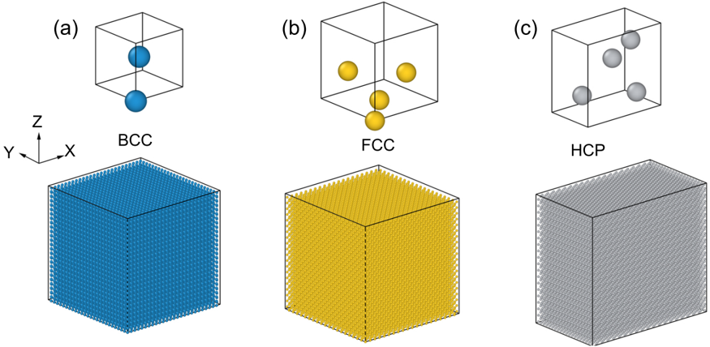
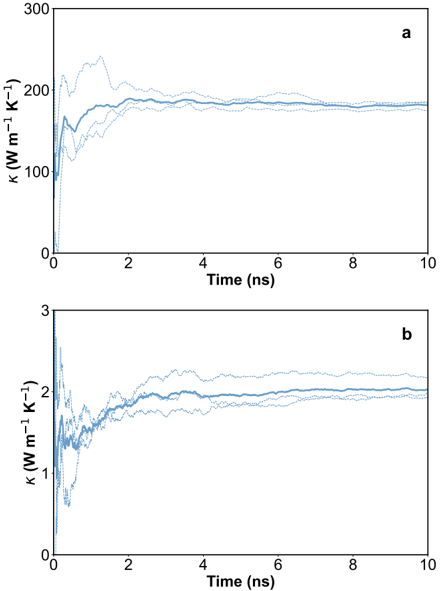
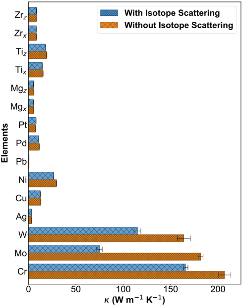
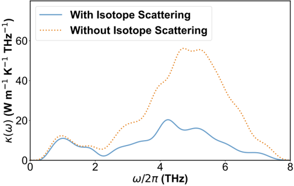
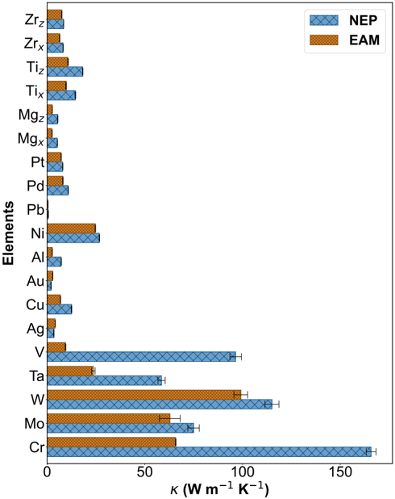
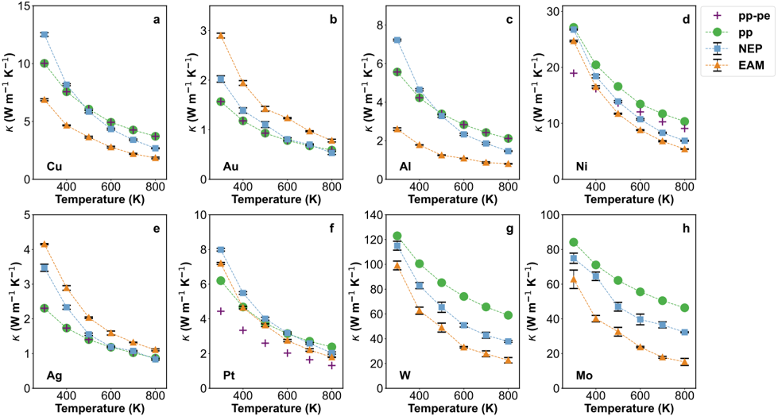
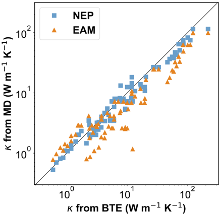
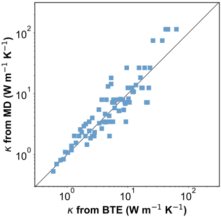

# Figuras extraídas

**Fuente:** `/media/santi/ALMACEN_GRANDE_1/ilovepappers/pappers/Shuo.pdf`
**Total figuras:** 8

---

## FIG_001 · Picture · Página 2

**Caption:** FIG. 1. Simulation models in this work. Unit cells and supercells for metals with (a) BCC, (b) (FCC, and (c) HCP lattices. The supercells for the BCC and FCC lattices are cubic, while that for the HCP lattice is not cubic but orthogonal. The spacial directions x , y , and z align with the cell axes of the lattices. The BCC supercell contains 35152 atoms, and the FCC and HCP supercells contain 32000 atoms.

---

## FIG_002 · Picture · Página 5

**Caption:** FIG. 2. Time convergence of the phonon thermal conductivity. Cumulative averages of the phonon thermal conductivity κ of (a) BCC Mo and (b) FCC Au as a function of time calculated using the UNEP-v1 model at 300 K and zero pressure. In both panels, the thin lines represent results from three independent HNEMD simulations, and the thick line represents the average of them. Isotope disorder was not considered in the simulations.

---

## FIG_003 · Picture · Página 5

**Caption:** FIG. 3. Comparison of phonon thermal conductivities with and without isotope scattering effects. In all the MD simulations, the temperature is 300 K and the pressure is zero. Error bars denote the standard error of the mean from three independent calculations.

---

## FIG_004 · Picture · Página 6

**Caption:** _Sin caption_

---

## FIG_005 · Picture · Página 7

**Caption:** FIG. 5. Phonon thermal conductivity comparison between MD simulations with UNEP-v1 and EAM models. In all the MD simulations, the temperature is 300 K, the pressure is zero, and isotope scattering is considered. Error bars denote the standard error of the mean from three independent calculations.

---

## FIG_006 · Picture · Página 8

**Caption:** FIG. 6. Phonon thermal conductivity comparison between MD simulations and BTE calculations. In each panel, filled circles represent BTE results considering phonon-phonon (pp) scattering only, plus symbols represent BTE results considering both phonon-phonon and phonon-electron (pe) scatterings, filled squares represent MD results based on the UNEP-v1 model, and filled triangles represent MD results based on the EAM potential. BTE results for W and Mo are from Wang and Bao 13 , while those for the remaining elements are from Wang et al. 6 .

---

## FIG_007 · Picture · Página 9

**Caption:** FIG. 7. Comparison of MD and BTE results for phonon thermal conductivities for all the materials considered in this work, including 16 metals and 4 binary alloys. Filled squares and triangles represent MD results from the UNEP-v1 model and the EAM potential, respectively. Only phonon-phonon scattering is considered in the BTE results.

---

## FIG_008 · Picture · Página 9

**Caption:** FIG. 8. Comparison of MD and BTE results for phonon thermal conductivities for all the materials considered in this work, including 16 metals and 4 binary alloys. Filled squares represent MD results from the UNEP-v1 model. Both phonon-phonon and phonon-electron scatterings are considered in the BTE results.
