# Figuras extraídas

**Fuente:** `/media/santi/ALMACEN_GRANDE_1/ilovepappers/pappers/TGS_vacancias_in_situ_Botica_MIT_2026.pdf`
**Total figuras:** 15

---

## FIG_001 · Picture · Página 1

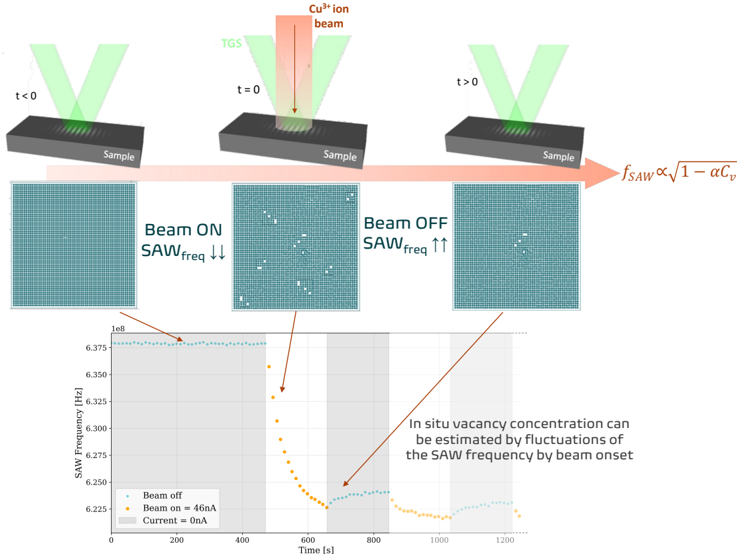

**Caption:** _Sin caption_

---

## FIG_002 · Picture · Página 10

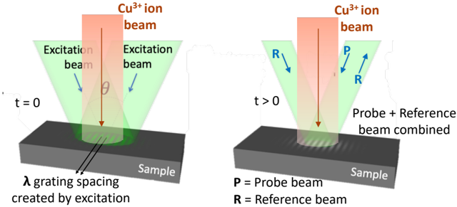

**Caption:** Figure 1: Scheme of TGS coupled with in situ irradiation. Adapted from [24].

---

## FIG_003 · Picture · Página 13

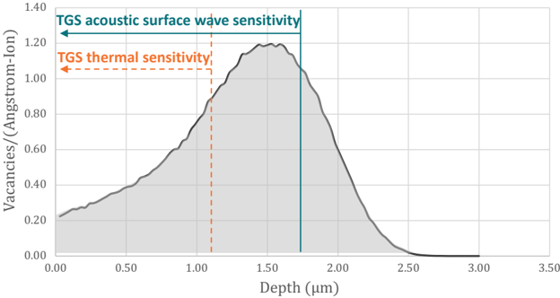

**Caption:** Figure 2: Irradiation depth profile as calculated by SRIM and nominal TGS e-folding depth sensitivity for thermal and acoustic wave properties.

---

## FIG_004 · Picture · Página 15

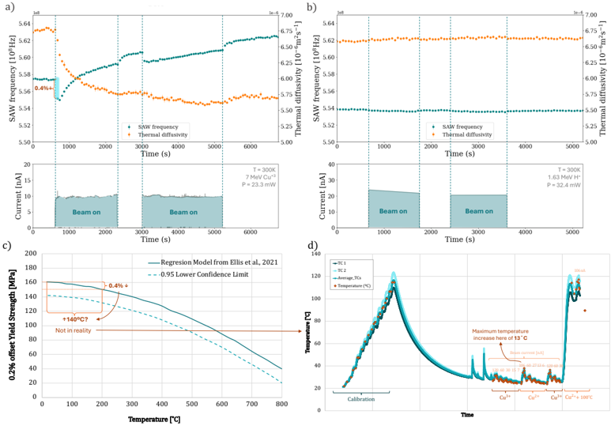

**Caption:** Figure 3: in situ TGS results from 7 MeV Cu 3+ irradiation at 23.3 mW (a) and from 1.63 MeV proton irradiation (b). Most crucially, these two results show that two experiments with the same beam heating power in Watts produce changes in SAW frequency proportional to their ion stopping powers, and not to beam heating temperature. This isolates the effect of beam heating from vacancy concentration on the changes in SAW frequency and thermal diffusivity. c) 0.2% offset Yield Strength model for GRCop-84 from [35], showing that a 0.4% change in elastic properties would imply an increase in temperature of 140 ◦ C . d) Infrared camera calibration and temperature measurement for different isotopes of copper at 1.68MV terminal potential. This plot shows that the maximum increase in temperature for Cu 2+ is 13 ◦ C , and just around 1 . 5 ◦ C for 15 nA of Cu 3+ (current conditions used in plots a) and b).

---

## FIG_005 · Picture · Página 17

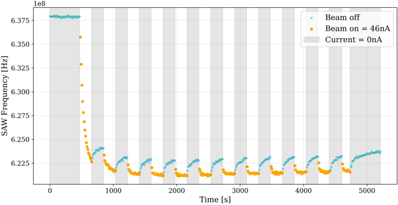

**Caption:** Figure 4: Periodic pulsed beam experiment, showing how SAW frequency evolves as the Cu-ion beam is cycled on and off. The white background and orange dots represent the periods in which the beam is on, and the grey background and blue dots represent the periods in which the beam is off.

---

## FIG_006 · Picture · Página 18

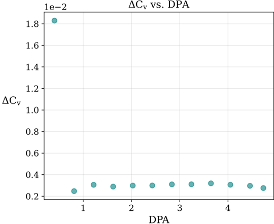

**Caption:** Figure 5: Vacancy concentration evolution with increasing dose for a periodic pulsed beam experiment. The initial large increase represents the change from only thermal point defects (here we deem this to be negligible) to a high concentration, while the increases at all subsequent doses are much smaller as the proliferation of radiation defects from initial irradiation quickly reduces later vacancy concentrations.

---

## FIG_007 · Picture · Página 19

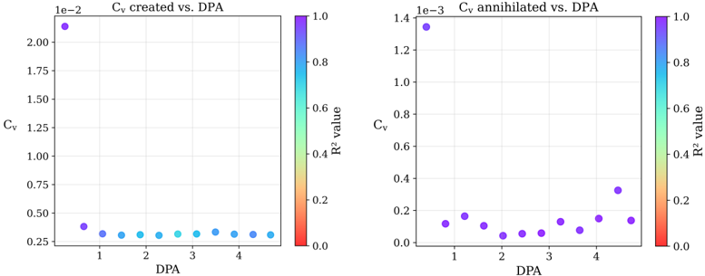

**Caption:** Figure 6: Vacancy concentration calculated for each beam pulse during the logarithmic pulsed-beam experiment (Fig. 4). The concentration of vacancies created corresponds to the beam on periods, and the concentration of vacancies annihilated corresponds to the beam off periods. The color of each point corresponds to the quality of the data, measured by R 2 value.

---

## FIG_008 · Picture · Página 20

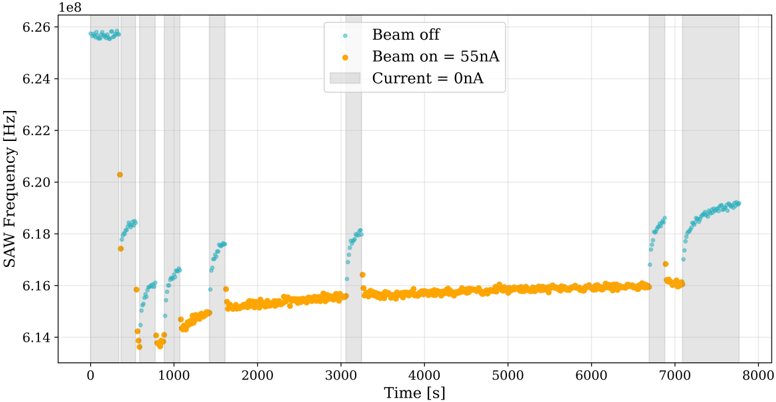

**Caption:** Figure 7: Logarithmic pulsed beam experiment. The white background and orange dots represent the periods in which the beam is on, and the grey background and blue dots represent the periods in which the beam is off.

---

## FIG_009 · Picture · Página 20

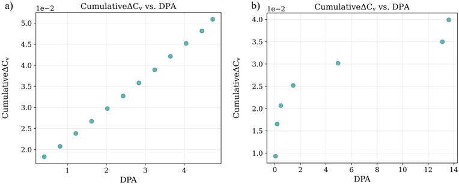

**Caption:** Figure 8: Cumulative vacancy concentration comparison between a) the periodic pulsedbeam, and b) the logarithmic scale pulsed-beam experiments.

---

## FIG_010 · Picture · Página 21

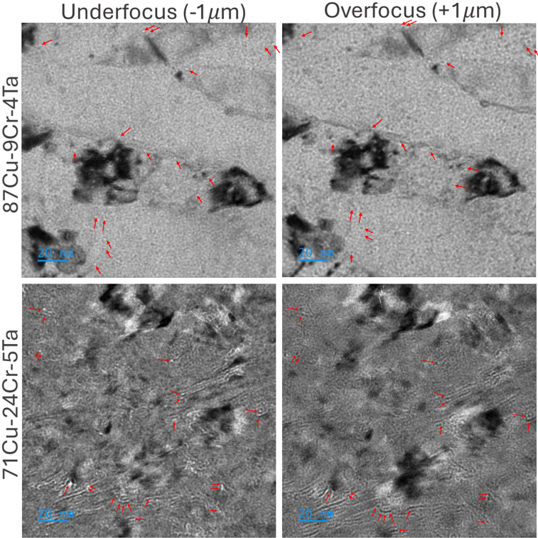

**Caption:** Figure 9: TEM images from the different Cu-Cr-Ta compositions. On the left side pictures were taken with an underfocus value of -1 µm , and images on the right column were taken with an overfocus value of +1 µm .

---

## FIG_011 · Picture · Página 22

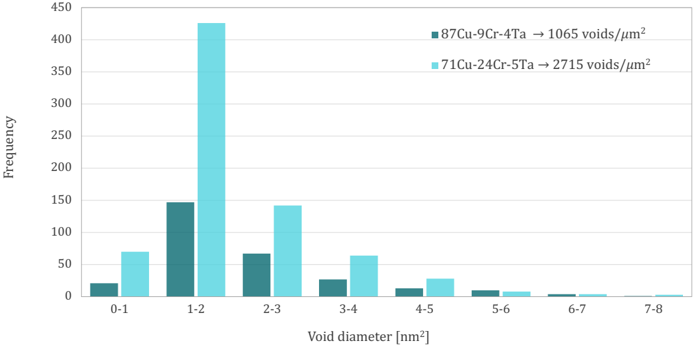

**Caption:** Figure 10: Distribution of the number and size of voids detected on each sample. Void densities per µm 2 for each composition are shown in the upper right.

---

## FIG_012 · Picture · Página 25

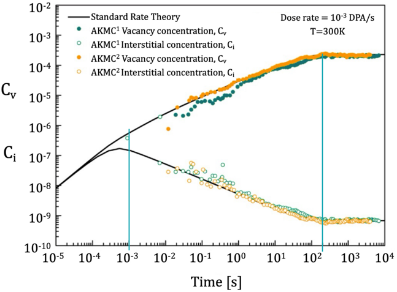

**Caption:** Figure 11: Point defect evolution for FeNi at 300K and 10-3 DPA/s, obtained from standard rate theory and atomistic kinetic Monte Carlo (AKMC) simulations using a random sink distribution and an annihilation rate of sinks. Plot adapted from [36].

---

## FIG_013 · Picture · Página 28

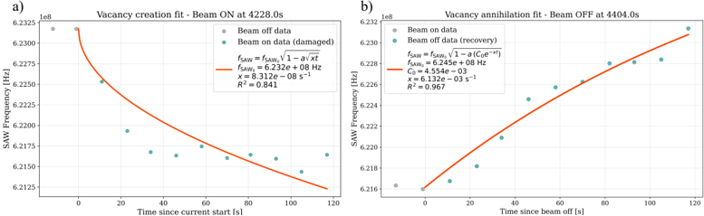

**Caption:** Figure 12: Beam on/off period fitting. The data from these fitting correspond to the 4228 s beam on period and the 4404 s beam off period from Figure 4.

---

## FIG_014 · Picture · Página 32

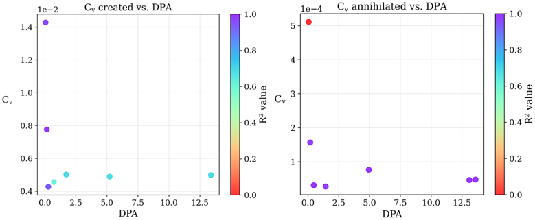

**Caption:** Figure 13: Vacancy concentration calculated for each beam pulse during the logarithmic pulsed-beam experiment (Figure 7). the concentration of vacancies created correspond to the beam on periods, and the concentration of vacancies annihilated correspond to the beam off period. The color of each point corresponsd to the quality of the data, measured by its R 2 value.

---

## FIG_015 · Picture · Página 33

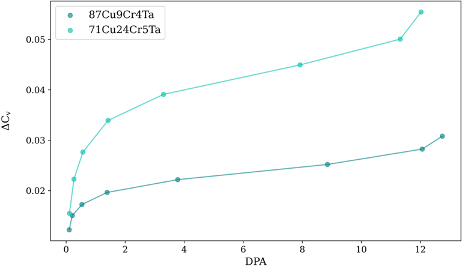

**Caption:** Figure 14: Cumulative vacancy concentration calculated for Cu-9Cr-4Ta (dark blue) and Cu-24Cr-5Ta (light blue) with increasing DPA, showing that the former, despite lower alloying element concentration, exhibits less vacancy concentration increase at similar doses.
