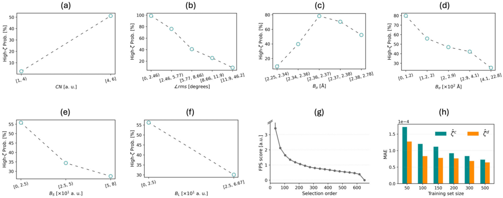
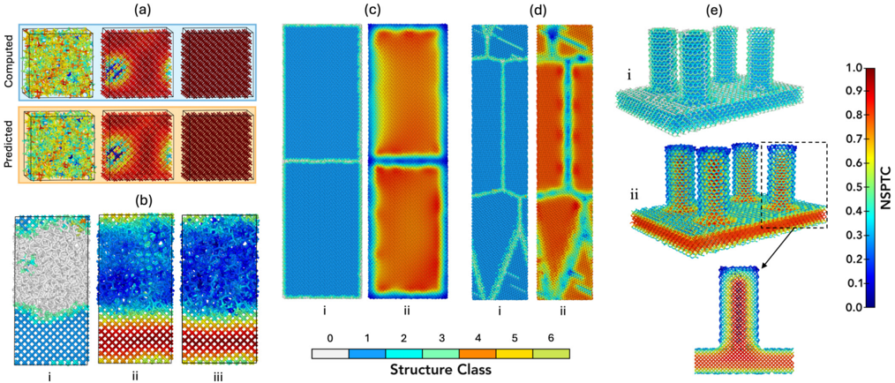
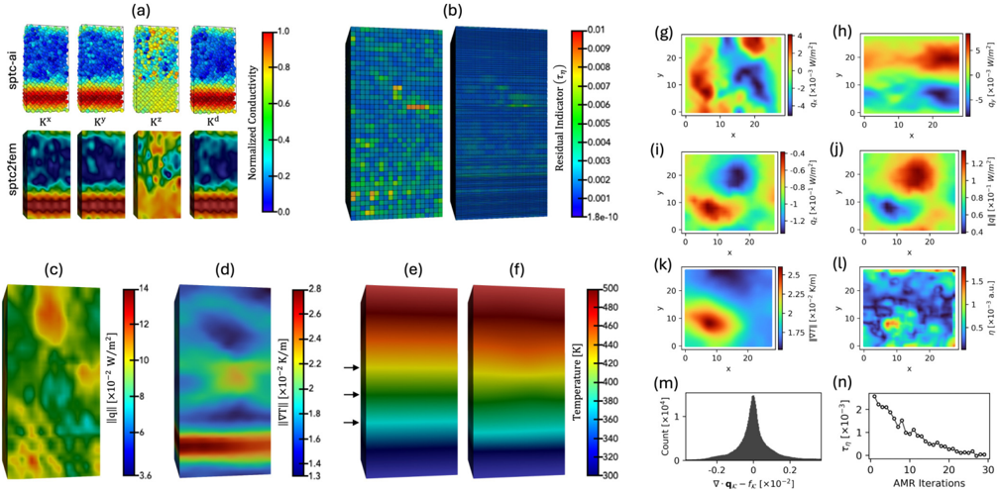
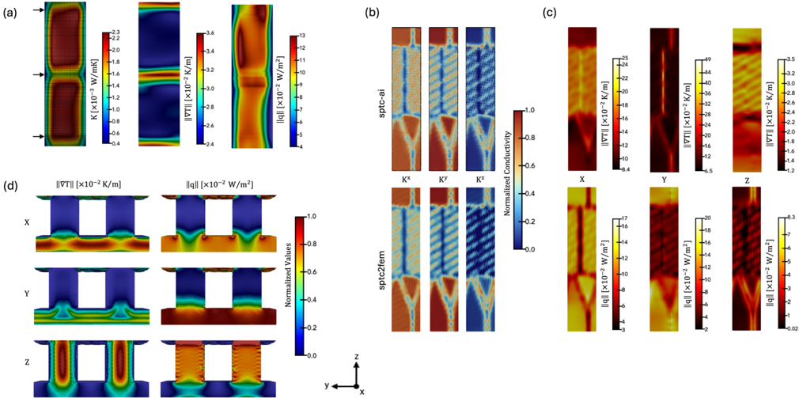
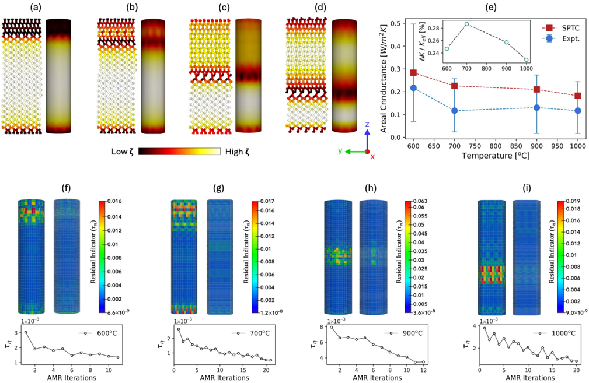

# Figuras extraídas

**Fuente:** `/home/santi/Documentos/ilovepappers/pappers/chemical.pdf`
**Total figuras:** 6

---

## FIG_001 · Picture · Página 1

**Caption:** _Sin caption_

---

## FIG_002 · Picture · Página 4

**Caption:** FIG. 1. Architecture and Training of sptc-ai . Empirical probability of high-SPTC outcome from binned distribution of the continuous structural descriptors, including (a) the coordination number (CN), (b) the root-mean-square deviation from the ideal tetrahedral angle ( ∠ rms), (c) the mean (B µ ) and (d) standard deviation (B σ ) of bond lengths, and the (e) fractions of short (BS) and (f) long (BL) bonds. (g) Farthest point sampling score for all structures. (h) Mean absolute error (MAE) for the averaged directional SPTC ( ˆ ζ c ) and the directly predicted isotropic SPTC ( ˆ ζ d ) for the different training set sizes.

---

## FIG_003 · Picture · Página 5

**Caption:** FIG. 2. Performance of sptc-ai . The 'NSPTC' colorbar indicates the normalized SPTC, ranging from 0 (blue) to 1 (red), while the 'Structure Class' colorbar encodes the OVITO-based local environment: amorphous (0, gray), cubic diamond (1, blue) and its first (2, cyan) and second (3, green) neighbors, and hexagonal diamond (4, orange) with its first (5, yellow) and second (6, lime) neighbors. (a) Model performance on held-out test structures: computed (top) and predicted (bottom) SPTC distributions for (left → right) amorphous, defective, and purely crystalline Si. (b) Generalization of sptc-ai to an unseen amorphous-crystalline Si interface containing 2022 atoms, showing (i) structure class, (ii) predicted SPTC, and (iii) computed SPTC. (c)-(e) Structure class and predicted SPTC for (c) a 223 930-atom Si twin-grain-boundary nanowire, (d) a 134 923-atom polycrystalline Si nanowire, and (e) a 26 191-atom Si nanopillar. Panels (c) and (d) show mid-slices; the black rectangle in (e) highlights the zoomed mid-slice region of the nanopillar.

---

## FIG_004 · Picture · Página 6

**Caption:** FIG. 3. Analysis of sptc2fem results for the amorphous-crystalline Si structure. (a) Anisotropic and isotropic SPTC (top) and coarsegrained conductivity (bottom); colormap shows normalized values. (b) Adaptive mesh refinement using the equal mass controller with Dörfler marking, showing coarse (left) and refined (right) meshes. (c)(d) Dirichlet solve for thermal loading along z : magnitude of the flux and temperature gradient. (e) Steady-state temperature for K ( x ) = 1 and (f) for sptc-ai ; arrows mark regions with differing temperature transitions. (g)-(l) Slices at z = 30 Å of directional fluxes, flux magnitude, temperature-gradient magnitude, and flux residuals η . (m) Histogram of continuity residual and (n) the AMR convergence.

---

## FIG_005 · Picture · Página 7

**Caption:** FIG. 4. Analysis of the sptc2fem results for the other structures. (a) Twin grain boundary: isotropic conductivity (arrows mark EMCrefined regions), temperature gradient, and flux (left to right). (b) Polycrystalline Si: anisotropic SPTC (top) and coarse-grained conductivity (bottom); colormap shows normalized values, and (c) the magnitude of temperature gradient (top) and flux (bottom) for thermal loading along x , y , and z (left to right). (d) Silicon nanopillar: magnitude of temperature gradient (left) and flux (right) for thermal loading along x , y , and z (top to bottom).

---

## FIG_006 · Picture · Página 9

**Caption:** FIG. 5. Experimental validation of the method. (a)-(d) Atomic-scale (left) and FEM-scale (right) 3C/2H nanowire models at annealing temperatures of 600, 700, 900, and 1000 ◦ C. The colormap spans low (black) to high (white) SPTC. (e) Experimental areal conductance [70] compared with SPTC-derived values (W / m -2 K -1 ); the inset shows the percent relative difference, /Delta1 K = K exp -K eff . (f)-(i) Mesh refinement showing the starting coarse (left) and final refined (right) meshes. The bottom panel shows convergence of the residual indicator threshold τη for each refinement series.
