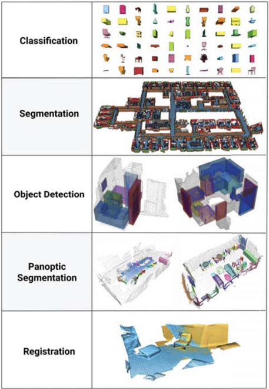
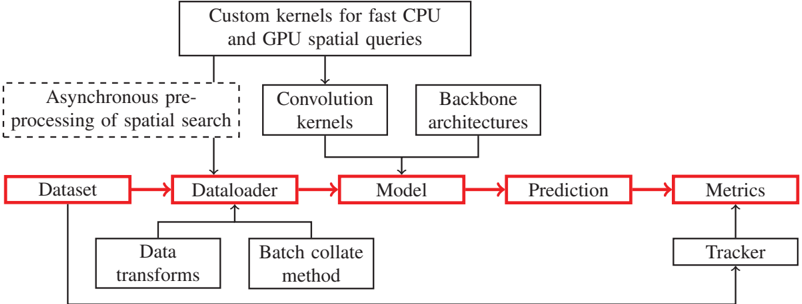
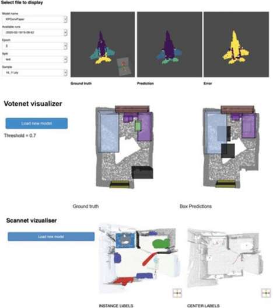
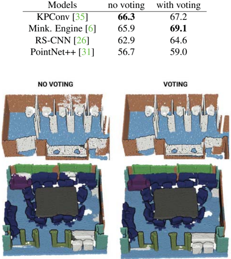
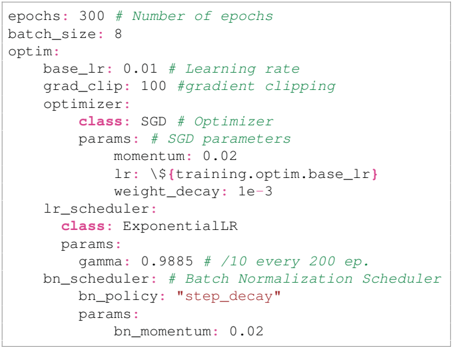
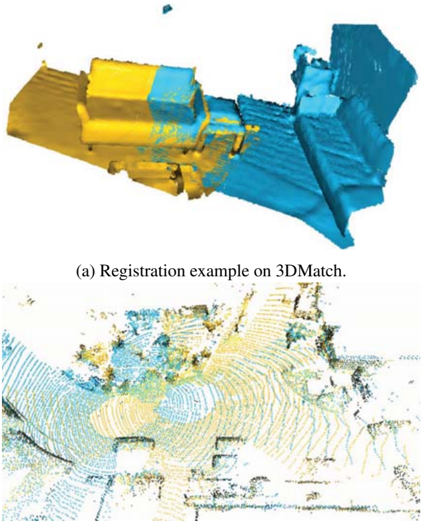

# Figuras extraídas

**Fuente:** `/media/santi/ALMACEN_GRANDE_1/ilovepappers/pappers/TorchPoints3D_framework_Chaton_2020.pdf`
**Total figuras:** 6

---

## FIG_001 · Picture · Página 1

**Caption:** Figure 1: Torch-Points3D supports multiple tasks such as classification, segmentation, object detection, panoptic segmentation, and registration. All visuals have been produced by the framework.

---

## FIG_002 · Picture · Página 4

**Caption:** Figure 2: Overall architecture of the framework, with data flow highlighted in red. Dataset implements the core loading mechanism of raw data and creates objects containing the points' positions, relevant features, and labels. Those objects are then passed through data augmentation transforms and aggregated into batches in the Dataloader . They are finally passed to the Model , which outputs the prediction. A tracker evaluates the performance from predefined Metrics and publish results on the console and/or directly on Weight and Biases ( wandb.ai ).

---

## FIG_003 · Picture · Página 5

**Caption:** _Sin caption_

---

## FIG_004 · Picture · Página 7

**Caption:** Table 3: Improvement in terms of mIoU provided by inference-time voting schemes on S3DIS 6-folds.

---

## FIG_005 · Picture · Página 7

**Caption:** Listing 4: Optimizer hyper-parameters used for training all models on S3DIS.

---

## FIG_006 · Picture · Página 8

**Caption:** (b) Registration example on KITTI odometry.
