# Figuras extraídas

**Fuente:** `/media/santi/ALMACEN_GRANDE_1/ilovepappers/pappers/UNet_nucleacion_voids_tantalio_Anantharanga_2025.pdf`
**Total figuras:** 20

---

## FIG_001 · Picture · Página 1

**Caption:** _Sin caption_

---

## FIG_002 · Picture · Página 4

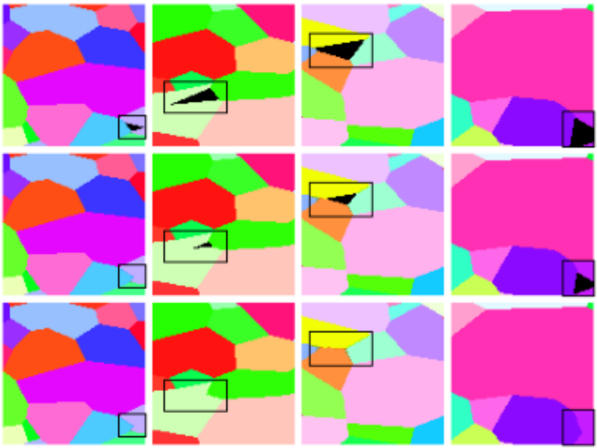

**Caption:** Figure 1: A reversed erosion algorithm, together with EBSD and grain boundary information, is used to reconstruct pre-damaged microstructures. (top) Samples of EBSD data showing defects resulting from the presence of voids. (middle) Erosion algorithm fills the defects until (bottom) The defect is completely filled.

---

## FIG_003 · Picture · Página 5

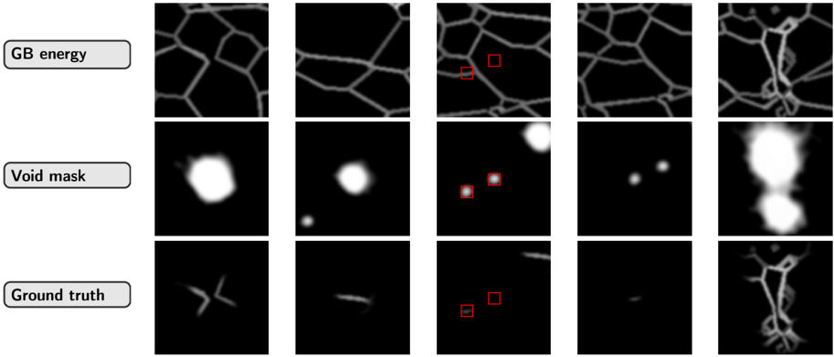

**Caption:** Figure 2: A visual compilation of three image sets: grain boundary energy (top row), void masks (middle row), and final ground truth images (bottom row). The final ground truth images are obtained by performing a pixel wise multiplication of grain boundary energy and void masks. The red boxes emphasize two cases: (i) when voids intersect grain boundaries, resulting in retained regions in the final mask, and (ii) when voids fall outside grain boundaries, leading to their exclusion from the final mask. This approach ensures that only voids that are on grain boundaries are preserved for further analysis.

---

## FIG_004 · Picture · Página 6

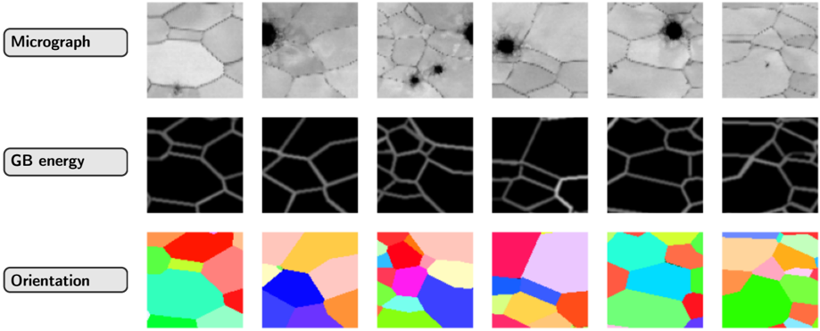

**Caption:** Figure 3: A visual compilation of three image sets: micrograph (top row), grain boundary energy (middle row), and grain orientation (bottom row). The dataset to the ML model includes grain orientations and grain boundary energies.

---

## FIG_005 · Picture · Página 7

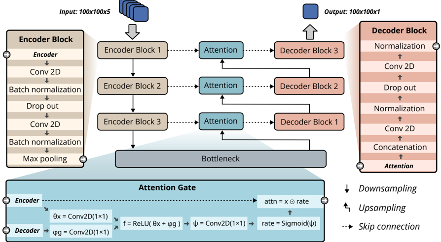

**Caption:** Figure 4: The full U-Net architecture, comprised of an encoder-decoder structure with attention gates between corresponding layers. The encoder processes a 100×100×5 input and the decoder reconstructs a 100×100×1 predictions. Popouts illustrate the encoder, decoder, and attention gate architectures.

---

## FIG_006 · Picture · Página 8

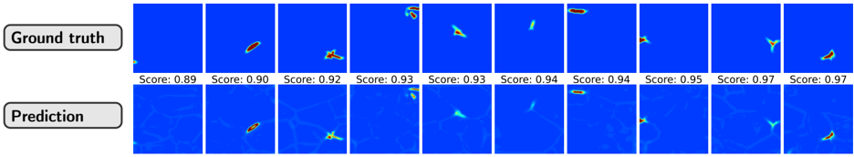

**Caption:** Figure 5: Representative selection of model results for training sets, indicating the robustness of the ML architecture for capturing void nucleation probability fields. Intensity values are clamped between 0.05 and 0.6 for better visualization.

---

## FIG_007 · Picture · Página 9

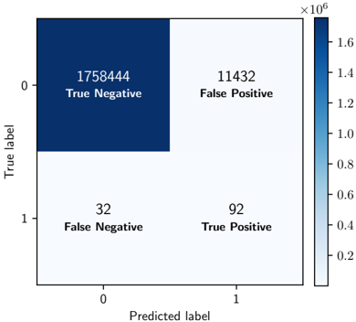

**Caption:** _Sin caption_

---

## FIG_008 · Picture · Página 9

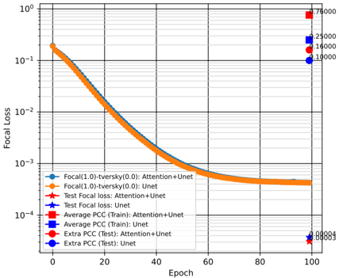

**Caption:** _Sin caption_

---

## FIG_009 · Picture · Página 10

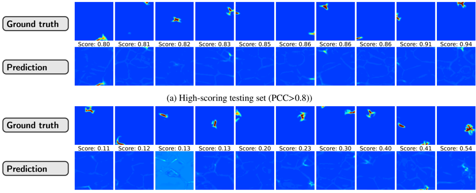

**Caption:** _Sin caption_

---

## FIG_010 · Picture · Página 12

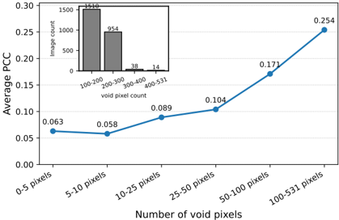

**Caption:** _Sin caption_

---

## FIG_011 · Picture · Página 12

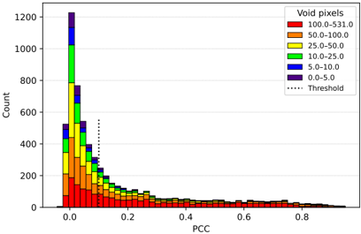

**Caption:** _Sin caption_

---

## FIG_012 · Picture · Página 12

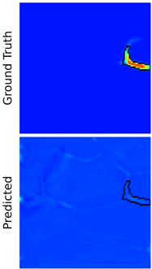

**Caption:** Figure 8: PCC analysis of model performance across entire dataset

---

## FIG_013 · Picture · Página 12

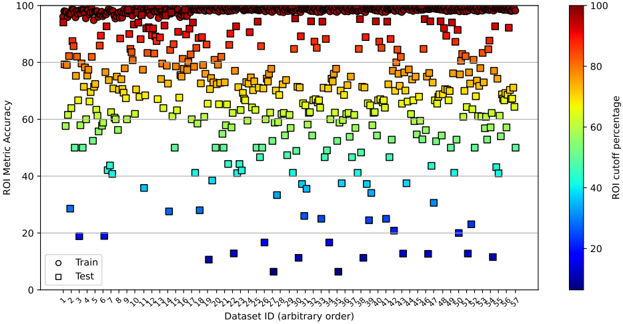

**Caption:** (a) Graphical illustration of ROI metric: the region of interest around a void is projected onto the predicted image.

---

## FIG_014 · Picture · Página 18

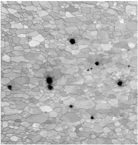

**Caption:** _Sin caption_

---

## FIG_015 · Picture · Página 18

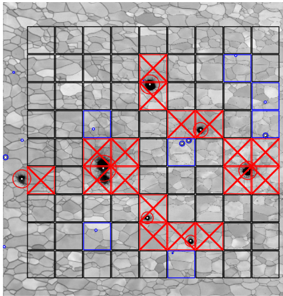

**Caption:** (c) Micrograph segmented into red (bad voids), blue (good voids), and black (no void regions).

---

## FIG_016 · Picture · Página 18

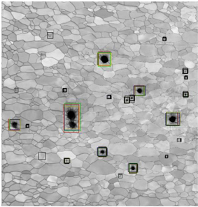

**Caption:** _Sin caption_

---

## FIG_017 · Picture · Página 18

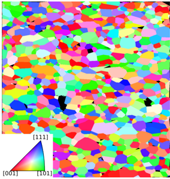

**Caption:** _Sin caption_

---

## FIG_018 · Picture · Página 18

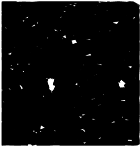

**Caption:** (f) Mask applied to the microstructure to highlight regions of voids

---

## FIG_019 · Picture · Página 18

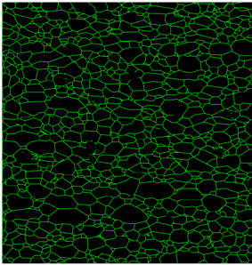

**Caption:** _Sin caption_

---

## FIG_020 · Picture · Página 19

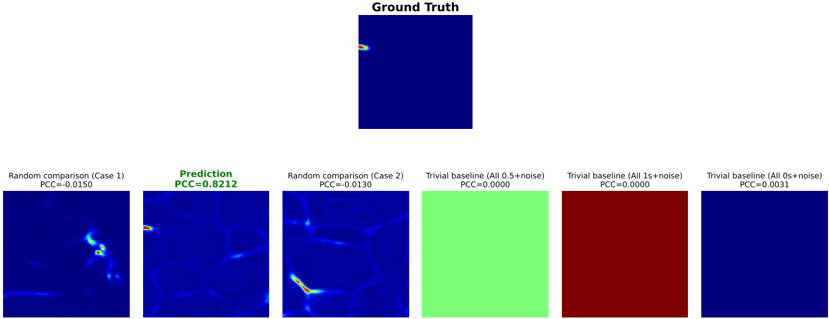

**Caption:** Figure 11: Pearson correlation coefficient based comparison between the ground truth and predicted void nucleation fields. The reference ground truth image is shown in the top row indicating the baseline against which all comparisons are made. The bottom row presents various predicted images, each annotated with its corresponding PCC value. The predicted field corresponding to the ground truth reference yields the highest correlation values as showm in green, while random predictors (such as constant fields of ones, zeros, or 0.5 values) exhibit significantly lower PCC values, underscoring their lack of structural correspondence. This shows that PCC is stringent as compared many other metrics which can give a false impression that the model predicts well even in cases where it does not do well.
