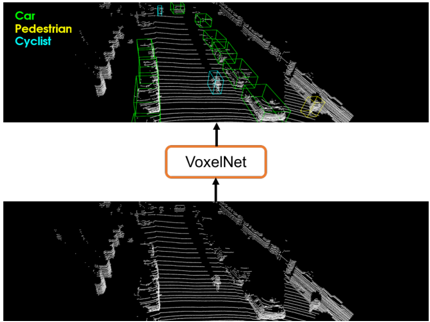
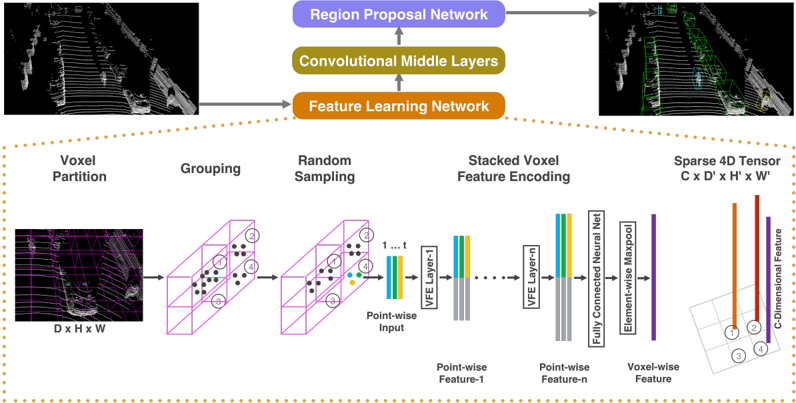
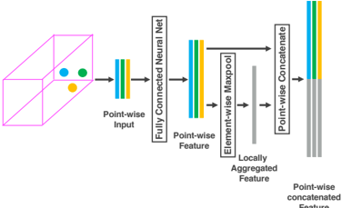
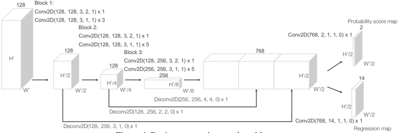
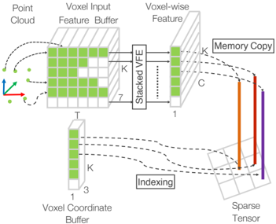
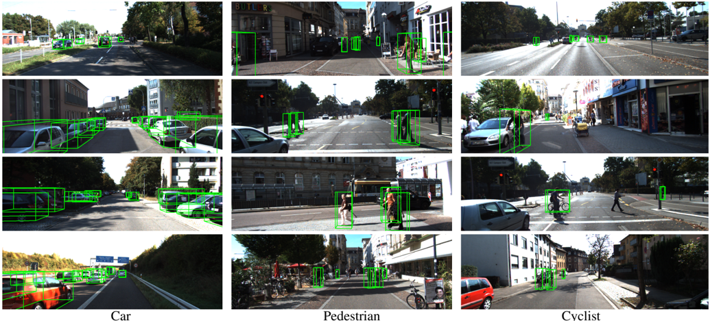

# Figuras extraídas

**Fuente:** `/media/santi/ALMACEN_GRANDE_1/ilovepappers/pappers/VoxelNet_Zhou_2017.pdf`
**Total figuras:** 6

---

## FIG_001 · Picture · Página 1

**Caption:** Figure 1. VoxelNet directly operates on the raw point cloud (no need for feature engineering) and produces the 3D detection results using a single end-to-end trainable network.

---

## FIG_002 · Picture · Página 2

**Caption:** Figure 2. VoxelNet architecture. The feature learning network takes a raw point cloud as input, partitions the space into voxels, and transforms points within each voxel to a vector representation characterizing the shape information. The space is represented as a sparse 4D tensor. The convolutional middle layers processes the 4D tensor to aggregate spatial context. Finally, a RPN generates the 3D detection.

---

## FIG_003 · Picture · Página 3

**Caption:** _Sin caption_

---

## FIG_004 · Picture · Página 4

**Caption:** Figure 4. Region proposal network architecture.

---

## FIG_005 · Picture · Página 5

**Caption:** Figure 5. Illustration of efficient implementation.

---

## FIG_006 · Picture · Página 8

**Caption:** Figure 6. Qualitative results. For better visualization 3D boxes detected using LiDAR are projected on to the RGB images.
