# Figuras extraídas

**Fuente:** `/media/santi/ALMACEN_GRANDE_1/ilovepappers/pappers/carbono_amorfo_ruestes.pdf`
**Total figuras:** 16

---

## FIG_001 · Picture · Página 1

**Caption:** _Sin caption_

---

## FIG_002 · Picture · Página 1

**Caption:** _Sin caption_

---

## FIG_003 · Picture · Página 1

**Caption:** _Sin caption_

---

## FIG_004 · Picture · Página 4

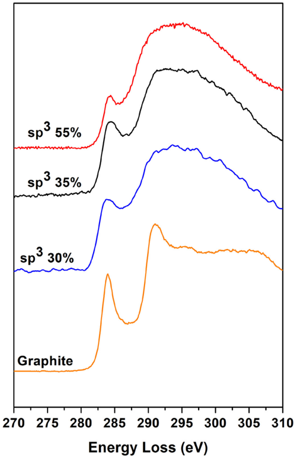

**Caption:** Fig. 2. Measured EELS spectra for DLC samples with diverse sp 3 content: 20% (green line), 30% (blue line), 35% (black line) and 55% (red line). For comparison an EELS spectra for a graphite sample is also shown (orange line).

---

## FIG_005 · Picture · Página 4

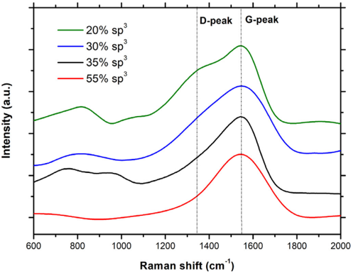

**Caption:** Fig. 1. Measured Raman spectra for DLC samples with diverse sp 3 content: 20% (green line), 30% (blue line), 35% (black line) and 55% (red line).

---

## FIG_006 · Picture · Página 5

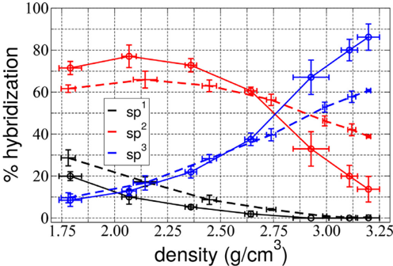

**Caption:** Fig. 4. Hybridization percentage of samples generated using DFT and EDIP with 256 atoms.

---

## FIG_007 · Picture · Página 5

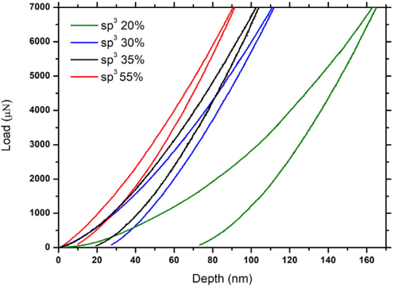

**Caption:** Fig. 3. Experimental nanoindentation load-depth curves for DLC samples with diverse sp 3 content: 20% (green line), 30% (blue line), 35% (black line) and 55% (red line).

---

## FIG_008 · Picture · Página 5

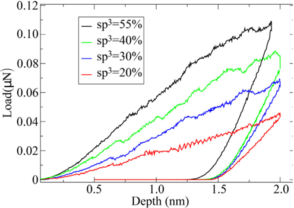

**Caption:** Fig. 5. Load vs. indenter depth curves for DLC with 20, 30 and 55% sp 3 %.

---

## FIG_009 · Picture · Página 6

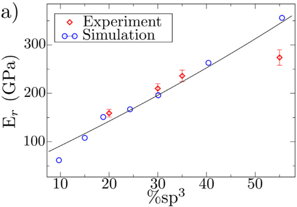

**Caption:** Fig. 6. (a) Elastic modulus for different sp 3 %, red and blue symbols represent experiments and simulations respectively. Line indicates the fit E = 478 . 5[0 . 248 + sp 3 ) ] 3 / 2 [29,70] . (b) Hybridization as a function of the average coordination of every sample indented with MD. (c) Elastic modulus vs. average coordination. The line indicates the best fit using the model by He and Thorpe [71] , E r = k ( 〈 r 〉 -r p ) m , using r p = 2 . 4 , k = 280 . 3 GPa, and exponent m = 1 . 7 .

---

## FIG_010 · Picture · Página 6

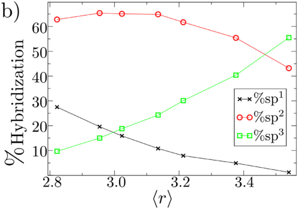

**Caption:** _Sin caption_

---

## FIG_011 · Picture · Página 6

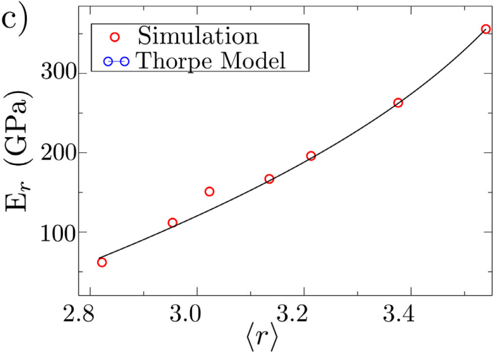

**Caption:** _Sin caption_

---

## FIG_012 · Picture · Página 7

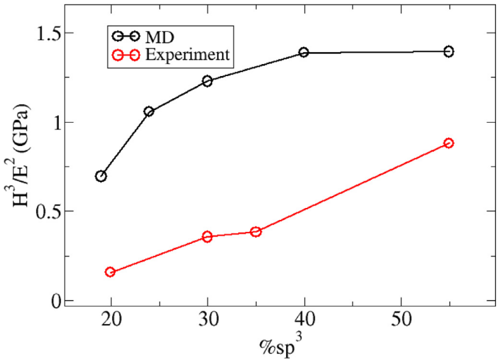

**Caption:** Fig. 8. Figure of merit H 3 /E 2 versus sp 3 content, for both experiments and simulations.

---

## FIG_013 · Picture · Página 7

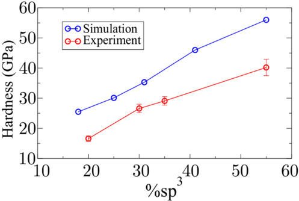

**Caption:** Fig. 7. MD hardness at full penetration versus %sp 3 . Experimental results are also included.

---

## FIG_014 · Picture · Página 8

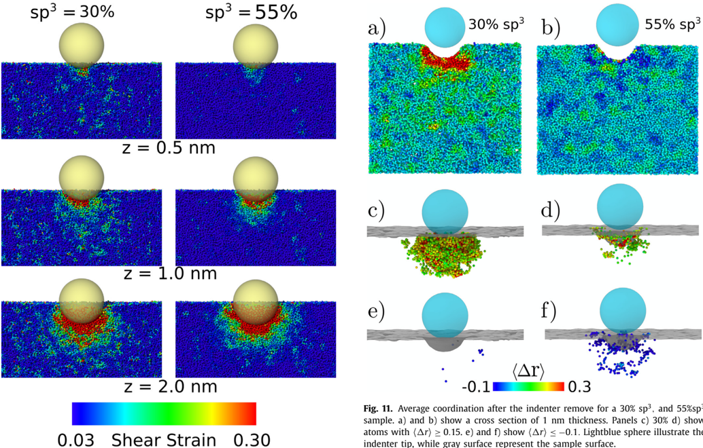

**Caption:** Fig. 9. Indentation for different DLC samples. Every picture correspond to a half-cut of the sample. Color code illustrates the shear strain of each atom.

---

## FIG_015 · Picture · Página 8

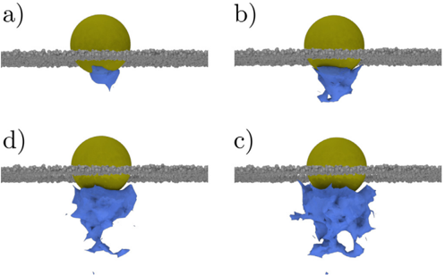

**Caption:** Fig. 10. Shear strain surface around atoms with more than 0.3 shear strain for an aC sample of sp 3 % = 30 %. a), b), c) and d) correspond at indenter depth of 0.5, 1.0, 1.5 and 2.0 nm respectively. Gray atoms correspond to the DLC surface.

---

## FIG_016 · Picture · Página 9

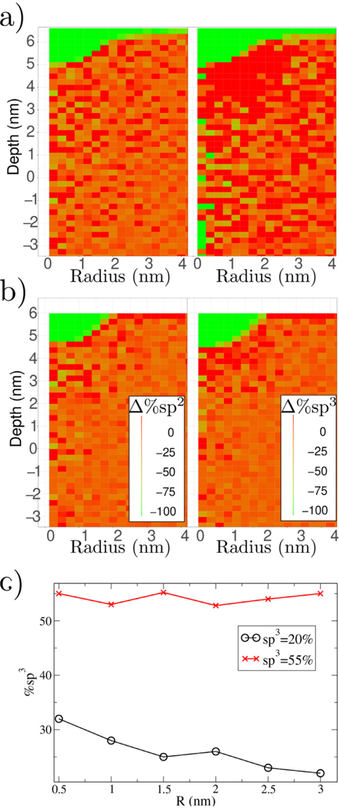

**Caption:** Fig. 12. Hybridization change for different sp 3 concentration. a) % hybridization change with respect to a non-indented sample with a sp 3 = 20%, left panel, right panel show the /Delta1 % sp 2 , and /Delta1 % sp 3 , respectively. b) % hybridizatoin change for a sp 3 = 55% sample. c) sp 3 as function of distance of the indenter. Calculation were perform at an indenter depth of z = 2 nm. Averages were calculated using spherical bins of 0.5 nm of thickness.
