# Figuras extraídas

**Fuente:** `/home/santi/Documentos/ilovepappers/pappers/ilove-Jiang.2026.pdf`
**Total figuras:** 20

---

## FIG_001 · Picture · Página 4

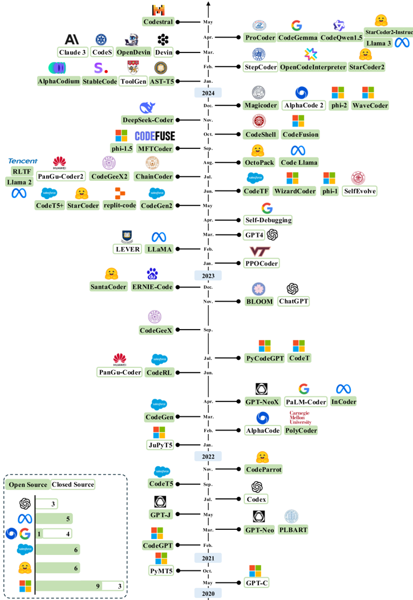

**Caption:** Fig. 1. A chronological overview of LLMs for code generation in recent years. The timeline was established mainly according to the release date. The models with publicly available model checkpoints are highlighted in green color.

---

## FIG_002 · Picture · Página 6

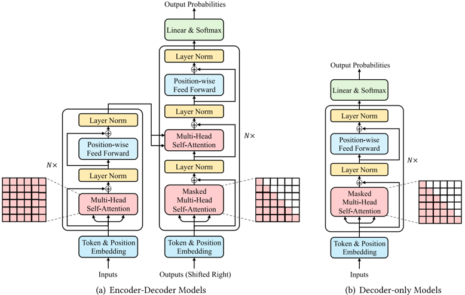

**Caption:** Fig. 2. The overview of LLMs with encoder-decoder and decoder-only Transformer architecture for code generation, adapted from [254].

---

## FIG_003 · Picture · Página 10

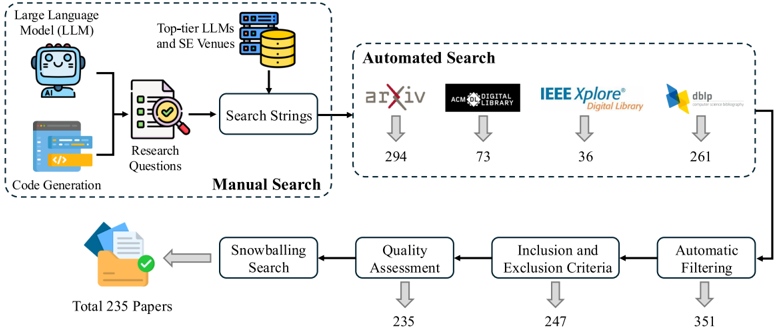

**Caption:** Fig. 3. Overview of the paper search and collection process.

---

## FIG_004 · Picture · Página 15

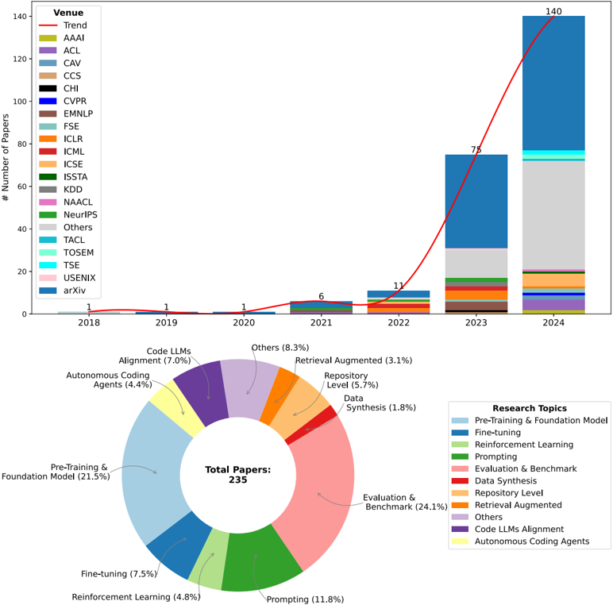

**Caption:** Fig. 4. Data qualitative analysis. Top : Annual distribution of selected papers across various publication venues. Bottom : Distribution analysis of research topics covered in the included papers.

---

## FIG_005 · Picture · Página 16

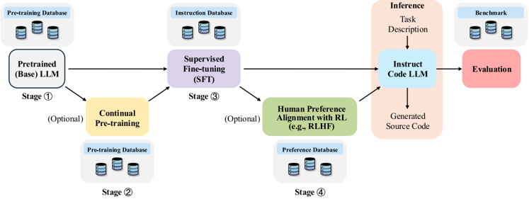

**Caption:** Fig. 5. A diagram illustrating the general training, inference, and evaluation workflow for Code LLMs and their associated databases. The training workflow is mainly divided into four distinct stages: Stages G 2460 and G 2461 are the pre-training phase, whereas Stages G 2462 and G 2463 represent the post-training phases. It is important to note that Stages G 2461 and G 2463 are optional. For instance, StarCoder [146] incorporates only Stage G 2460 . WizardCoder [171], fine-tuned upon StarCoder, includes only Stage G 2462 , while Code Llama [224], continually pre-trained on Llama 2, encompasses Stages G 2461 and G 2462 . DeepSeek-Coder-V2 [330], continually pre-trained on DeepSeek-V2, covers Stages G 2461 , G 2462 , and G 2463 . Note that pre-trained model can be directly used for inference through prompt engineering.

---

## FIG_006 · Picture · Página 17

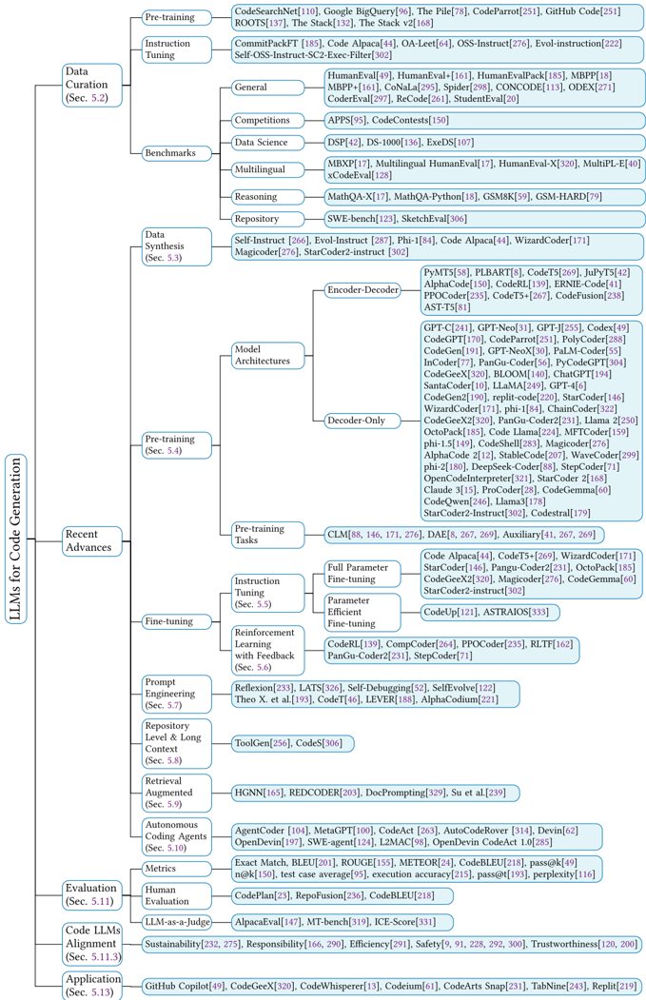

**Caption:** Fig. 6. Taxonomy of LLMs for code generation.

---

## FIG_007 · Picture · Página 18

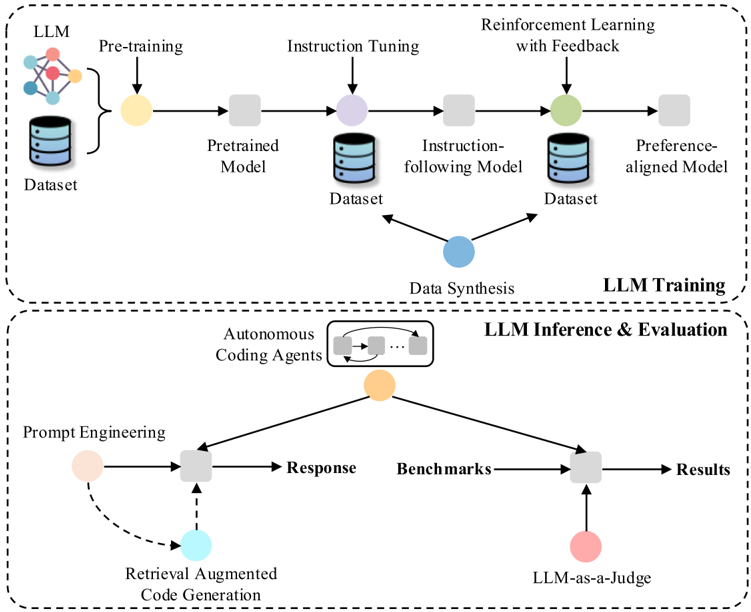

**Caption:** Fig. 7. The diagram provides a comprehensive overview of various techniques and their interconnections within the development of LLMs. Circular icons, distinguished by different colors, represent the specific techniques, while gray rectangles denote the evolved models with corresponding techniques. The upper section of the diagram outlines the techniques involved in the model training process, such as pre-training, instruction tuning, and reinforcement learning from human feedback (RLHF), as well as the incorporation of synthetic data. The lower section highlights the techniques related to model inference and evaluation, including prompt engineering, multi-turn prompting, retrieval-augmented generation, and LLM-based evaluations like LLM-asa-Judge. This visual representation underscores the dynamic evolution and integration of innovations in LLM development, facilitating a clearer understanding of how these technologies progressively enhance model capabilities and address various challenges.

---

## FIG_008 · Picture · Página 20

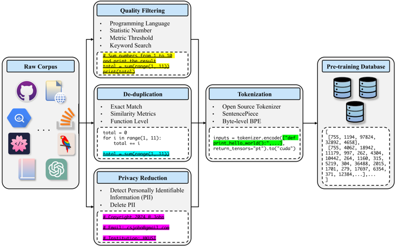

**Caption:** Fig. 8. A diagram depicting the standard data preprocessing workflow utilized in the pre-training phase of LLMs for code generation.

---

## FIG_009 · Picture · Página 28

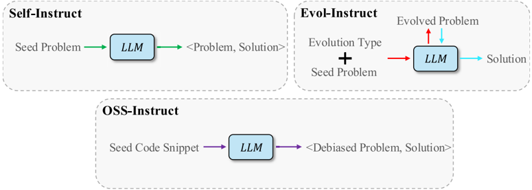

**Caption:** Fig. 9. The comparison among three representative data synthesis methods used for generating instruction data with LLMs. The Code Alpaca [44] employs the self-instruct method, whereas WizardCoder [171] and Magicoder [276] utilize the Evol-Instruct and OSS-Instruct methods, respectively.

---

## FIG_010 · Picture · Página 31

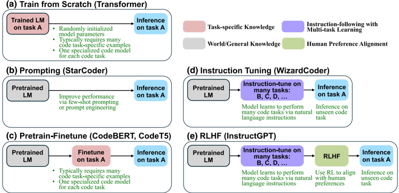

**Caption:** Fig. 10. Comparison of instruction tuning with various fine-tuning strategies and prompting for code tasks, adapted from [272]. For (a), which involves training a Transformer from scratch, please refer to [7] for its use in source code summarization task. In the case of (e), we utilize a representative RLHF [198] as an example. Additional reinforcement learning methods, such as DPO [213], are also applicable at this stage.

---

## FIG_011 · Picture · Página 32

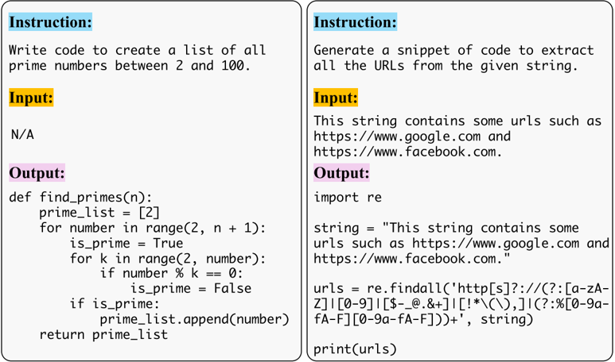

**Caption:** Fig. 11. Two examples of instruction data sampled from Code Alpaca [44] used to instruction-tune pre-trained code LLM to enhance their alignment with NL instructions. The instruction corpus encompasses a variety of tasks, each accompanied by distinct instructions, such as prime numbers generation and URLs extraction.

---

## FIG_012 · Picture · Página 33

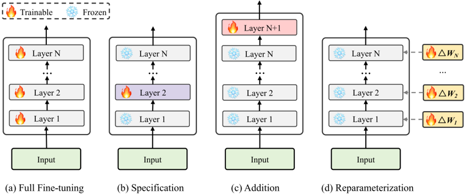

**Caption:** Fig. 12. An illustration of FFT and PEFT methods. Part (a) refers to the Full Fine-tuning method, which updates all parameters of the base model during fine-tuning. Part (b) stands for the Specification-based PEFT method that conditionally fine-tunes a small subset of the model parameters while freezing the rest of the model, e.g., BitFit [303]. Part (c) represents the Addition-based PEFT method that fine-tunes the incremental parameters introduced into the base model or input, e.g., Adapter [102], Prefix-tuning [148], and Prompt-tuning [142]. Part (d) symbolizes the Reparameterization-based method which reparameterizes existing model parameters by low-rank transformation, e.g., LoRA [103], QLoRA [66], and AdaLoRA [310].

---

## FIG_013 · Picture · Página 37

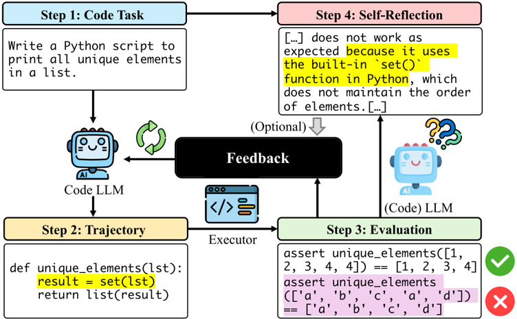

**Caption:** Fig. 13. An illustration of the self-improving code generation pipeline using prompts for LLMs. This process incorporates iterative self-refinement by integrating execution outcomes and includes an optional selfreflection mechanism to enhance generation quality.

---

## FIG_014 · Picture · Página 39

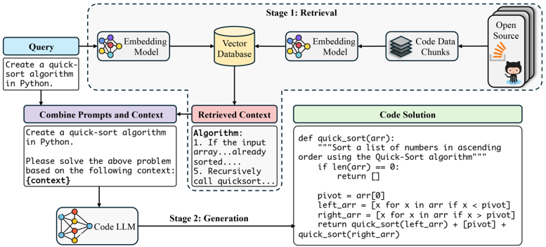

**Caption:** Fig. 14. A workflow illustration of the RACG. Upon receiving a query (instruction), the retriever selects the relevant contexts from a large-scale vector database. Subsequently, the retrieved contexts are merged with the query, and this combined input is fed into the generator (LLM) to produce the target code solution.

---

## FIG_015 · Picture · Página 40

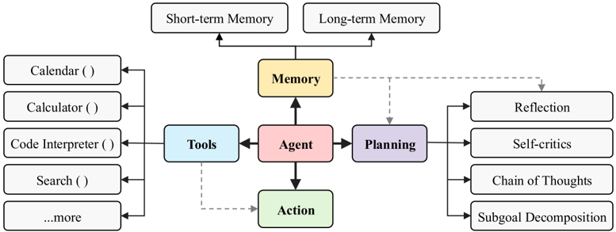

**Caption:** Fig. 15. The general architecture of an LLM-powered autonomous agent system, adapted from [277]. Planning : The agent decomposes large tasks into smaller, manageable sub-goals or engages in self-criticism and selfreflection on past actions to learn from mistakes and improve future performance. Memory : This component enables the agent to store and retrieve past information. Tools : The agent is trained to invoke external functions or APIs. Action : The agent executes actions, with or without the use of tools, to interact with the environment. The gray dashed lines represent the dataflow within the system.

---

## FIG_016 · Picture · Página 41

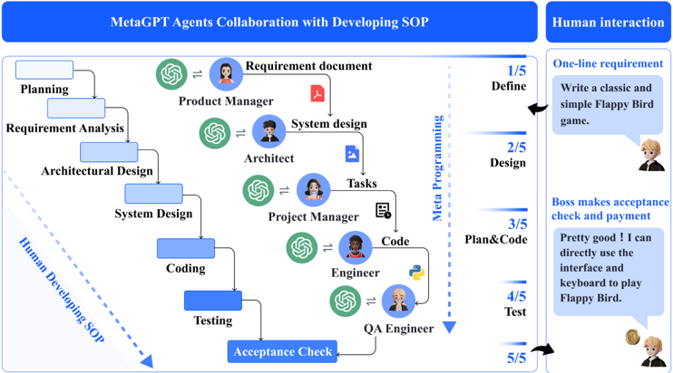

**Caption:** Fig. 16. MetaGPT integrates human workflow efficiencies into LLM-based multi-agent collaboration to break down complex code-related tasks into specific, actionable procedures. These procedures are then assigned to various roles, such as Product Manager, Architect, and Engineer played by LLM. The image is sourced from the original paper [100].

---

## FIG_017 · Picture · Página 43

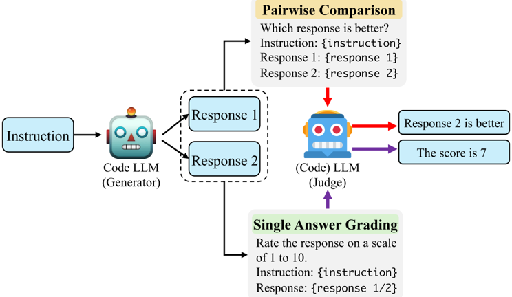

**Caption:** Fig. 17. The pipeline of (Code) LLM-as-a-judge for evaluating generated code by Code LLMs. There are primarily two types of approaches: pairwise comparison and single answer grading.

---

## FIG_018 · Picture · Página 46

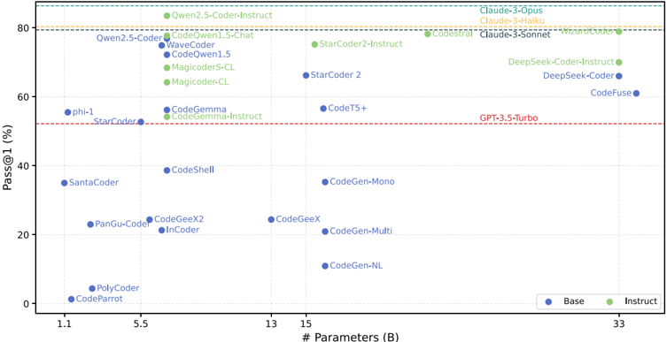

**Caption:** Fig. 18. The performance comparison of LLMs for code generation on the MBPP [18] benchmark, measured by pass@1 . For models with various sizes, we report only the largest size version of each model with a magnitude of billion (B) parameters.

---

## FIG_019 · Picture · Página 46

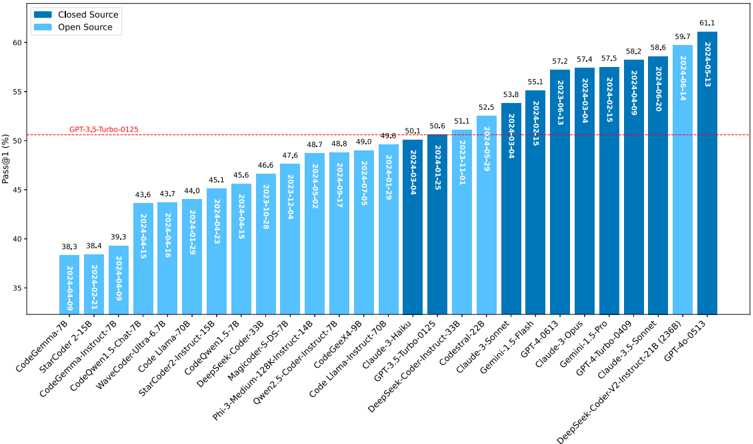

**Caption:** Fig. 19. The performance comparison of LLMs for code generation on the BigCodeBench [332] benchmark, measured by pass@1 . For models with various sizes, we report only the largest size version of each model with a magnitude of billion (B) parameters.

---

## FIG_020 · Picture · Página 54

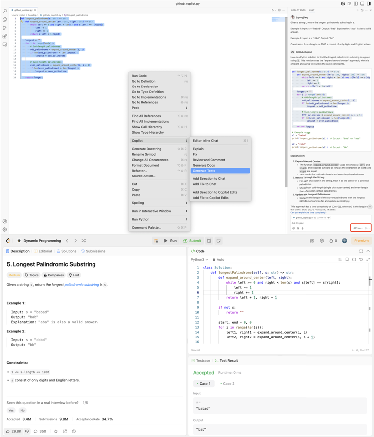

**Caption:** Fig. 20. An exemplar of GitHub Copilot to demonstrate how to use development tools powered by LLMs, including Claude 3.5 Sonnet (Preview), Claude 3.7 Sonnet (Preview), Claude 3.7 Sonnet Thinking (Preview), Gemini 2.0 Flash (Preview), GPT-4o, o1 (Preview), and o3-mini (Preview). To illustrate its capabilities, we input the description of the '5. Longest Palindromic Substring' problem from LeetCode into Copilot's chat box. The code generated by Copilot is then submitted to the online judge platform, where it is successfully accepted.
