# Figuras extraídas

**Fuente:** `/home/santi/Documentos/ilovepappers/pappers/ilove-LucaReali.2026.pdf`
**Total figuras:** 34

---

## FIG_001 · Picture · Página 1

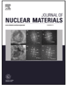

**Caption:** _Sin caption_

---

## FIG_002 · Picture · Página 1

**Caption:** _Sin caption_

---

## FIG_003 · Picture · Página 1

**Caption:** _Sin caption_

---

## FIG_004 · Picture · Página 1

**Caption:** _Sin caption_

---

## FIG_005 · Picture · Página 2

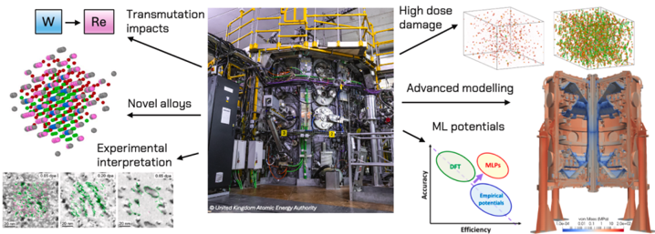

**Caption:** Fig. 1. Theory and modelling of fusion materials will necessarily play a part in transitioning from present, experimental devices to future fusion reactors. In this review, we highlight examples from the state-of-the-art alongside the areas where we see gaps that should soon be addressed (central image: ©2023 United Kingdom Atomic Energy Authority).

---

## FIG_006 · Picture · Página 3

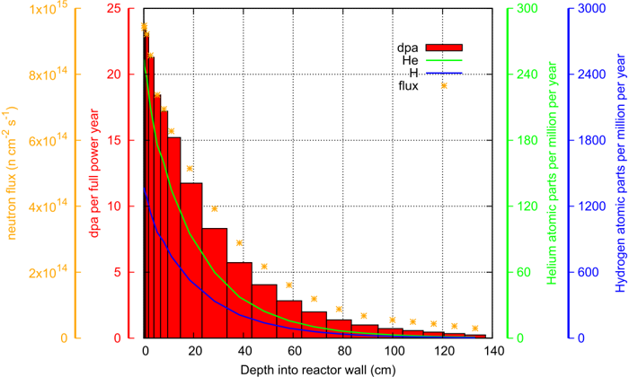

**Caption:** Fig. 2. Variation in the predicted damage dose rate (measured according to the NRT-displacements per atom or dpa per unit time), and helium and hydrogen production per year that would be experienced in pure Fe as a function of depth into the plasma-facing wall of a typical fusion tokamak design. Also shown is the variation in total neutron fl ux over the same depth for the design (an early concept of the STEP prototype [44,45]) that included other materials, such as tungs10 armour and tritium breeding materials. The neutron fl uxes are the volume averages in voxels of a rectangular mesh superimposed over the underlying (STEP) tokamak geometry and include the accumulated contributions from all nuclear interactions, including neutron scattering, multiplication, and absorption. This large variation of neutron-exposure-related phenomena on the engineering component-scale highlights the heterogeneous modelling challenge that must be solved to predict material performance at this scale.

---

## FIG_007 · Picture · Página 4

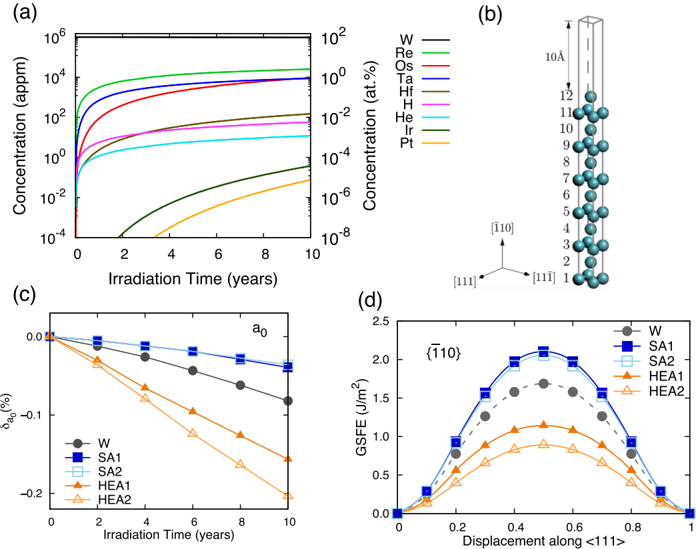

**Caption:** Fig. 3. (a) Transmutation of W after 10 years of continuous exposure to the plasma-facing conditions expected in a prototype fusion reactor; (b) Atomic arrangement of the surface models used to calculate the general stacking faults energy (GSFE) on the ⟨ 111 ⟩ { ̄ 110} slip system; (c) Evolution of the lattice constant in transmuted W-alloys during the fi rst ten years of continuous exposure to EU-DEMO conditions, in terms of the relative difference   0 =  0  - 0 0  0 0 ; and (d) GSFE for the slip along ⟨ 111 ⟩ direction in { ̄ 110} plane after 5 years of irradiation. Figure adapted from [48,49].

---

## FIG_008 · Picture · Página 4

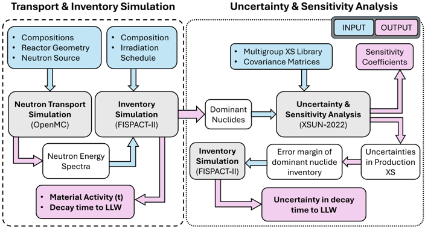

**Caption:** Fig. 4. Summary of method combining transport and inventory calculation to investigate material activity with independent uncertainty analysis on relevant nuclear data.

---

## FIG_009 · Picture · Página 6

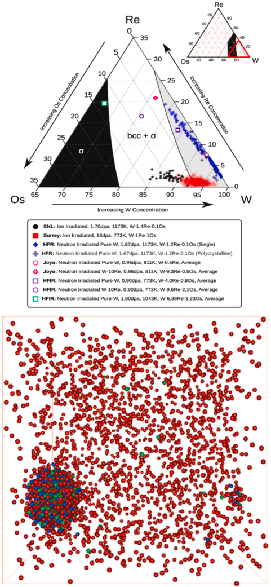

**Caption:** Fig. 5. Top: A section of phase diagram containing Re, Os cluster concentration determined from experimental data for neutron irradiated W and for ion irradiated W-Re-Os with similar alloy composition and dose [75-78]. Bottom: First principles based Monte Carlo simulations in a bcc 30x30x30 supercell containing voids (blue) decorated by Re (red) and Os (green) in W with 2at% Re and 0.2at% Os and 0.2 at% vacancy at 1173K [68,69]. (For interpretation of the references to colour in this fi gure legend, the reader is referred to the web version of this article.)

---

## FIG_010 · Picture · Página 7

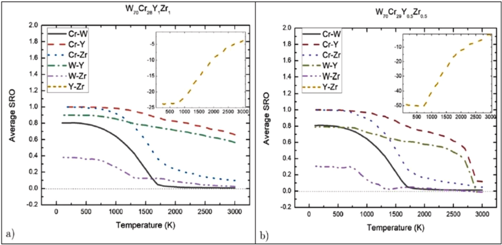

**Caption:** Fig. 6. Short-range order evolution in W-Cr-Y-Zr SMART materials as function of alloy compositions-a) being W 70 Cr 28 Y 1 Zr 1 and b) being W 70 Cr 29 Y 0 . 5 Zr 0 . 5 -showing the phase decomposition between W and Cr whereas the SRO between Y and Zr (insert fi gures) is strongly negative [79-81].

---

## FIG_011 · Picture · Página 8

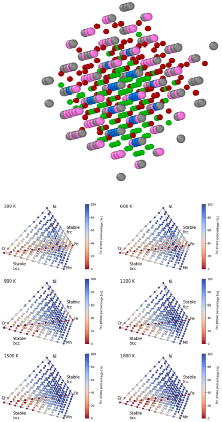

**Caption:** Fig. 8. Top: Formation of Cr (grey atoms) clustering predicted and extracted from modelling of Fe-alloys with nominal 3at.%Cr alloys containing Fe (pink) containing C (red), N (green) impurities interacting with vacancies (blue) [98]. Bottom: Temperature and composition maps showing fcc (blue) and bcc (red) phases of Fe-Cr-Ni-Mn high entropy alloys from Monte-Carlo simulations using cluster expansion Hamiltonian [96,97,99].. (For interpretation of the references to colour in this fi gure legend, the reader is referred to the web version of this article.)

---

## FIG_012 · Picture · Página 8

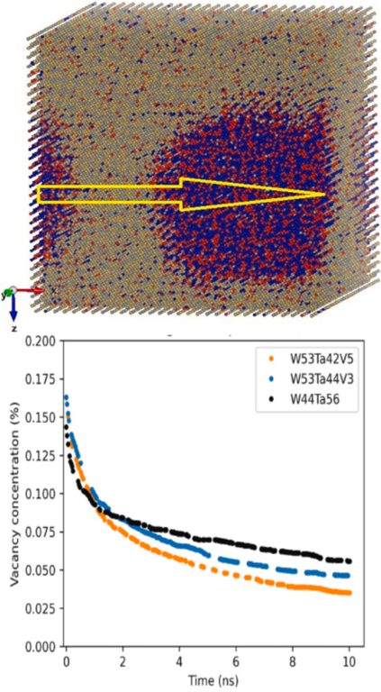

**Caption:** Fig. 7. Top: Modelling of co-segregation of Cr (blue) and V (red) from W (yellow) and Ta (green) in high-entropy alloys W 38 Ta 36 Cr 15 V 11 [79]. The arrow shows a direction where the predicted composition partitioning changes between the matrix and the Cr-V-rich precipitates. Bottom: Reduction of void density from binary W-Ta to W-Ta-V alloys with 3% and 5% at. of V obtained from overlapping cascade molecular dynamics simulations in combination with annealing using machine-learning potentials [88]. (For interpretation of the references to colour in this fi gure legend, the reader is referred to the web version of this article.)

---

## FIG_013 · Picture · Página 9

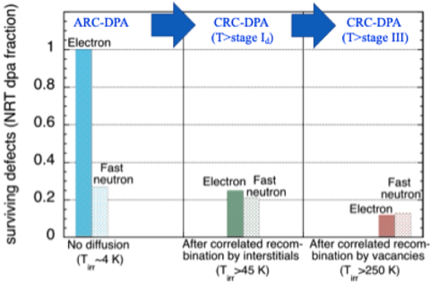

**Caption:** _Sin caption_

---

## FIG_014 · Picture · Página 10

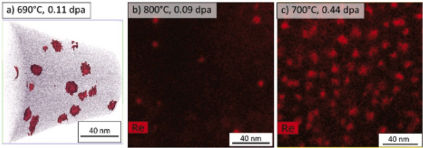

**Caption:** Fig. 10. Re-enriched matrix precipitates in pure W irradiated in a mixed spectrum reactor at 590-700 °C [5]. The measured and calculated transmutant Re content is far below the 25% Re equilibrium phase stability limit for W-Re at these temperatures [112].

---

## FIG_015 · Picture · Página 10

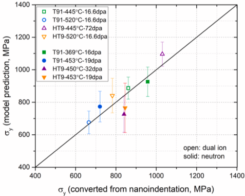

**Caption:** Fig. 11. Comparison of predicted and measured hardening of HT9 and T91 ferritic/martensitic steels following fast reactor or dual ion irradiation [129].

---

## FIG_016 · Picture · Página 12

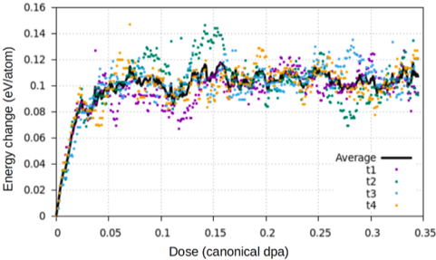

**Caption:** Fig. 12. DFT-CRA trajectories of microstructural evolution in bcc Fe. The evolution of the total energy for four trajectories (t1-t4) and their average is shown, data from [145].

---

## FIG_017 · Picture · Página 13

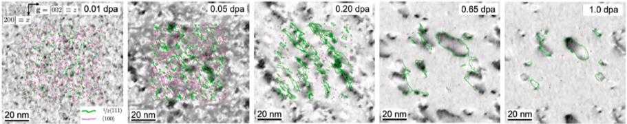

**Caption:** _Sin caption_

---

## FIG_018 · Picture · Página 13

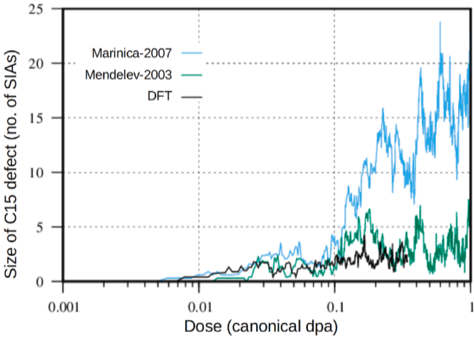

**Caption:** Fig. 14. The largest C15-type structures, dynamically formed under CRA conditions, as a function of irradiation dose predicted by different methodologies [145].

---

## FIG_019 · Picture · Página 13

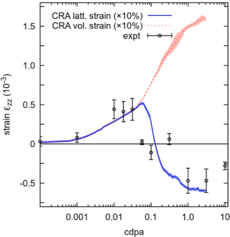

**Caption:** Fig. 15. Variation of lattice strain and volume strain of a ion irradiated tungsten sample. The scatter plot shows X-ray Laue diffraction measurements of the lattice strain along the irradiation direction. Lattice strain and volumetric strain derived from CRA simulations are shown in solid and dashed curves respectively. Figure adapted from [158].

---

## FIG_020 · Picture · Página 14

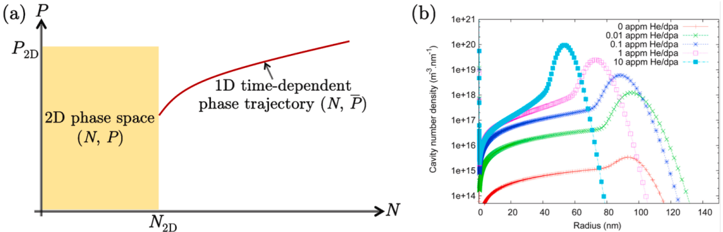

**Caption:** _Sin caption_

---

## FIG_021 · Picture · Página 15

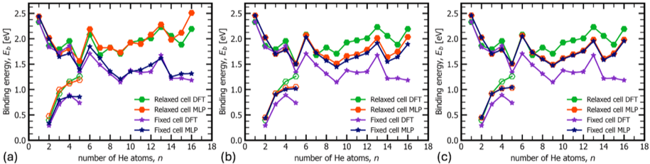

**Caption:** Fig. 17. Comparison of binding energies calculated with the MLP using (a) 4 × 4 × 4, (b) 8 × 8 × 8, and (c) 12 × 12 × 12 supercells. The DFT data (purple and green) in all panels is calculated using a 4 × 4 × 4 supercell. Binding energies calculated using fi xed-cells (purple and blue star markers); relaxed-cells (green and red hexagon markers. Binding energies of He with He  -1  bubbles (solid markers) and with He  -1 clusters (open markers). (For interpretation of the references to colour in this figure legend, the reader is referred to the web version of this article.)

---

## FIG_022 · Picture · Página 15

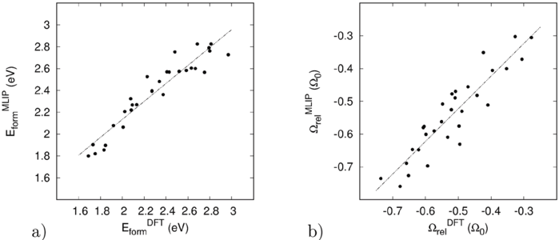

**Caption:** Fig. 18. Comparison of (a) formation energies and (b) relaxation volumes of vacancies in the equiatomic random Ta-Ti-V-W high-entropy alloy computed using DFT and MLP.

---

## FIG_023 · Picture · Página 16

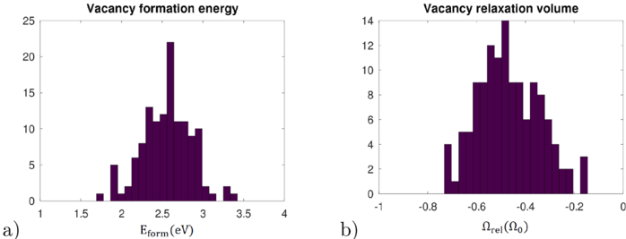

**Caption:** Fig. 19. Distribution of (a) formation energies and (b) relaxation volumes for vacancies computed using MLP for the structure of disordered equiatomic Ta-Ti-V-W alloy with 128at. sites.

---

## FIG_024 · Picture · Página 17

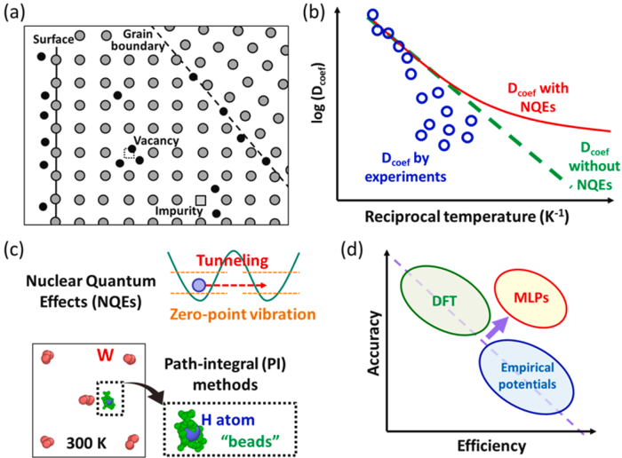

**Caption:** Fig. 20. (a) Hydrogen interacting with lattice defects in a material. (b) A typical Arrhenius plot of the diffusion coefficient of solute hydrogen in a metal. The blue open symbols represent experimental data, which often deviate at low temperatures due to the trapping effects of lattice defects. The red solid and green dashed lines show the diffusion coefficients with and without NQEs, respectively. (c) NQEs and their description by PI methods. (d) Improvements in the accuracy-efficiency trade-off thanks to MLPs. (For interpretation of the references to colour in this fi gure legend, the reader is referred to the web version of this article.)

---

## FIG_025 · Picture · Página 17

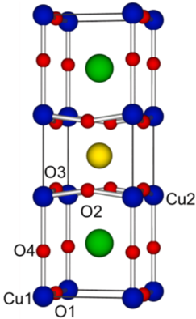

**Caption:** Fig. 21. Graphical representation of the REBa 2 Cu 3 O 7 unitcell, where red spheres represent oxygen ions and the blue, green and yellow spheres represent the copper, barium and rare earth cations respectively. (For interpretation of the references to colour in this fi gure legend, the reader is referred to the web version of this article.)

---

## FIG_026 · Picture · Página 18

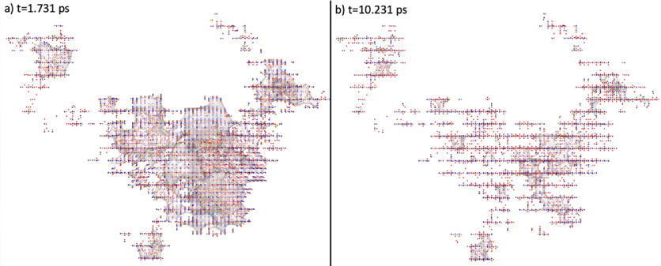

**Caption:** Fig. 22. Two images of the cascade progression in the x-z plane of a 20 keV cascade with pka launched in the x direction taken at the peak damage and fi nal state. Vacancies are cubes, interstitial are spheres, antisites are spherocylinders with the colours the same as in Fig. 21 [283].

---

## FIG_027 · Picture · Página 19

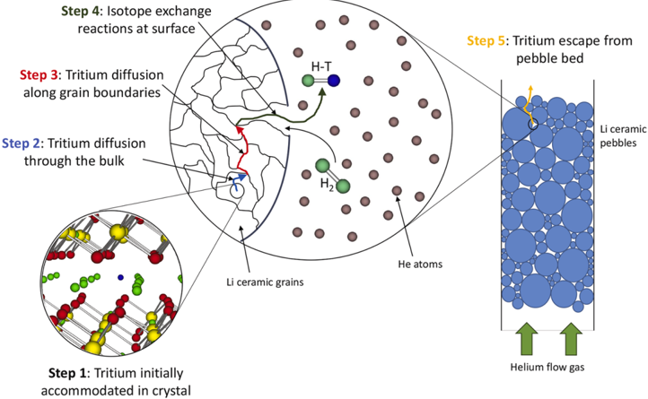

**Caption:** _Sin caption_

---

## FIG_028 · Picture · Página 19

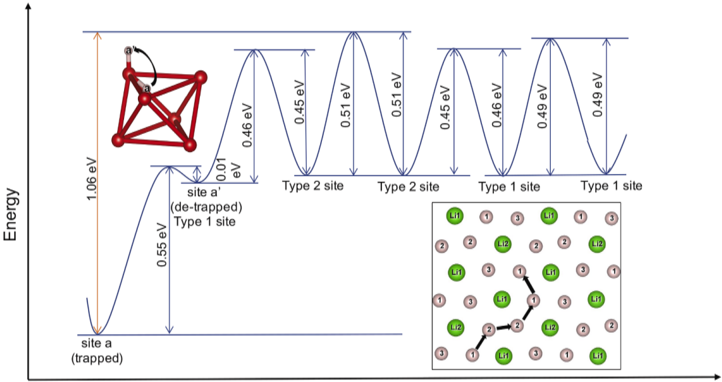

**Caption:** _Sin caption_

---

## FIG_029 · Picture · Página 21

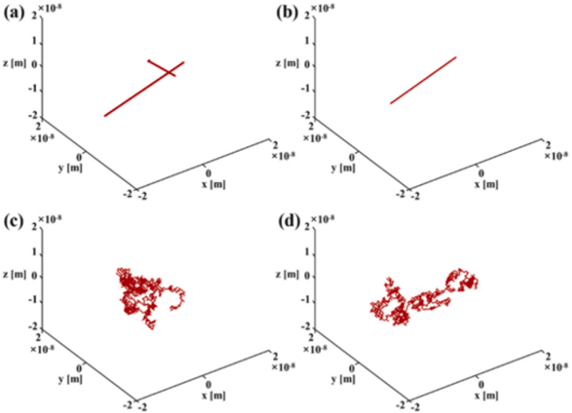

**Caption:** Fig. 25. Trajectories of migrating SIA  defects and He-SIA  (  = 1, 2) defects at 300 K. (a) SIA 1 ; (b) SIA 2 ; (c) He-SIA 1 , and (d) He-SIA 2 [328].

---

## FIG_030 · Picture · Página 21

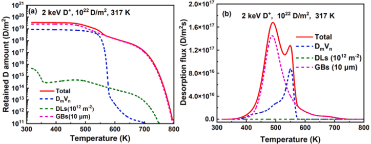

**Caption:** Fig. 26. (a) Simulated retention as a function of the annealing temperature after 2 keV D ion implantation with a fl uence of 10 22 D/m 2 at 317 K. (b) Simulated total and partial TDS spectra at the heating rate of 0.5 K/s [346].

---

## FIG_031 · Picture · Página 22

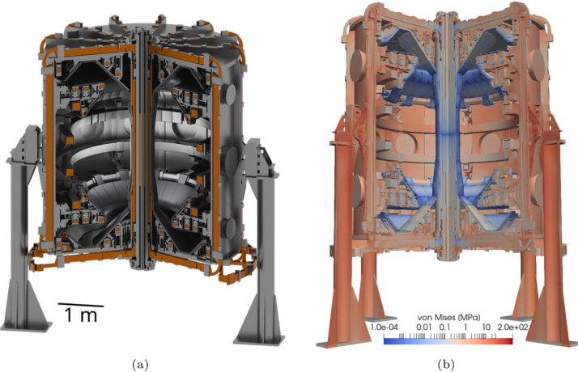

**Caption:** Fig. 27. (a) Analysis-ready CAD model of the MAST-U tokamak device. The associated fi nite element mesh involves 127 million elements. (b) for the purpose of demonstrating the capabilities of a full-scale FEM simulation, the tokamak is loaded with gravitational body forces, producing stresses in the structure illustrated here using the von Mises invariant of the stress fi eld. Figures from [349].

---

## FIG_032 · Picture · Página 22

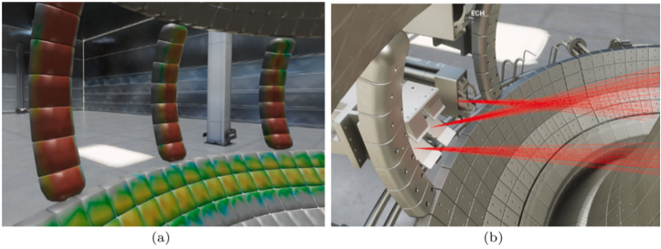

**Caption:** Fig. 28. A demonstration of the capabilities of V-KSTAR: a) 3D distribution of heat fl uxes on the plasma facing components of the KSTAR tokamak due to fast ion losses. b) V-KSTAR 3D tracings of radio frequency waves injected for plasma heating and current drive in KSTAR.

---

## FIG_033 · Picture · Página 24

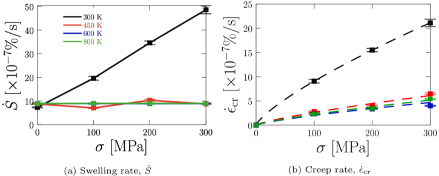

**Caption:** Fig. 29. Changes in dimensional stability as a function of temperature for Fe under DEMO helium-cooled pebble bed (HCPB) fusion blanket conditions [367], using a model developed in Ref. [361]. Fig. 29(a) Swelling rate. Fig. 29(b) Creep rate.

---

## FIG_034 · Picture · Página 24

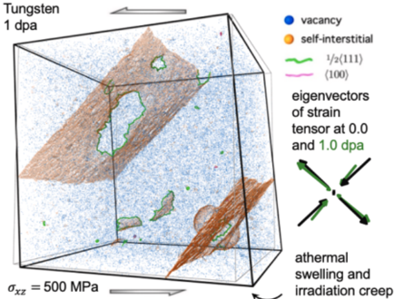

**Caption:** Fig. 30. Molecular dynamics simulation of low temperature irradiation creep in tungsten. Figure adapted from Ref. [148]. In the absence of thermally activated diffusion, vacancies remain immobile and isolated, while self-interstitial atom defects coalesce irrespectively of thermal activation, driven by elastic interactions. The irreversible deformation remains closely aligned with externally applied stress.
