# Figuras extraídas

**Fuente:** `/home/santi/Documentos/ilovepappers/pappers/ilove-Nordlund.2018.pdf`
**Total figuras:** 25

---

## FIG_001 · Picture · Página 1

**Caption:** _Sin caption_

---

## FIG_002 · Picture · Página 1

**Caption:** _Sin caption_

---

## FIG_003 · Picture · Página 1

**Caption:** _Sin caption_

---

## FIG_004 · Picture · Página 3

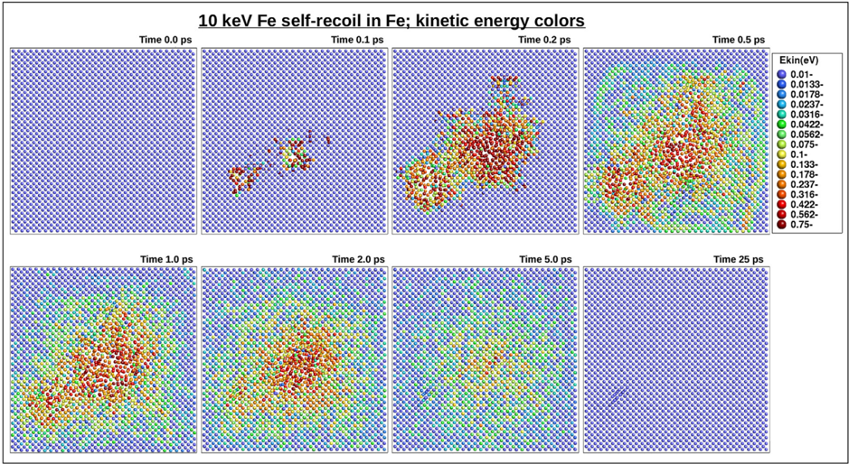

**Caption:** (a) Kinetic energy of atoms during a collision cascade

---

## FIG_005 · Picture · Página 3

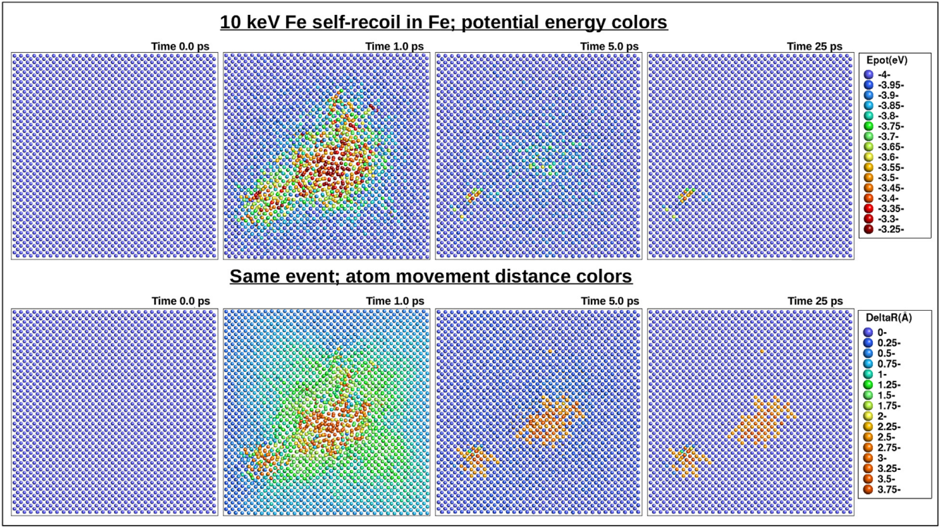

**Caption:** (b) Potential energy and displacement distance during a collision cascade

---

## FIG_006 · Picture · Página 4

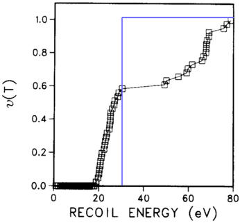

**Caption:** Fig. 3. Illustration of the damage function as a function of energy for Cu. The graph clearly shows that there is not a single TDE value for damage production. Overlayed on the original fi gure is a step function illustrating the NRT-dpa equation with a threshold of 30 eV. Figure adapted from Ref. [52], reprinted with permission from Elsevier.

---

## FIG_007 · Picture · Página 4

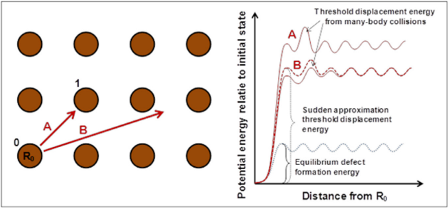

**Caption:** Fig. 2. Illustration of the threshold displacement energy concept. If the bottom left atom 0 at R0 receives a recoil e.g. in directions A or B, it will cause a complex many-body collisional process. In case the atom would move in a straight path along path B and the other atoms would not have time to move at all (which of course in reality will not be the case), the potential energy in the system could be illustrated as on the right side in the ' Sudden approximation ' curve. At some point there is a maximum in the potential energy curve, before the atom goes into an interstitial position in one of the minima to the right of the original position. This maximum is an estimate of the threshold displacement energy. In reality the atoms respond somewhat to the motion of the recoiling atom 0, which lowers the threshold energy. In equilibrium, the threshold is much lower since all atoms have ample time to relax their position and a defect is formed only when the atom positions and movements happen to be such that a defect can form. Path A illustrates a case where the original atom 0 is directed directly towards another atom 1. In this case the original atom most likely replaces the atom at 1, while atom 1 receives a secondary recoil and becomes an interstitial atom. However, after this initial defect production, recombination effects may still affect the threshold, see discussion in main text. Figure from OECD review article [41], reprinted with permission TO BE OBTAINED.

---

## FIG_008 · Picture · Página 5

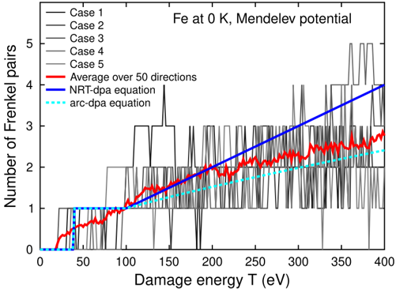

**Caption:** Fig. 4. Illustration of the highly chaotic nature of damage production. The lines in fi ve shades of grey show damage production as a function of energy for the same recoil atom in exactly the same direction without any thermal atom displacements. The thick red curve shows the average over 50 individual directions (the curves for all individual cases are not shown since it is dif fi cult to view fi fty shades of grey). Except for the ambient temperature being 0 K, the simulations are identical to those done by the Mendelev potential in Ref. [59]. Note how in a few cases, perfect damage recombination occurs even up to 400 eV. Since the initial and ambient temperature is 0 K, the recombination is fully athermal, i.e. made possible by the kinetic energy introduced by the recoil itself. Also shown are the NRT-dpa and arc-dpa equations for Fe. The agreement between the average curve and the arc-dpa is not perfect since the arc-dpa was fi t to a composite data set of many potentials. Original fi gure for this Article. (For interpretation of the references to color in this fi gure legend, the reader is referred to the Web version of this article.)

---

## FIG_009 · Picture · Página 7

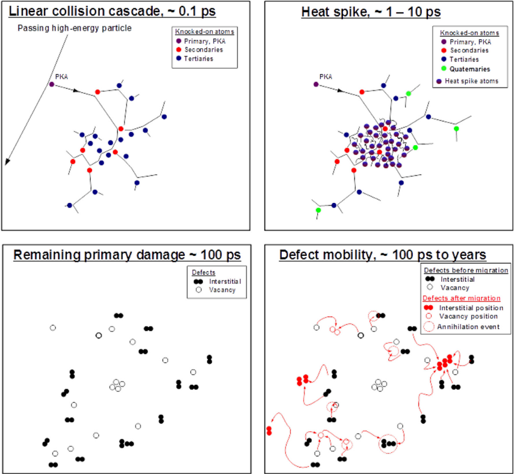

**Caption:** Fig. 5. Schematic illustration of the time scales associated with an athermal collision cascade ( fi rst three frames) and subsequent thermal defect migration (last frame). Figure from Ref. [243], reprinted by permission from Springer Nature.

---

## FIG_010 · Picture · Página 7

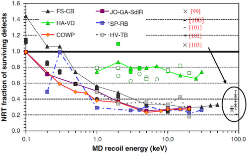

**Caption:** Fig. 6. Comparison of surviving defect fraction in Fe obtained from MD simulations with different potentials and groups based on the data available in 2005 [85]. From Ref. [85], reprinted with permission from Elsevier.

---

## FIG_011 · Picture · Página 8

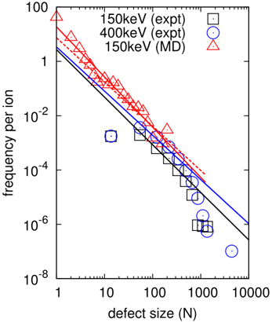

**Caption:** Fig. 8. The frequency of defects as a function of defect size. Prediction from MD compared to in situ observations of W-irradiated W foils at cryogenic temperatures [104]. Reprinted with permission.

---

## FIG_012 · Picture · Página 8

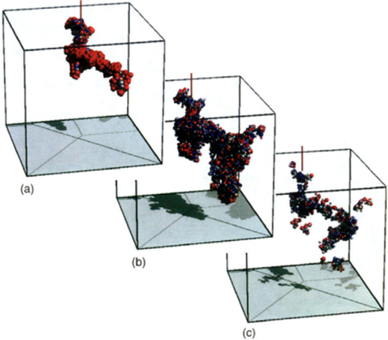

**Caption:** Fig. 7. MDsimulation of the damage evolution in a cascade induced by a 5 keV recoil in Si. The spheres show atoms with a potential energy more than 0.2 eV higher than the ground state, and the colors and atom sizes indicate how much above the ground state it is (red being > ¼ 1 eV above). a) 0.1 ps, b) 1 ps and c) 8 ps after the cascade starts. The fi nal state at 8 ps is stable over MD time scales at room temperature. Reprinted fi gure with permission from Ref. [113]. Copyright (1995) by the American Physical Society. Reprinted with permission from the authors. (For interpretation of the references to color in this fi gure legend, the reader is referred to the Web version of this article.)

---

## FIG_013 · Picture · Página 9

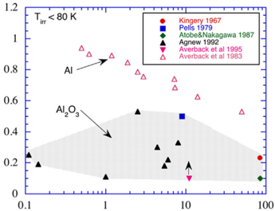

**Caption:** Fig. 9. Surviving defect fractions in irradiated Al2O3 and Al.

---

## FIG_014 · Picture · Página 11

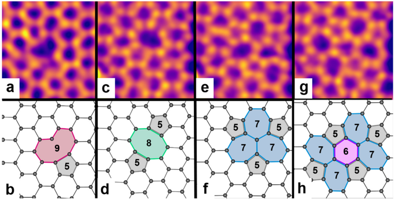

**Caption:** Fig. 10. Different con fi gurations of vacancies in a monolayer of graphene. The images (top row) were taken by aberration-corrected scanning TEM (Nion Ultrastem 100 at 60 or 90 kV). The corresponding lattice models (bottom row) are based on DFT-relaxed structures [175,409]. (a, b): single vacancy (nonagon with one open bond and a pentagon); (c-h): three different reconstructions of a double vacancy with pentagons, heptagons and octagons (indicated). The microscopy images were treated with double gaussian fi lter [410]. Original work for this article courtesy by Mukesh Tripathi, Gregor T. Leuthner and Jani Kotakoski.

---

## FIG_015 · Picture · Página 12

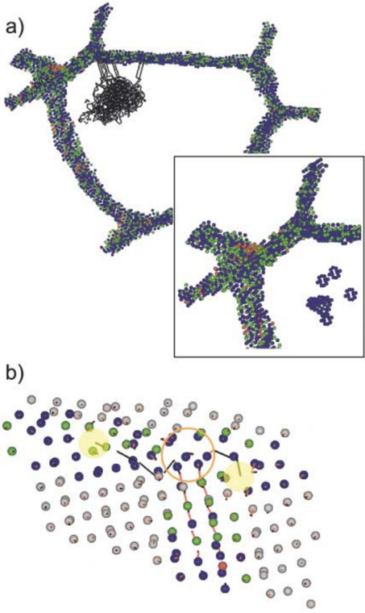

**Caption:** Fig. 11. Molecular dynamics view of the mechanism of radiation damage reduction in nanocrystalline Ni. In the image, only atoms that are in a defective environment are plotted, making the cascade and grain boundaries easily visible. (a) Selected area of a 12-nm nc grain size sample showing the grain boundary (GB) atoms and the displacement vectors between the atoms due to a 5 keV PKA. The inset shows a magni fi ed view of the defect region after cooling down. (b) An example of the GB acting as an interstitial sink, by the annihilation of interstitials with free volume in the GB (marked in yellow). Reprinted fi gure from Ref. [221]. Copyright (2002) by the American Physical Society. (For interpretation of the references to color in this fi gure legend, the reader is referred to the Web version of this article.)

---

## FIG_016 · Picture · Página 14

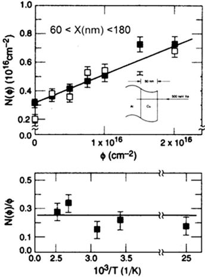

**Caption:** Fig. 12. Recoil implantation of Cu into Al during 500keV Xe bombardment. Figure based on data from Ref. [284].

---

## FIG_017 · Picture · Página 15

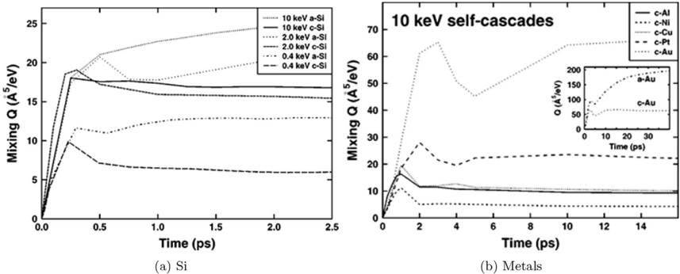

**Caption:** Fig. 13. Time development of the ion beam mixing in crystalline and amorphous Si as well as several metals. Reprinted from Ref. [326], with the permission of AIP Publishing.

---

## FIG_018 · Picture · Página 15

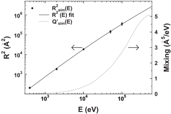

**Caption:** Fig. 14. Simulated R 2 values (circles), fi t of the function R 2 ð E Þ to the simulated data, and mixing Q 0 ð E Þ (dashed line) for Ni. Reprinted fi gure with permission from Ref. [292]. Copyright (1999) by the American Physical Society.

---

## FIG_019 · Picture · Página 16

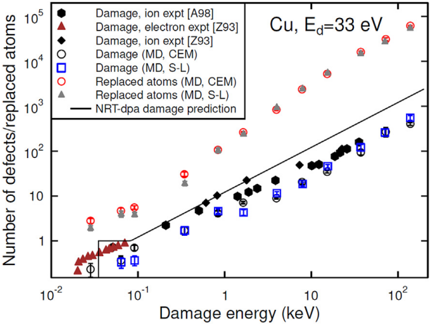

**Caption:** Fig. 15. Experimental and simulation data showing quantitatively the problem with the NRT-dpa equation. In the fi gure, ' expt ' stands for experimental data, and MD for simulated molecular dynamics data. The other abbreviations denoted different interatomic potentials. The references are as in Ref. [313]. The fi gure shows that the NRTdpa equation does not represent correctly either the actual damage (Frenkel pairs produced) nor the number of replaced atoms. The former is overestimated by roughly a factor of 3, and the latter underestimated by a factor of 30. From Ref. [313], reprinted with open access permission.

---

## FIG_020 · Picture · Página 17

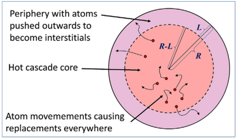

**Caption:** Fig. 16. Schematic of the concepts and quantities used in deriving the new arc-dpa and rpa equations. From Ref. [313], reprinted with open access permission.

---

## FIG_021 · Picture · Página 18

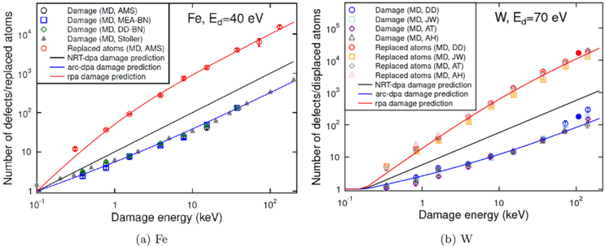

**Caption:** Fig. 17. Illustration of the improvement obtained with the new arc-dpa and rpa equations for a) Fe and b) W. The W data also includes two data points simulated at 800 K with the DD potential (solid circles). The references are: [A98]: Ref. [111], [Z93]: Ref. [304]. The references are as in Ref. [313]. From Ref. [313], reprinted with open access permission.

---

## FIG_022 · Picture · Página 19

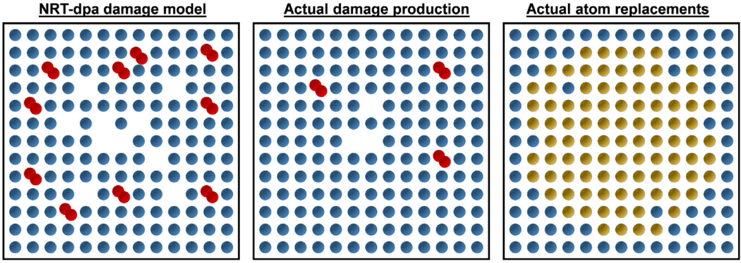

**Caption:** Fig. 18. Schematic illustration of the damage predicted by the three different damage models for the case of  1 keV damage energy in a typical metal. For illustration purposes, the damage is illustrated as if all damage were produced in the same 2-dimensional plane. Blue circles illustrate atoms in original lattice positions, yellow-brown denotes atoms that are in a different lattice position after the damage event, red atom pairs denote two interstitial atoms sharing the same lattice site, and empty lattice positions denote vacancies. Left: Damage production predicted by the NRT-dpa model. Middle: actual damage production, addressed by the new arc-dpa equation. Right: actual atom replacements, addressed by the new rpa equation, agreeing better with experimental data on number of replaced atoms (ion beam mixing). Note that in real 3 dimensional systems, the difference is even larger than in this 2D schematic. From Ref. [313], reprinted with open access permission. (For interpretation of the references to color in this fi gure legend, the reader is referred to the Web version of this article.)

---

## FIG_023 · Picture · Página 21

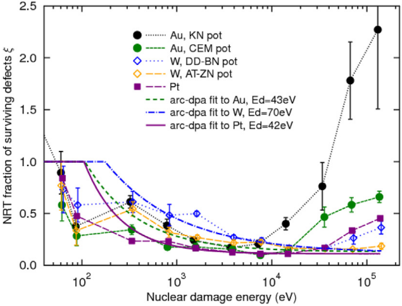

**Caption:** Fig. 19. Average numbers of defects from cascades in Au, Pt and W, as a function of PKA energy. Defect numbers are expressed as the NRT ef fi ciency, i.e. the fraction of defects as compared to the NRT model prediction. The ef fi ciency function as de fi ned in the arcdpa model is also plotted for each material. For Au and Pt, the function was fi tted to the data shown here, while for W the function was fi tted to data from 4 different potentials, two of which are shown here. Original work for this article.

---

## FIG_024 · Picture · Página 23

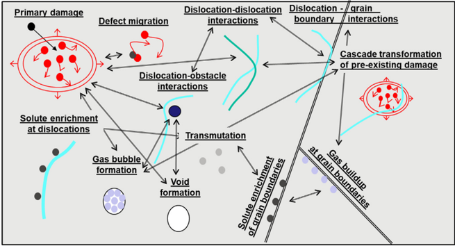

**Caption:** Fig. 20. Some damage buildup processes that may occur in metals after the primary damage state formation. Note that in semiconductors and ionic materials, amorphous regions usually play a major additional role. Original work for this article.

---

## FIG_025 · Picture · Página 23

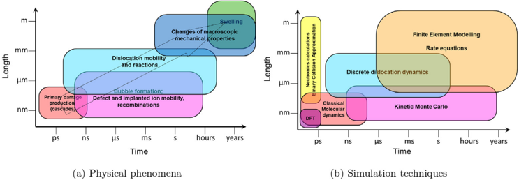

**Caption:** Fig. 21. a) Multiple scales of physical phenomena b) Multiscale modeling to address this. Figure from Ref. [243], reprinted by permission from Springer Nature.
