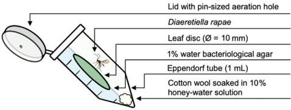
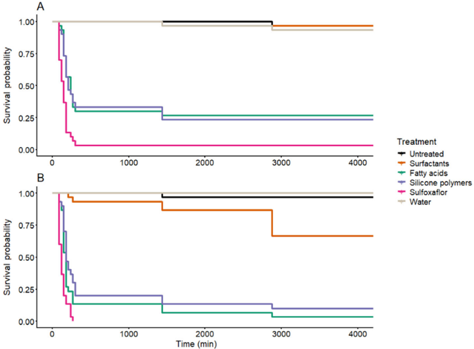
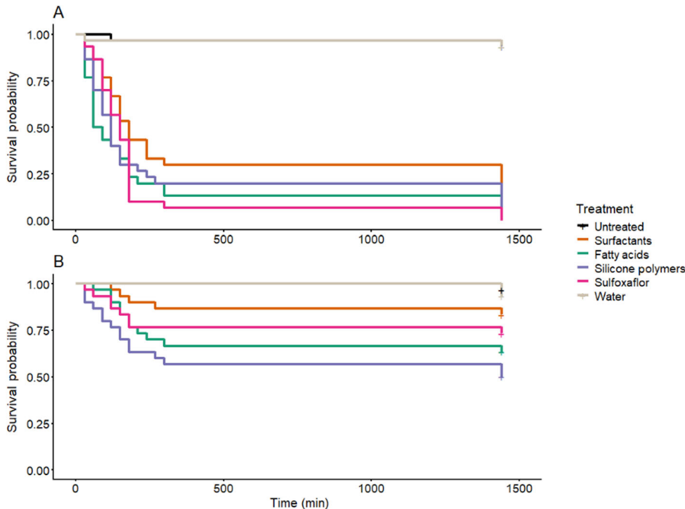
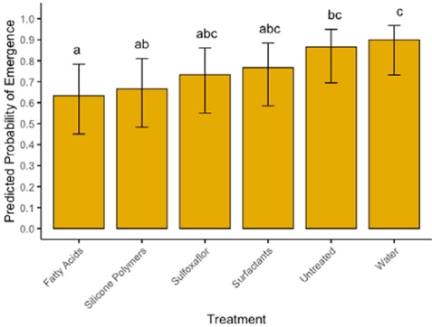
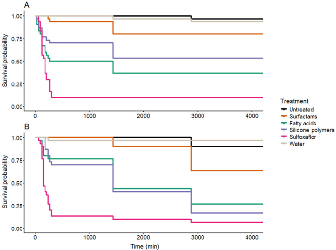
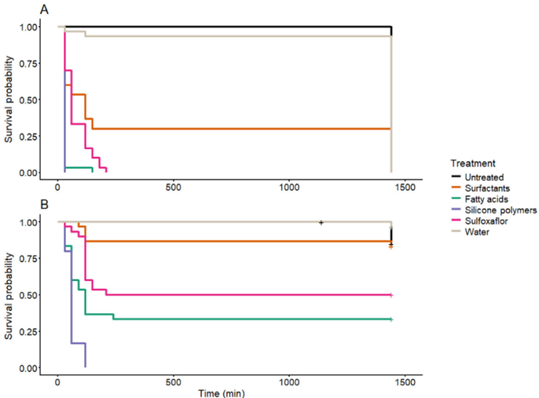
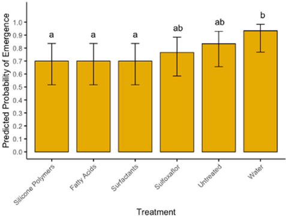
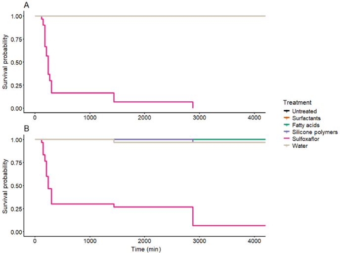
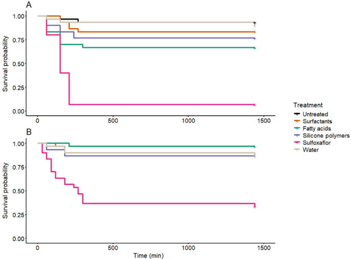
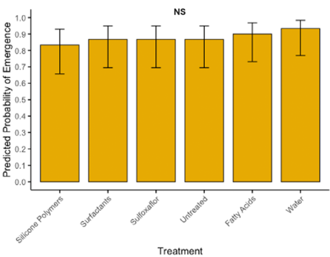

# Figuras extraídas

**Fuente:** `/home/santi/Documentos/ilovepappers/pappers/ilove-Tonks.2026.pdf`
**Total figuras:** 22

---

## FIG_001 · Picture · Página 1

**Caption:** _Sin caption_

---

## FIG_002 · Picture · Página 2

**Caption:** _Sin caption_

---

## FIG_003 · Picture · Página 3

**Caption:** _Sin caption_

---

## FIG_004 · Picture · Página 3

**Caption:** Figure 1. Containment of Diaeretiella rapae for exposure method assays.

---

## FIG_005 · Picture · Página 4

**Caption:** _Sin caption_

---

## FIG_006 · Picture · Página 5

**Caption:** _Sin caption_

---

## FIG_007 · Picture · Página 5

**Caption:** Figure 2. Survival of (A) Myzus persicae and (B) Brevicoryne brassicae after combined application of negative controls (untreated, water), a synthetic positive control (sulfoxa fl or), or one of three bioinsecticides (fatty acids, silicone polymers, surfactants). For both species, survival was signi fi cantly affected by treatment (log-rank test, P < 0.001).

---

## FIG_008 · Picture · Página 6

**Caption:** _Sin caption_

---

## FIG_009 · Picture · Página 6

**Caption:** _Sin caption_

---

## FIG_010 · Picture · Página 6

**Caption:** Figure 4. Predicted probability of emergence for Diaeretiella rapae from parasitoid mummies after combined application. Bars are modelestimated means ( ± 95% con fi dence interval) from a binomial generalised linear model for six treatment groups. Treatments sharing a letter are not signi fi cantly different (LSD (Least Signi fi cant Difference) pairwise comparisons, P < 0.05).

---

## FIG_011 · Picture · Página 7

**Caption:** _Sin caption_

---

## FIG_012 · Picture · Página 7

**Caption:** Figure 5. Survival of (A) Myzus persicae and (B) Brevicoryne brassicae after direct application of negative controls (untreated, water), a synthetic positive control (sulfoxa fl or), or one of three bioinsecticides (fatty acids, silicone polymers, surfactants). For both species, survival was signi fi cantly affected by treatment (log-rank test, P < 0.001).

---

## FIG_013 · Picture · Página 8

**Caption:** _Sin caption_

---

## FIG_014 · Picture · Página 8

**Caption:** _Sin caption_

---

## FIG_015 · Picture · Página 8

**Caption:** Figure 7. Predicted probability of emergence for Diaeretiella rapae from parasitoid mummies after direct application of various treatments. Bars are model-estimated means ( ± 95% con fi dence interval) from a binomial generalised linear model for six treatment groups. Treatments sharing a letter are not signi fi cantly different (LSD pairwise comparisons, P < 0.05).

---

## FIG_016 · Picture · Página 9

**Caption:** _Sin caption_

---

## FIG_017 · Picture · Página 9

**Caption:** Figure 8. Survival of (A) Myzus persicae and (B) Brevicoryne brassicae after exposure to residues of negative controls (untreated, water), a synthetic positive control (sulfoxa fl or), or one of three bioinsecticides (fatty acids, silicone polymers, surfactants). For both species, survival was signi fi cantly affected by treatment (log-rank test, P < 0.001).

---

## FIG_018 · Picture · Página 9

**Caption:** Figure 9. Survival of (A) Diaeretiella rapae and (B) Chrysoperla carnea after exposure to residues of negative controls (untreated, water), a synthetic positive control (sulfoxa fl or), or one of three bioinsecticides (fatty acids, silicone polymers, surfactants). For both species, survival was signi fi cantly affected by treatment (log-rank test, P < 0.001).

---

## FIG_019 · Picture · Página 10

**Caption:** _Sin caption_

---

## FIG_020 · Picture · Página 10

**Caption:** Figure 10. Predicted probability of emergence for Diaeretiella rapae from parasitoid mummies after exposure to residues of various treatments. Bars are model-estimated means ( ± 95% con fi dence interval) from a binomial generalised linear model for six treatment groups. Treatments sharing a letter are not signi fi cantly different (LSD pairwise comparisons, P < 0.05). NS, Not signi fi cant.

---

## FIG_021 · Picture · Página 11

**Caption:** _Sin caption_

---

## FIG_022 · Picture · Página 12

**Caption:** _Sin caption_
