# Figuras extraídas

**Fuente:** `/home/santi/Documentos/ilovepappers/pappers/ilove-Zhanguang.pdf`
**Total figuras:** 20

---

## FIG_001 · Picture · Página 1

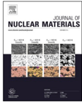

**Caption:** _Sin caption_

---

## FIG_002 · Picture · Página 1

**Caption:** _Sin caption_

---

## FIG_003 · Picture · Página 1

**Caption:** _Sin caption_

---

## FIG_004 · Picture · Página 1

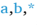

**Caption:** _Sin caption_

---

## FIG_005 · Picture · Página 2

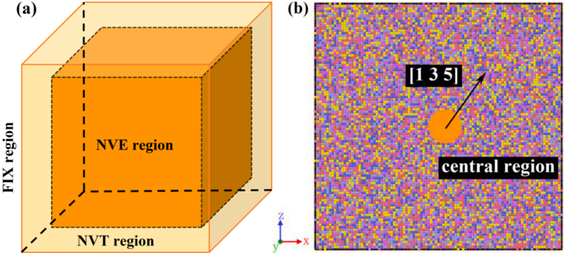

**Caption:** Fig. 1. (a) Diagram of simulation region division, (b) Single crystal FeCoNiCrCu HEA.

---

## FIG_006 · Picture · Página 3

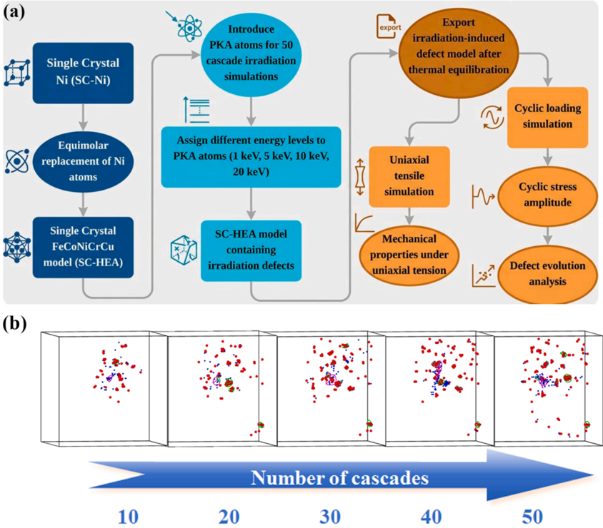

**Caption:** Fig. 2. (a) Simulation flowchart, (b) Diagram of overlapping cascade irradiation (red atoms are interstitials, blue atoms are vacancies).

---

## FIG_007 · Picture · Página 4

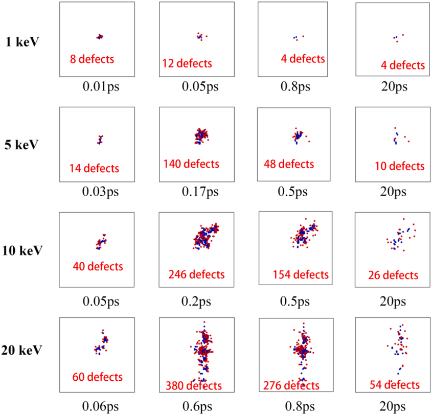

**Caption:** Fig. 3. Evolution of the number of defects during a single cascade collision at different PKA energies.

---

## FIG_008 · Picture · Página 5

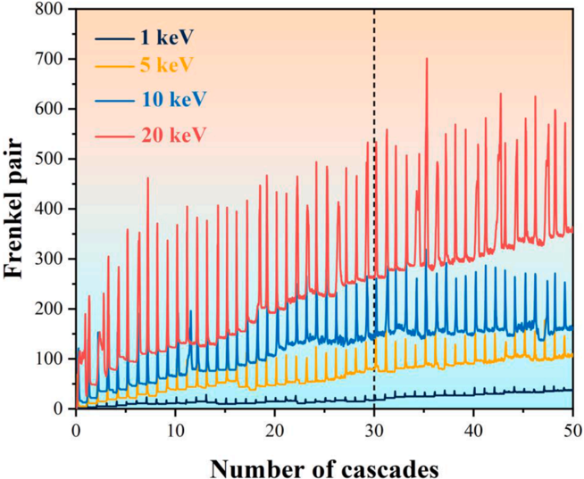

**Caption:** Fig. 4. Curve of Frenkel defect pairs changing with cascade count under different PKA energies.

---

## FIG_009 · Picture · Página 5

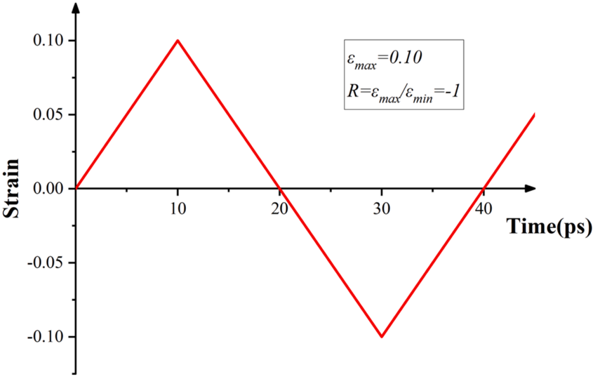

**Caption:** Fig. 5. Diagram of cyclic loading application.

---

## FIG_010 · Picture · Página 6

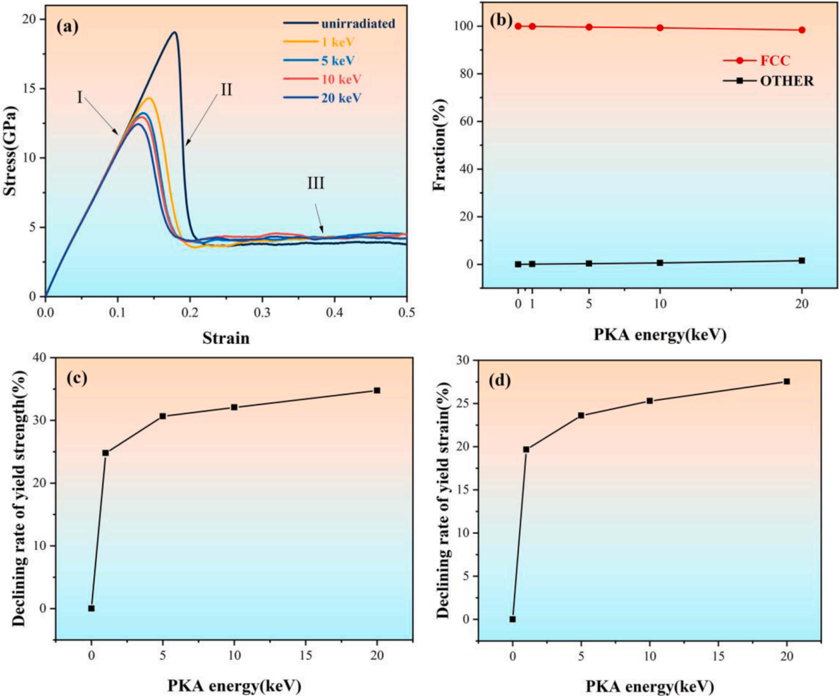

**Caption:** Fig. 6. (a) Uniaxial stress-strain curve, (b) Variation of face-centered cubic (FCC) phase proportion with PKA energy, (c) Reduction rate of yield strength, (d) Reduction rate of yield strain.

---

## FIG_011 · Picture · Página 8

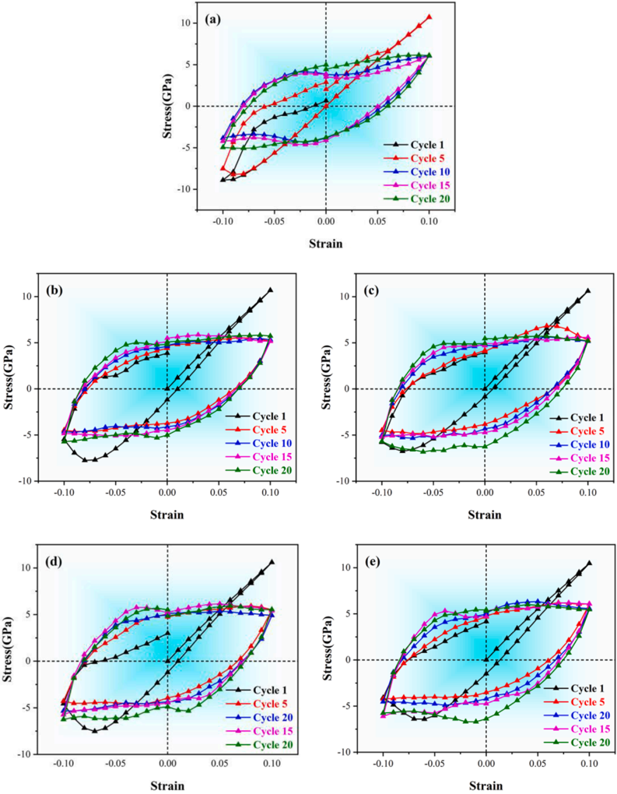

**Caption:** Fig. 7. Cyclic stress-strain loops for unirradiated FeCoNiCrCu and irradiated FeCoNiCrCu subjected to different PKA energies of 1k eV (b), 5k eV (c), 1kKeV (d), and 20k eV (e).

---

## FIG_012 · Picture · Página 9

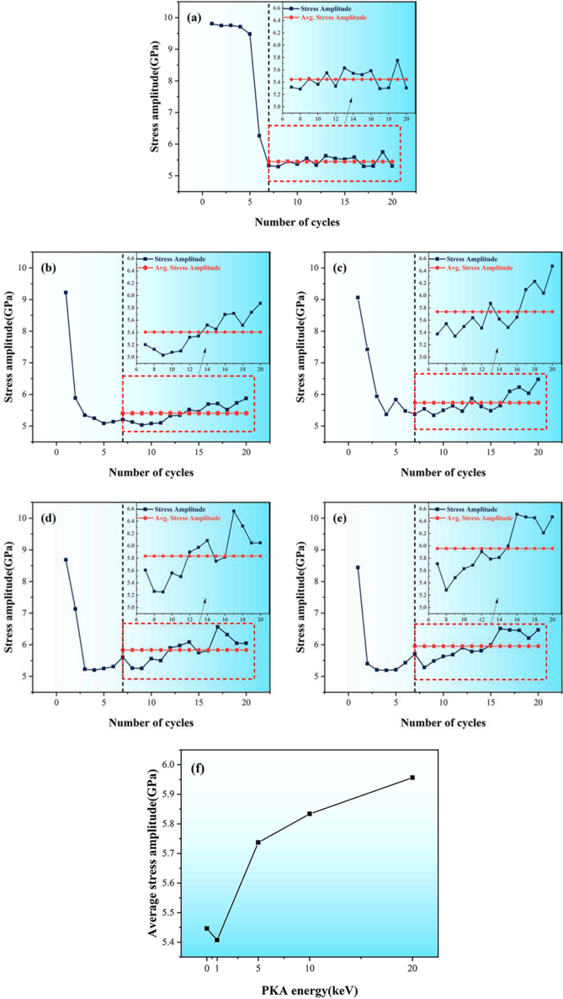

**Caption:** Fig. 8. Variation of stress amplitude with the number of cycles for unirradiated FeCoNiCrCu (a), irradiated FeCoNiCrCu subjected to different PKA energies of 1k eV (b), 5k eV (c), 10k eV (d), and 20k eV (e), and (f) Variation of average stress amplitude with PKA energy.

---

## FIG_013 · Picture · Página 10

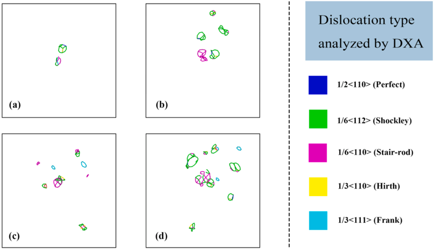

**Caption:** Fig. 9. Dislocation distributions of irradiated FeCoNiCrCu subjected to different PKA energies of 1k eV (a), 5k eV (b), 10k eV (c), 20k eV (d).

---

## FIG_014 · Picture · Página 11

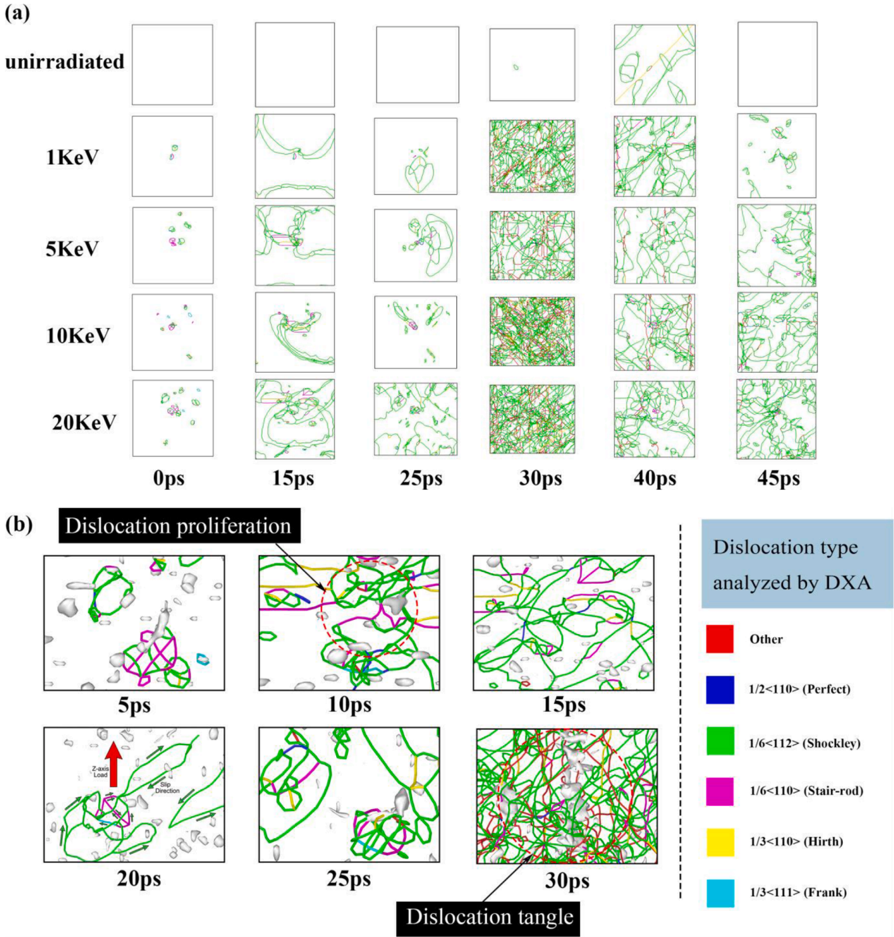

**Caption:** Fig. 10. (a) Dislocation evolutions of different irradiated FeCoNiCrCu at different of the first cycle, (b) Enlarged view of dislocation evolutions of PKA energy 20k eV irradiated FeCoNiCrCu.

---

## FIG_015 · Picture · Página 12

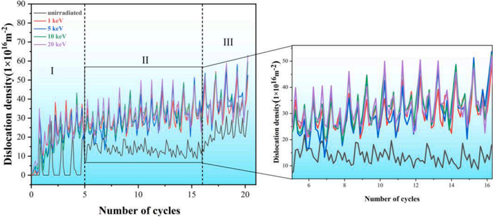

**Caption:** Fig. 11. Variations of dislocation density of different irradiated FeCoNiCrCu with the number of cyclic loading cycles.

---

## FIG_016 · Picture · Página 12

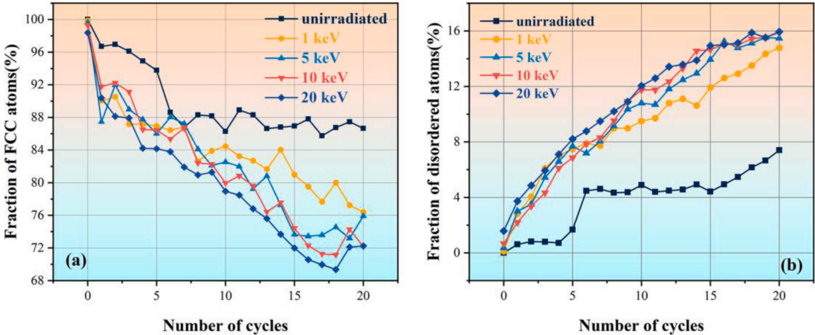

**Caption:** Fig. 12. (a) Variations of FCC atom proportion with the cycle numbers of cyclic loading, (b) Variations of lattice disorder atom proportion with the cycles number of cyclic loading in different irradiated FeCoNiCrCu.

---

## FIG_017 · Picture · Página 13

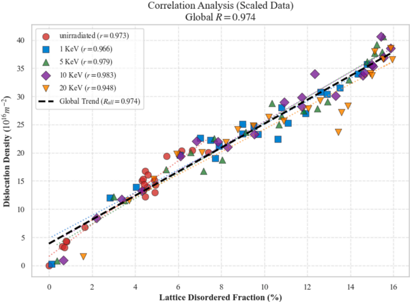

**Caption:** Fig. 13. Correlation between lattice disorder fraction and dislocation density.

---

## FIG_018 · Picture · Página 13

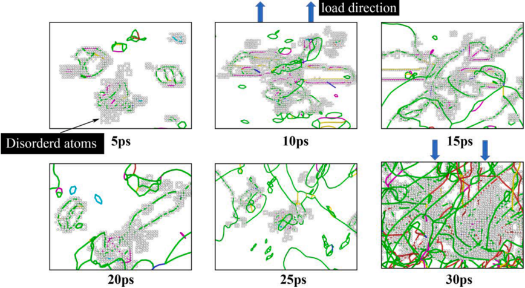

**Caption:** Fig. 14. Interaction between dislocations and lattice disordered atoms under cyclic loading.

---

## FIG_019 · Picture · Página 14

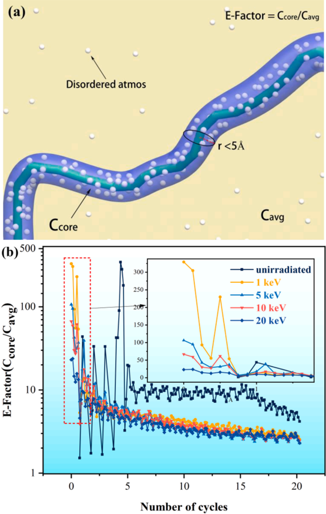

**Caption:** Fig. 15. Definition and evolution of the enrichment factor (E-Factor). (a) Schematic representation of the calculation model, showing disordered atoms within the cylindrical shell surrounding the dislocation core. (b) Variation of the E-Factor during the loading process.

---

## FIG_020 · Picture · Página 15

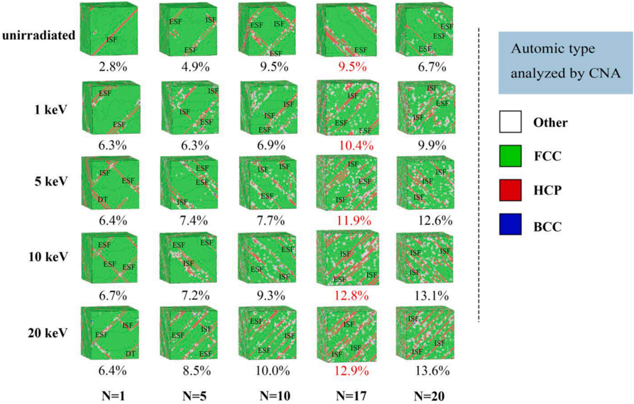

**Caption:** Fig. 16. Stacking fault defect distributions of different irradiated FeCoNiCrCu at different cycles.
