# Figuras extraídas

**Fuente:** `/media/santi/ALMACEN_GRANDE_1/ilovepappers/pappers/muy_importante.pdf`
**Total figuras:** 30

---

## FIG_001 · Picture · Página 1

**Caption:** _Sin caption_

---

## FIG_002 · Picture · Página 2

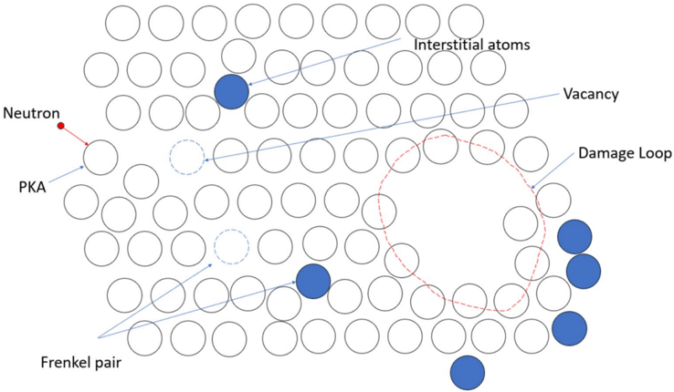

**Caption:** Figure 1 . Schematic diagram of radiation damaged.

---

## FIG_003 · Picture · Página 3

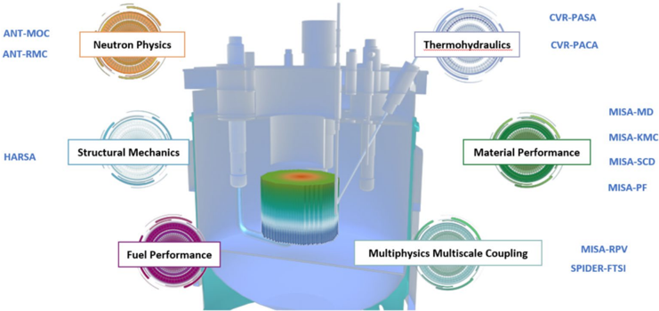

**Caption:** Figure 2 . Schematic diagram of a numerical reactor prototype (CVR1.0) system.

---

## FIG_004 · Picture · Página 4

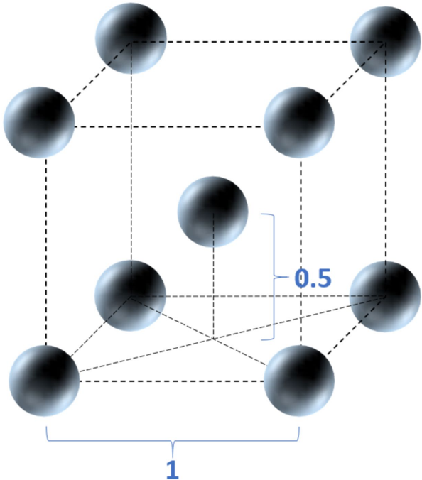

**Caption:** Figure 3 . Schematic diagram of body-centered cubic crystal structure.

---

## FIG_005 · Picture · Página 7

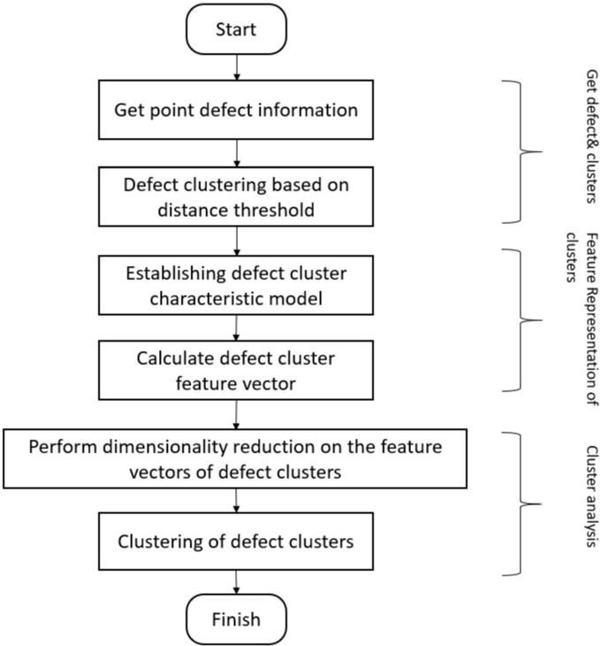

**Caption:** Figure 4 . Cascade defect cluster clustering analysis process.

---

## FIG_006 · Picture · Página 9

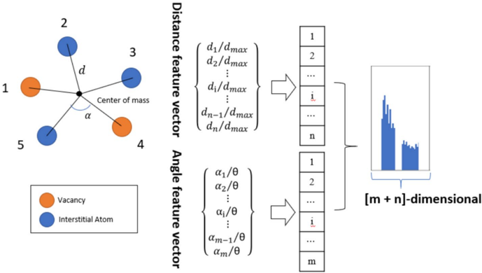

**Caption:** Figure 5 . Schematic diagram of representation method for defect clusters.

---

## FIG_007 · Picture · Página 9

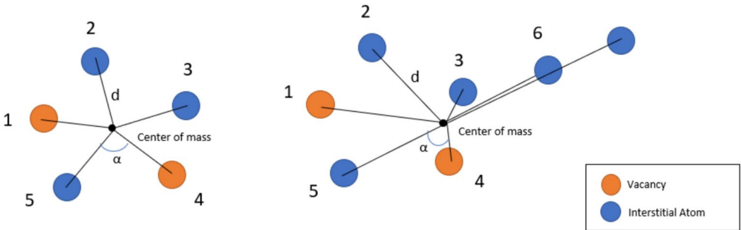

**Caption:** Figure 6 . Schematic diagram of cluster structure representation based on centroid.

---

## FIG_008 · Picture · Página 10

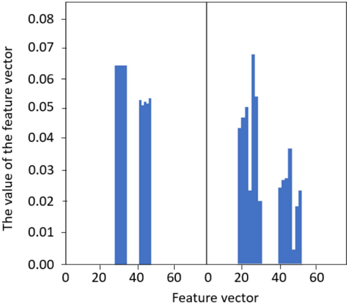

**Caption:** Figure 7 . Histogram of cluster structure feature vectors based on centroid.

---

## FIG_009 · Picture · Página 10

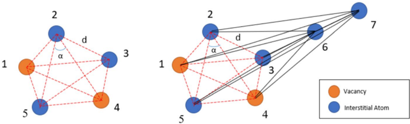

**Caption:** Figure 8 . Schematic diagram of cluster structure representation based on adjacent points.

---

## FIG_010 · Picture · Página 11

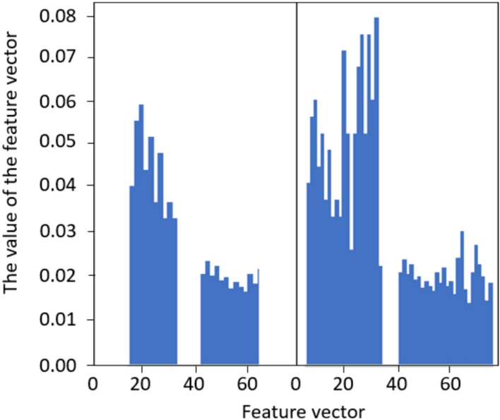

**Caption:** Figure 9 . Histogram of cluster structure feature vectors based on adjacent points.

---

## FIG_011 · Picture · Página 13

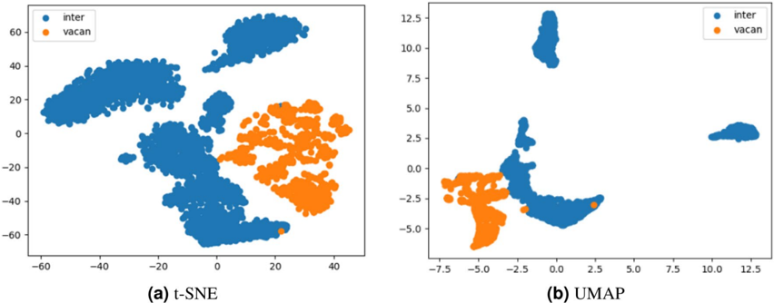

**Caption:** Figure 10 . Dimensionality reduction results with the t-SNE and the UMAP algorithm.

---

## FIG_012 · Picture · Página 15

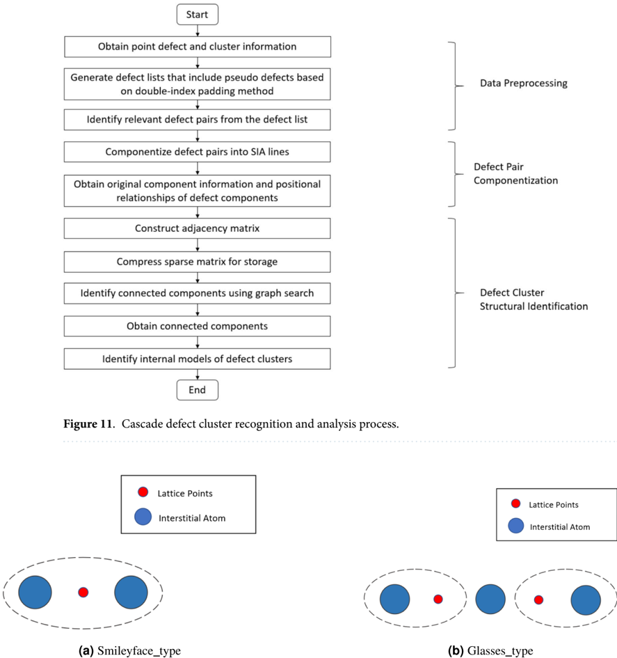

**Caption:** Figure 12 . Smileyface_type defects and glasses_type pairs.

---

## FIG_013 · Picture · Página 16

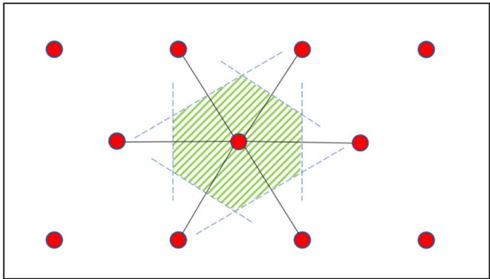

**Caption:** _Sin caption_

---

## FIG_014 · Picture · Página 16

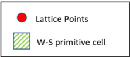

**Caption:** Figure 13 . Schematic diagram of the two-dimensional structure of the W-S primitive cell.

---

## FIG_015 · Picture · Página 16

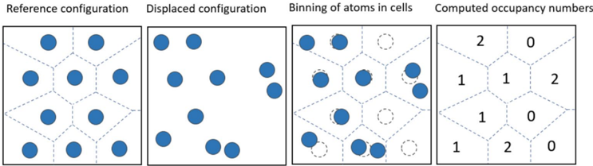

**Caption:** Figure 14 . Schematic diagram of defect analysis using the W-S primitive cell method.

---

## FIG_016 · Picture · Página 18

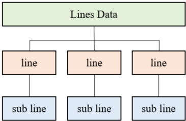

**Caption:** _Sin caption_

---

## FIG_017 · Picture · Página 18

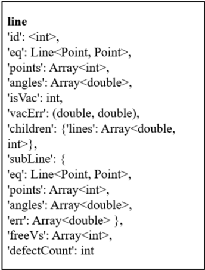

**Caption:** _Sin caption_

---

## FIG_018 · Picture · Página 21

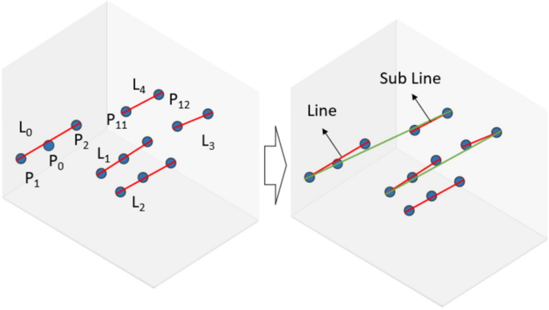

**Caption:** Figure 16 . Construction of SIA line assemblies.

---

## FIG_019 · Picture · Página 21

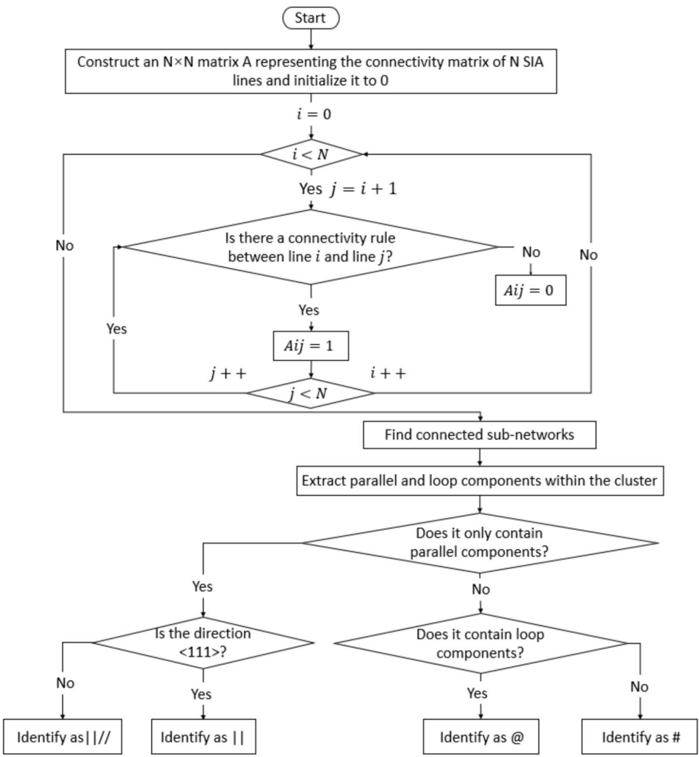

**Caption:** Figure 17 . Algorithm steps for defect cluster configuration identification.

---

## FIG_020 · Picture · Página 22

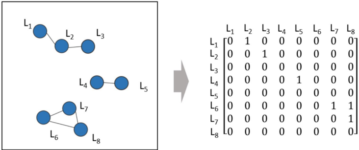

**Caption:** Figure 18 . Searching for connected components of a sparse matrix.

---

## FIG_021 · Picture · Página 22

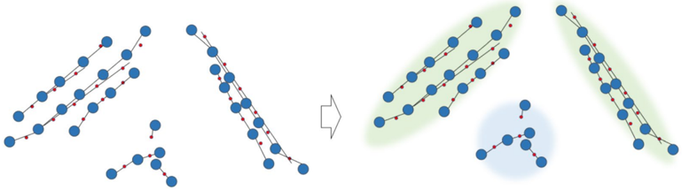

**Caption:** Figure 19 . Connected components are represented as parallel components or ring components.

---

## FIG_022 · Picture · Página 25

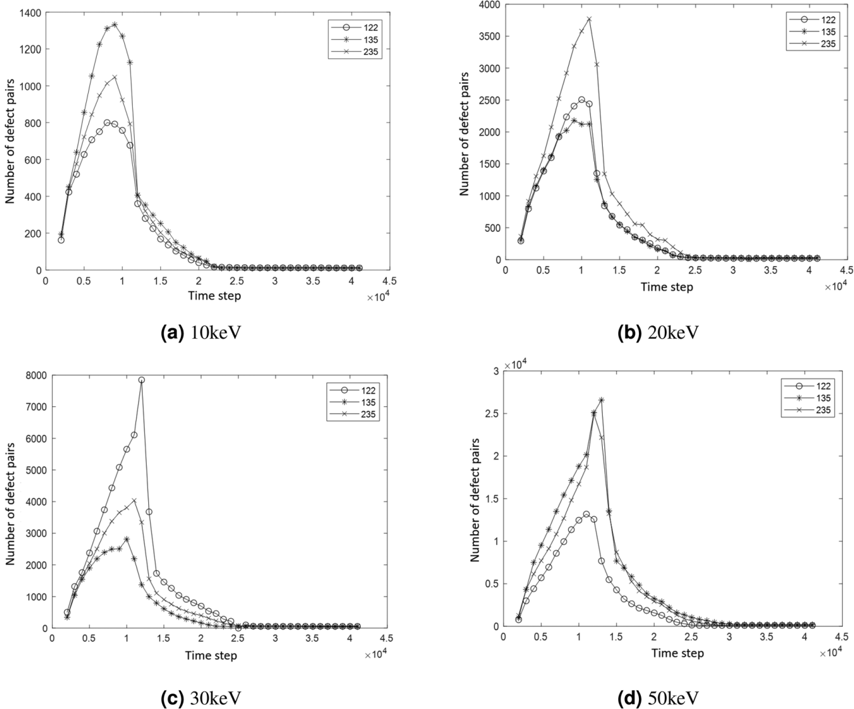

**Caption:** Figure 20 . Curve of Defect Quantity Variation with PKA Directions at different energy.

---

## FIG_023 · Picture · Página 26

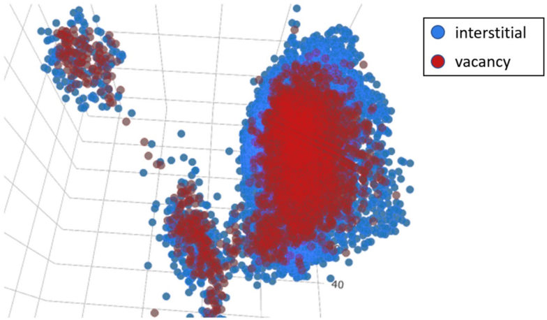

**Caption:** _Sin caption_

---

## FIG_024 · Picture · Página 26

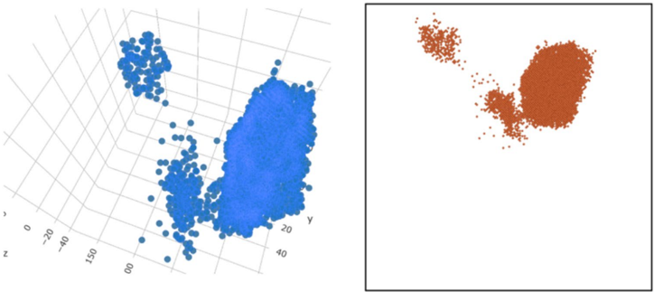

**Caption:** Figure 22 . Visualization of interstitial atoms.

---

## FIG_025 · Picture · Página 26

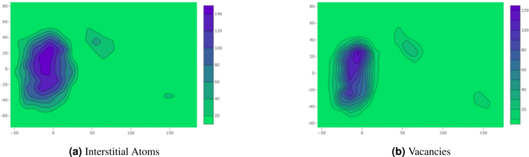

**Caption:** Figure 23 . 2D Map of the spatial density distribution of interstitial atoms and vacancies.

---

## FIG_026 · Picture · Página 27

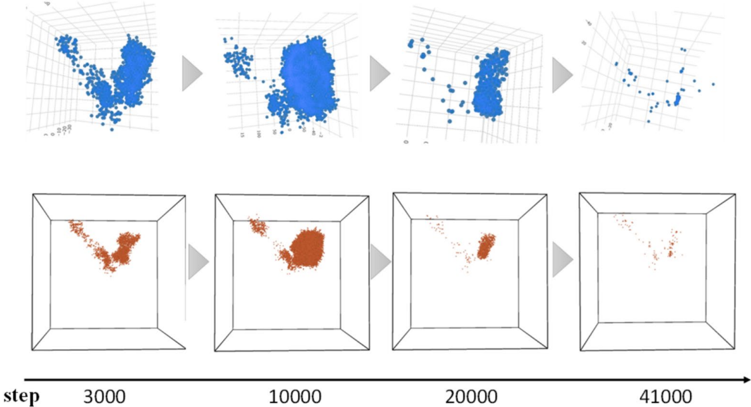

**Caption:** Figure 24 . Evolution Process of defect clusters.

---

## FIG_027 · Picture · Página 28

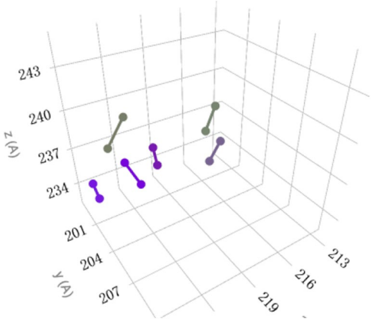

**Caption:** _Sin caption_

---

## FIG_028 · Picture · Página 28

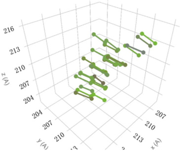

**Caption:** _Sin caption_

---

## FIG_029 · Picture · Página 28

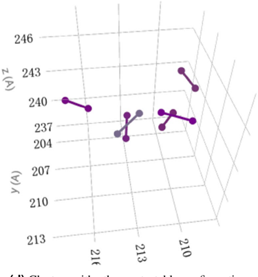

**Caption:** Figure 25 . Different defect configurations in Fe cascade collision.

---

## FIG_030 · Picture · Página 28

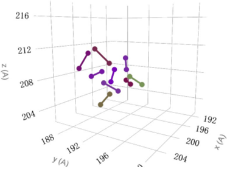

**Caption:** _Sin caption_
