# Figuras extraídas

**Fuente:** `/media/santi/ALMACEN_GRANDE_1/ilovepappers/pappers/voxel_voids_nucleacion_Hemani_2014.pdf`
**Total figuras:** 15

---

## FIG_001 · Picture · Página 1

**Caption:** _Sin caption_

---

## FIG_002 · Picture · Página 20

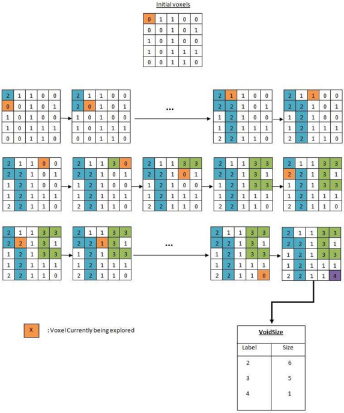

**Caption:** Figure 1: Void Analysis using serial algorithm

---

## FIG_003 · Picture · Página 21

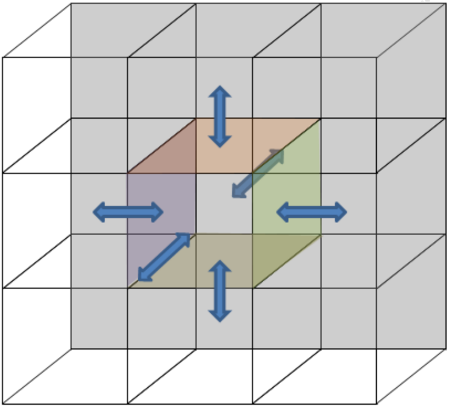

**Caption:** _Sin caption_

---

## FIG_004 · Picture · Página 22

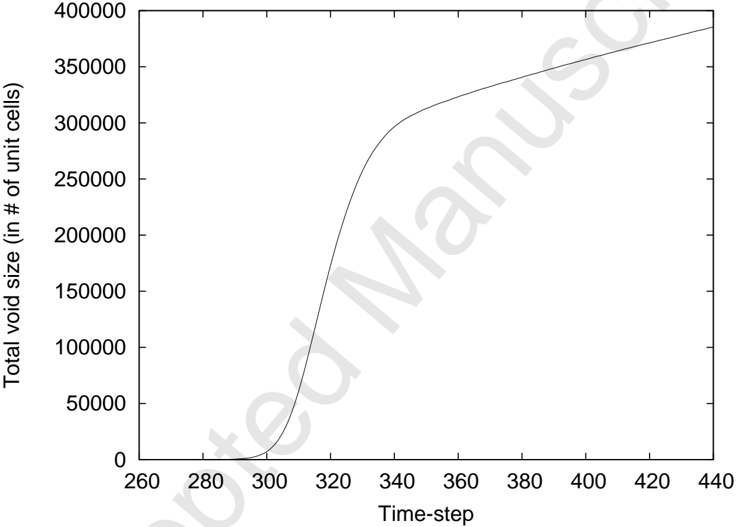

**Caption:** _Sin caption_

---

## FIG_005 · Picture · Página 23

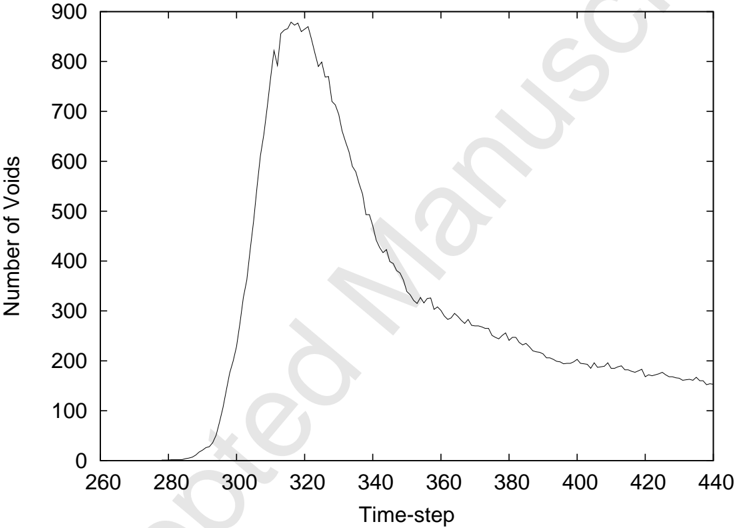

**Caption:** _Sin caption_

---

## FIG_006 · Picture · Página 24

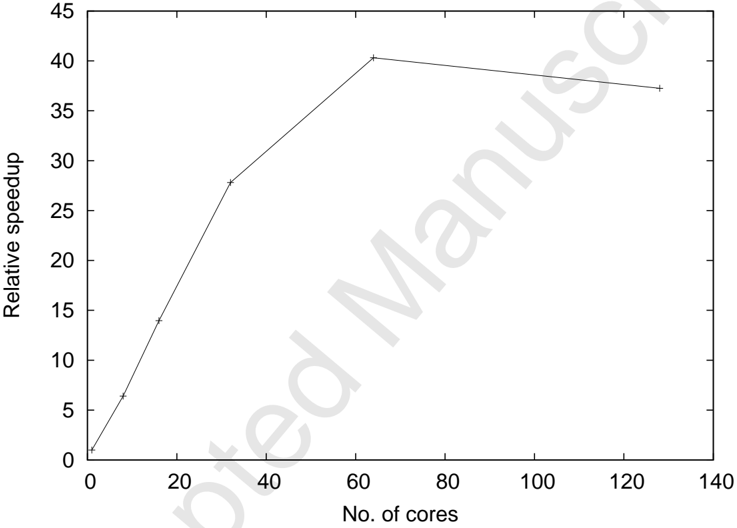

**Caption:** _Sin caption_

---

## FIG_007 · Picture · Página 25

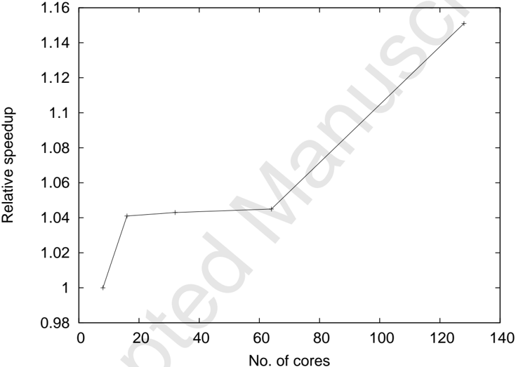

**Caption:** _Sin caption_

---

## FIG_008 · Picture · Página 26

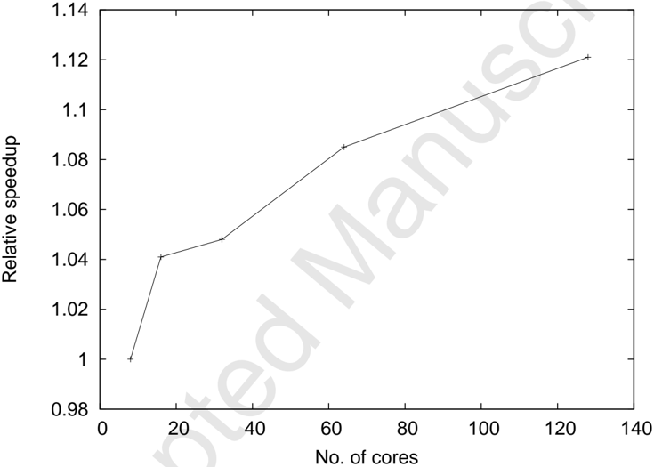

**Caption:** _Sin caption_

---

## FIG_009 · Picture · Página 27

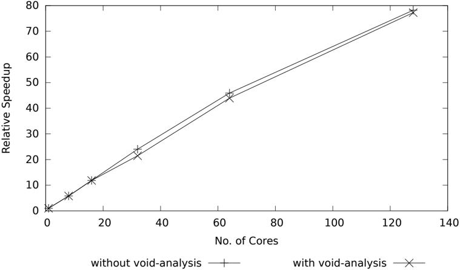

**Caption:** _Sin caption_

---

## FIG_010 · Picture · Página 29

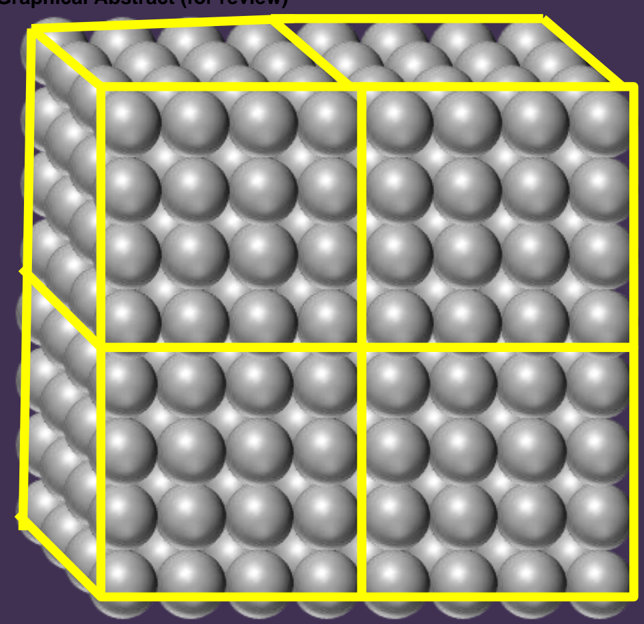

**Caption:** _Sin caption_

---

## FIG_011 · Picture · Página 29

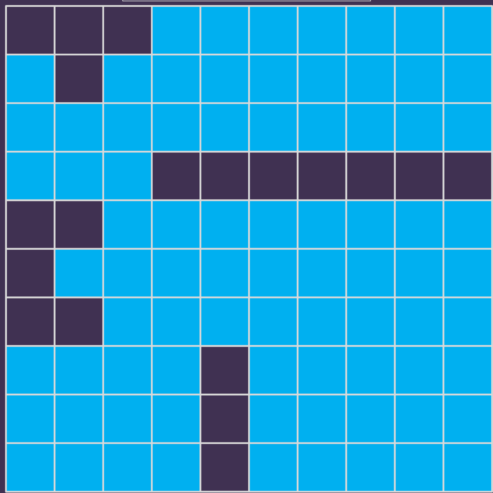

**Caption:** _Sin caption_

---

## FIG_012 · Picture · Página 29

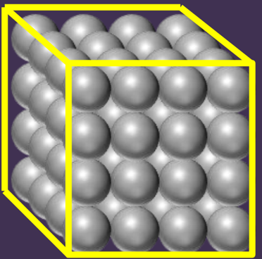

**Caption:** _Sin caption_

---

## FIG_013 · Picture · Página 29

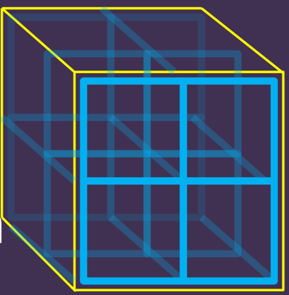

**Caption:** _Sin caption_

---

## FIG_014 · Picture · Página 29

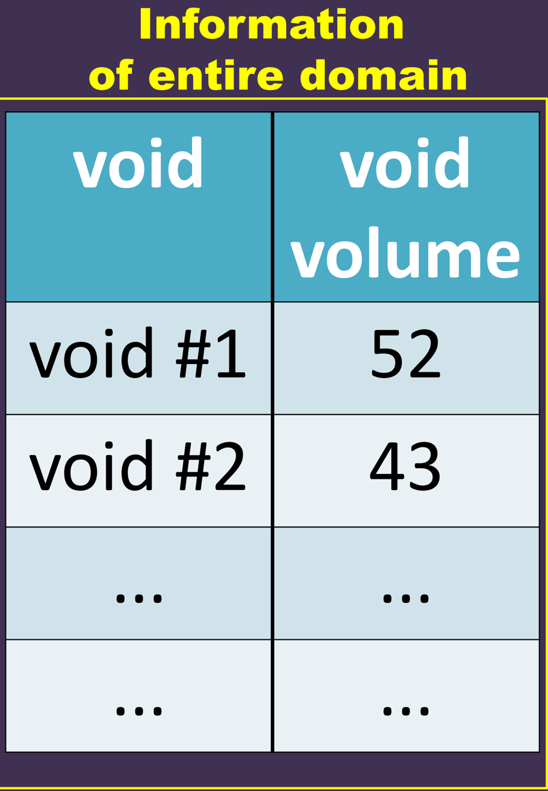

**Caption:** _Sin caption_

---

## FIG_015 · Picture · Página 29

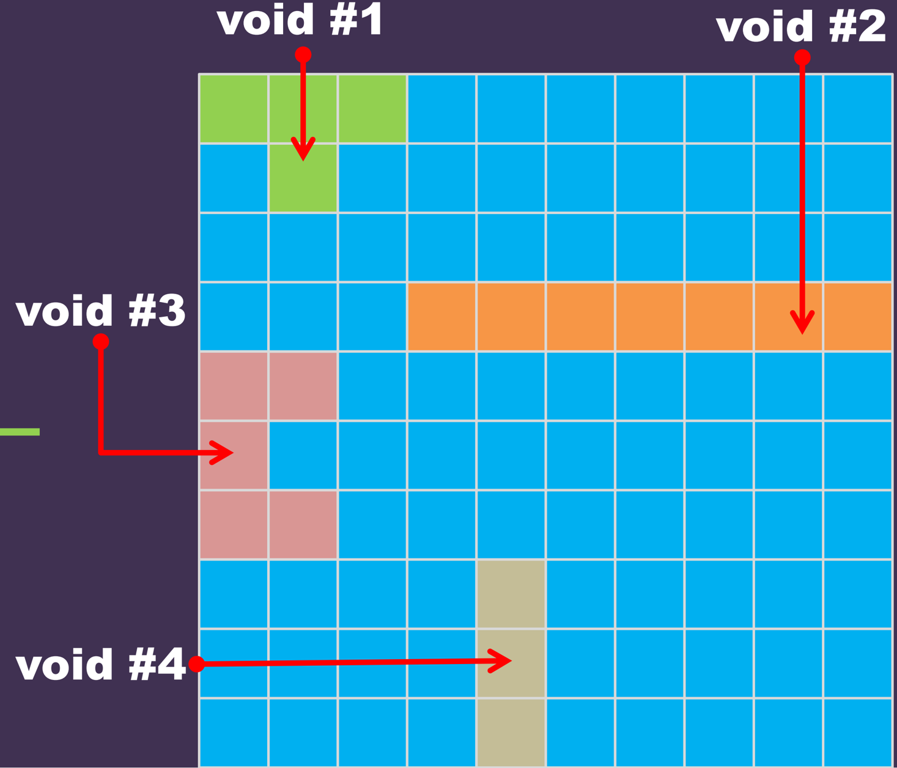

**Caption:** _Sin caption_
